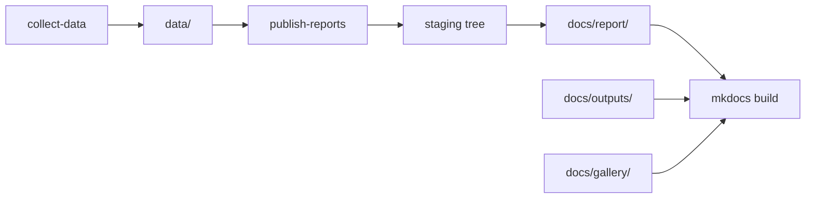

# Publication Flow

The repository publishes outputs in two layers: generated report bundles and the MkDocs site that explains and hosts them.

## Flow

## Why The Split Exists

- `docs/report/` contains generated publication artifacts that are rebuilt from code and data
- the rest of `docs/` contains hand-maintained narrative pages that explain those artifacts
- `mkdocs build` publishes both together into one site without collapsing their responsibilities
- report publication first writes into a sibling staging tree and swaps that tree into place only after generation succeeds

## Failure Modes This Boundary Prevents

- hand-editing generated atlas or report files and losing the link back to code or data
- treating narrative explanations as if they were generated guarantees
- publishing a docs shell that no longer matches the checked-in atlas or country bundles
- deleting a previously good `docs/report/` tree before a failed report regeneration finishes

## Purpose

This page explains how generated report bundles and the documentation site are expected to move together.
