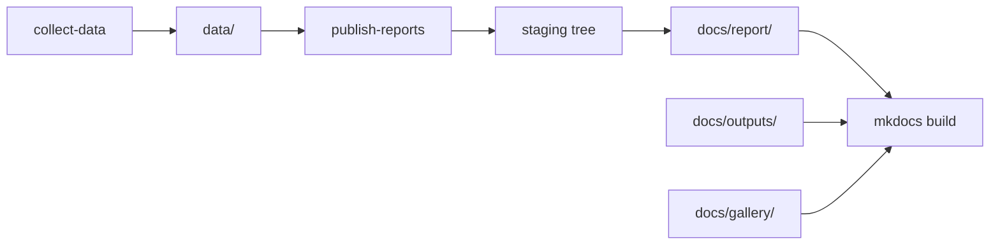

# Publication Flow

The repository publishes outputs in two layers: generated report bundles and the MkDocs site that explains and hosts them.

## Flow

## Publication Seams

- reporting code assembles generated bundles under a staging tree first
- the staged publication tree swaps into `docs/report/` only after generation succeeds
- MkDocs then publishes both the generated report tree and the hand-maintained docs shell into one static site

## Why The Split Exists

- `docs/report/` contains generated publication artifacts that are rebuilt from code and data
- the rest of `docs/` contains hand-maintained narrative pages that explain those artifacts
- `mkdocs build` publishes both together into one site without collapsing their responsibilities
- report publication first writes into a sibling staging tree and swaps that tree into place only after generation succeeds

## Why Staging Matters

Staging is not cosmetic. It prevents a failed report regeneration from deleting or half-replacing the previously published report tree, and it keeps generated summary paths anchored to the final `docs/report/...` locations instead of hidden temporary directories.

## Failure Modes This Boundary Prevents

- hand-editing generated atlas or report files and losing the link back to code or data
- treating narrative explanations as if they were generated guarantees
- publishing a docs shell that no longer matches the checked-in atlas or country bundles
- deleting a previously good `docs/report/` tree before a failed report regeneration finishes

## Reading Rule

Use this page when the question is about how generated bundles and the docs shell move together. Use [Outputs](../outputs/index.md) when the question is what those bundles contain.

## Purpose

This page explains how generated report bundles and the documentation site are expected to move together without collapsing generated and hand-maintained responsibilities.
