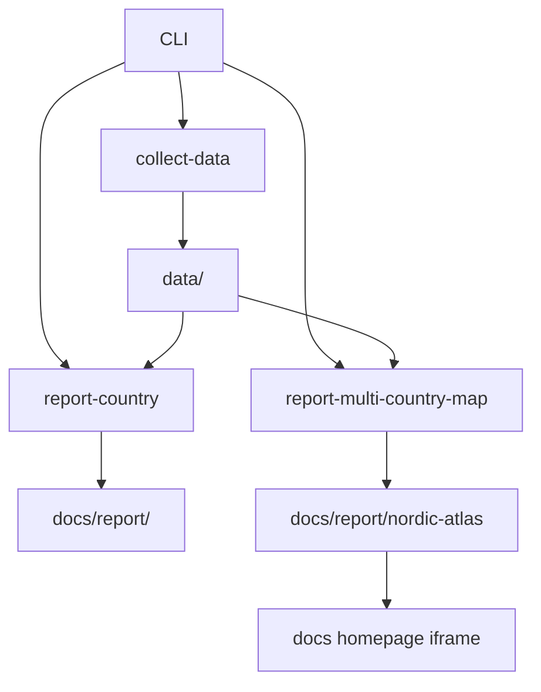

# System Overview

`bijux-pollenomics` is a file-oriented pipeline, not a server application.

## Major Components

- `src/bijux_pollenomics/data_downloader/`: data acquisition and normalization
- `src/bijux_pollenomics/reporting/`: AADR report generation, context-layer assembly, and atlas publication
- `src/bijux_pollenomics/settings.py`: shared publication defaults and Nordic atlas identity
- `data/`: tracked source inputs and normalized source products
- `docs/report/`: generated report artifacts
- `mkdocs.yml` and `docs/`: published documentation shell

## Processing Model

## Why This Architecture Is File-Centric

The repository’s outputs need to be:

- reproducible
- reviewable in git
- publishable as static documentation assets
- easy to rebuild without hidden services

## Contract Modules

Two parts of the tree now carry explicit file contracts instead of relying on repeated string literals:

- `src/bijux_pollenomics/data_downloader/contracts.py` owns normalized data artifact filenames that are reused by collectors and the atlas context-layer builder
- `src/bijux_pollenomics/reporting/paths.py` owns the generated bundle artifact names for country bundles and the Nordic Evidence Atlas bundle

That split matters because the repository publishes generated files directly. A file rename is not just an implementation detail here; it is part of the output contract.

## Publication Boundary

The repository draws a hard boundary between:

- source collection under `data/`
- generated publication bundles under `docs/report/`
- hand-maintained documentation under `docs/`

That boundary keeps generated artifacts reviewable without pretending that narrative documentation is itself machine-generated.

## Purpose

This page explains the top-level system shape before readers move into source ownership or collection flow details.
