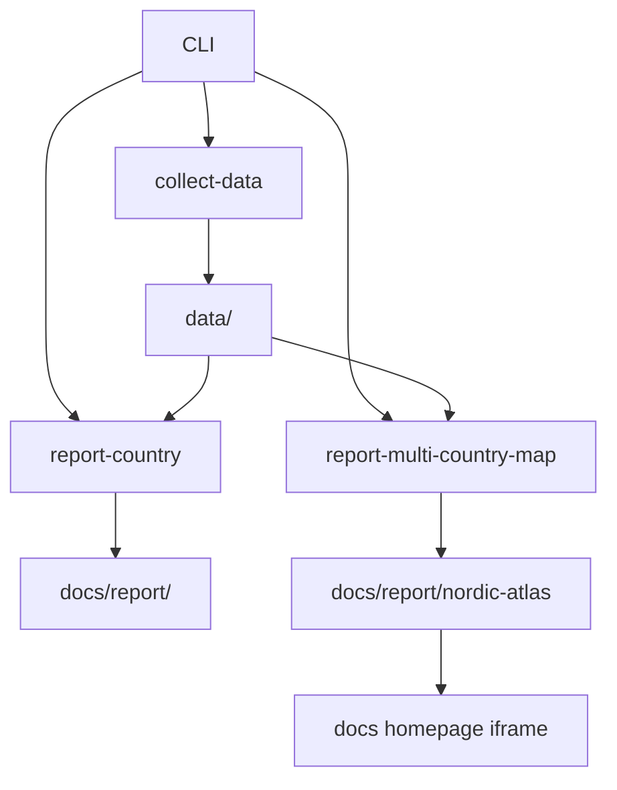

# System Overview

`bijux-pollenomics` is a file-oriented pipeline, not a server application.

## Major Components

- `packages/bijux-pollenomics/src/bijux_pollenomics/command_line/`: CLI parsing under `parsing/` plus command execution under `runtime/`
- `packages/bijux-pollenomics/src/bijux_pollenomics/config.py`: canonical defaults shared by the CLI, reporting workflows, and `Makefile`
- `packages/bijux-pollenomics/src/bijux_pollenomics/data_downloader/`: collection orchestration in `collector.py`, reusable collector workflow modules in `pipeline/`, source-owned logic in `sources/`, and shared spatial/export helpers in `spatial/` and `shared/`
- `packages/bijux-pollenomics/src/bijux_pollenomics/reporting/`: top-level publication orchestration in `service.py`, bundle assembly in `bundles/`, context-layer shaping in `context/`, AADR loading in `aadr/`, and generated output helpers in `rendering/`
- `data/`: tracked source inputs and normalized source products
- `docs/report/`: generated report artifacts
- `mkdocs.yml` and `docs/`: published documentation shell

## Processing Model

## System Seams

The repository stays maintainable by keeping five seams explicit:

- command parsing and dispatch decide which workflow to run
- collectors write source-specific outputs into `data/`
- reporting reads those tracked inputs and assembles publication bundles
- publication writes generated artifacts under `docs/report/`
- MkDocs publishes the narrative docs shell around those generated artifacts

## Why This Architecture Is File-Centric

The repository’s outputs need to be:

- reproducible
- reviewable in git
- publishable as static documentation assets
- easy to rebuild without hidden services

## Why Configuration Is Centralized

The repository keeps canonical defaults in `packages/bijux-pollenomics/src/bijux_pollenomics/config.py` so command-line defaults, `Makefile` defaults, and reporting defaults do not drift apart over time.

## Contract Modules

Two parts of the tree now carry explicit file contracts instead of relying on repeated string literals:

- `packages/bijux-pollenomics/src/bijux_pollenomics/data_downloader/contracts.py` owns normalized data artifact filenames that are reused by collectors and the atlas context-layer builder
- `packages/bijux-pollenomics/src/bijux_pollenomics/reporting/bundles/paths.py` owns the generated bundle artifact names for country bundles and the Nordic Evidence Atlas bundle

That split matters because the repository publishes generated files directly. A file rename is not just an implementation detail here; it is part of the output contract.

## Publication Boundary

The repository draws a hard boundary between:

- source collection under `data/`
- generated publication bundles under `docs/report/`
- hand-maintained documentation under `docs/`

That boundary keeps generated artifacts reviewable without pretending that narrative documentation is itself machine-generated.

## Reading Rule

Use this page for the top-level system shape. Use [Data collection flow](data-collection-flow.md) or [Publication flow](publication-flow.md) when you need one pipeline path in detail, and use [Codebase layout and ownership](codebase-layout-and-ownership.md) when you need module-level ownership.

## Purpose

This page explains the top-level system shape before readers move into collection, publication, or ownership details.
