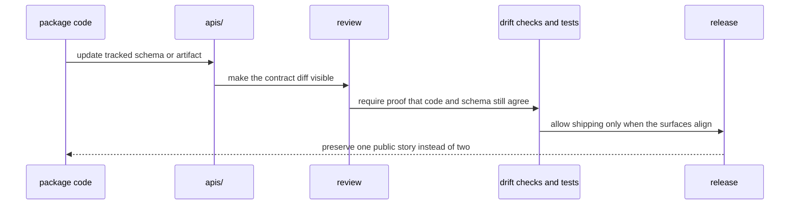

# API and Schema Governance

Shared API artifacts live under `apis/` so contract review does not depend on
reading package source alone. A caller or reviewer should not need to reverse-
engineer Python modules just to understand whether a public contract changed.

## How A Public Contract Change Should Move

## Governance Rules

- checked-in schema files must move with reviewable intent
- freeze checks belong in shared gates or repository-owned tests, not in prose alone
- breaking field removals must not move without a visible version change

## Current Schema Roots

- `apis/bijux-pollenomics/v1/schema.yaml` for the public repository API contract

## Gate Entry Points

- `make api` for full API lint, freeze, and drift checks
- `make api-freeze` for pinned OpenAPI and digest enforcement only
- `make openapi-drift` for backward-compatibility checks
