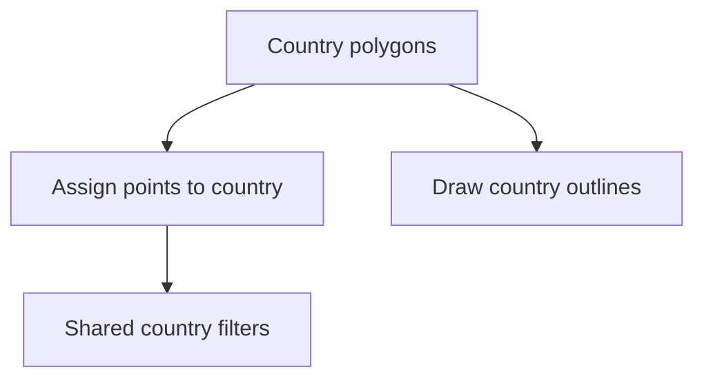

# Boundaries

`data/boundaries/` holds the Nordic country polygons used for classification and map framing.

## What It Produces

- raw country GeoJSON files under `data/boundaries/raw/`
- a Natural Earth source manifest under `data/boundaries/raw/source_manifest.json`
- a combined Nordic boundary collection under `data/boundaries/normalized/nordic_country_boundaries.geojson`

## Collector Contract

The collector:

- downloads Natural Earth 10m admin-0 country geometry from the pinned `v5.1.1` release asset
- filters that global boundary collection down to Sweden, Norway, Finland, and Denmark
- writes a provenance manifest with the pinned asset URL, version, feature count, and SHA-256 digest
- writes those filtered country files into the tracked raw boundary directory
- builds one combined Nordic boundary GeoJSON for country classification and map framing
- only reuses local raw boundaries when that provenance manifest is present and valid
- validates that every local raw boundary file still carries features and the expected `ADM0_A3` code before reuse
- uses strict polygon containment first, then a narrow fallback for inland-water and near-coast points that sit just outside the published land polygons

## Raw Files

- `data/boundaries/raw/denmark.geojson`
- `data/boundaries/raw/finland.geojson`
- `data/boundaries/raw/norway.geojson`
- `data/boundaries/raw/sweden.geojson`

## Why It Matters

Without boundaries, the repository cannot apply one consistent country filter to AADR, Neotoma, SEAD, and Sweden-specific archaeology overlays.

## Classification Note

The country polygons come from land-focused admin boundaries, which means some real research coordinates can fall into inland-water holes or just outside simplified coastlines. The shared classifier now recovers those cases conservatively instead of dropping them silently.

## Audit Artifacts

- one raw GeoJSON per Nordic country
- a pinned Natural Earth source manifest with release, asset, and digest details
- one normalized combined boundary collection used by classifiers and the atlas

## Acquisition Command

```bash
artifacts/.venv/bin/bijux-pollenomics collect-data boundaries --output-root data
```

## Product Role



## Purpose

This page explains why country boundaries are treated as first-class tracked data instead of as incidental display assets.
