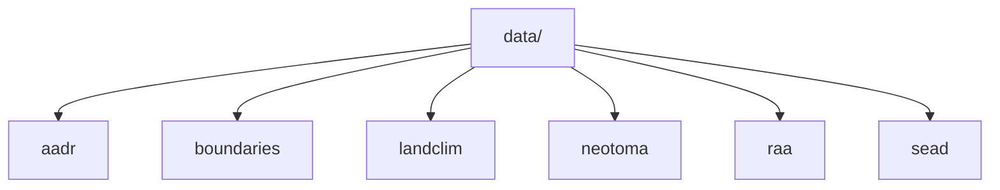

# Data Sources

This section explains the six tracked data categories under `data/`, the commands that build them, and the boundaries of what each source contributes.

## Pages in This Section

- [Source comparison](source-comparison.md)
- [Provenance and refresh policy](provenance-and-refresh-policy.md)
- [AADR](aadr.md)
- [Boundaries](boundaries.md)
- [LandClim](landclim.md)
- [Neotoma](neotoma.md)
- [SEAD](sead.md)
- [RAÄ](raa.md)

## Core Rule

The filesystem model and the acquisition model should match. That is why `collect-data <source>` writes directly into `data/<source>/`.

The collector also writes `data/collection_summary.json`, and when a source depends on boundaries it reuses tracked local boundary files when available instead of fetching them again unnecessarily.

## Trust Model

The repository treats source collection as an auditable ingest step, not as a hidden precondition.

- raw upstream payloads stay in `raw/` whenever the upstream format matters for later audit or reprocessing
- normalized outputs stay in `normalized/` when the repository needs stable map-ready or table-ready contracts
- manifests and summaries are part of the checked-in evidence, not optional extras
- a refreshed source snapshot should explain both where the files came from and why the normalized layer changed

## Reading Rule

Use this section in two passes:

1. read [Source comparison](source-comparison.md) when you need to compare sources against each other
2. read a source-specific page when you need the exact acquisition and normalization behavior for one source

That split is intentional. The project uses multiple evidence types whose geometry, coverage, and limitations are not interchangeable.

## Canonical Status

This section is the canonical source for data acquisition and storage guidance inside the docs site. It replaces the older narrative content that previously lived in separate `docs/data/...` pages.

## Purpose

This page organizes the source-specific documentation for the tracked data tree.
