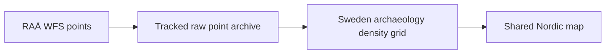

# RAÄ

`data/raa/` contains Swedish archaeology metadata and a map-optimized archaeology density layer derived from RAÄ / Fornsök.

## What It Produces

- raw capabilities, schema, and domain metadata under `data/raa/raw/`
- a full published archaeology point archive under `data/raa/raw/publicerade_lamningar_centrumpunkt.geojson`
- Swedish archaeology metadata and density GeoJSON under `data/raa/normalized/`

## Collector Contract

The collector:

- downloads RAÄ WFS capabilities and schema metadata
- downloads Fornsök domain metadata
- archives the full published archaeology point inventory with WFS paging
- validates that archived paging covered the reported `numberMatched` inventory exactly once
- derives Swedish counts for all published sites, `Fornlämning`, and `Fornlämning` plus `Möjlig fornlämning` from that archived inventory
- builds a 1-degree Swedish density grid from the archived feature inventory instead of issuing WFS count queries cell by cell
- writes a compact raw summary for the archived point inventory alongside the full GeoJSON

## Why Density Instead Of Every Point

RAÄ contributes national-scale Swedish archaeology context. The checked-in map uses a density layer rather than individual point markers because the source count is large enough that direct marker rendering would be heavy and visually noisy in the static HTML atlas.



## Acquisition Command

```bash
PYTHONPATH=src artifacts/.venv/bin/python -m bijux_pollenomics.cli collect-data raa --output-root data
```

## Scope Boundary

The RAÄ layer is Sweden-only. That is an implementation fact of the repository, not a claim about archaeology coverage in the other countries.

## What The Shared Map Is Honest About

The normalized RAÄ outputs are designed for national-scale archaeological context, not for feature-by-feature archaeological analysis.

- the shared map publishes a density surface, not every underlying point geometry
- the layer is intended to show concentration and relative coverage, not exact archaeological site locations for downstream decision automation
- Swedish coverage in this repository should not be mistaken for a Nordic archaeology inventory

## Audit Artifacts

- raw WFS capabilities, schema, and domain metadata
- a full archived raw point inventory
- a compact raw inventory summary that proves paging completeness
- a normalized density layer and companion metadata JSON used by the atlas

## Purpose

This page explains why RAÄ is both source-faithful and browser-optimized at the same time.
