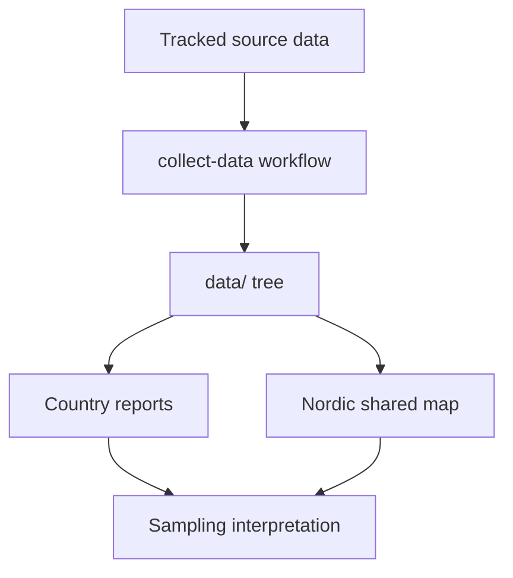

# Foundation

This section gives the mental model for `bijux-pollenomics` before you start running commands or reading code.

The repository is easiest to understand when you separate five concerns:

- tracked source data under `data/`
- normalization and acquisition logic under `src/bijux_pollenomics/data_downloader/`
- multi-source report and atlas generation under `src/bijux_pollenomics/reporting/`
- the shared Nordic map as the primary interactive output
- later spatial interpretation built on top of these reproducible layers

The foundation pages answer four foundational questions:

- what the repository scope includes and excludes
- what the project is trying to support scientifically
- what the repository produces today
- which boundaries are intentional
- why the map is the primary experience but not the only durable output

## Pages in This Section

- [Repository scope](repository-scope.md)
- [Product overview](product-overview.md)
- [Scope and non-goals](scope-and-non-goals.md)
- [Map-first product model](map-first-product-model.md)

## What You Should Know After This Section

- why the repository centers country-aware spatial evidence, not just raw files
- why AADR `.anno` metadata is tracked while heavy genotype files are not
- why the reporting layer now combines AADR outputs with the checked-in context layers
- how the shared map and report outputs relate to the tracked `data/` tree
- which next section to read for your role

## Reading Advice

Start here if you are new to the repository, planning new data layers, or trying to understand why the docs homepage leads with the map instead of the codebase.

## Honesty Rule

This section is allowed to describe intent and product framing, but it should still stay bounded by current repository behavior. Future scientific or product ambitions belong here only when they are explicitly labeled as not-yet-implemented.

## Purpose

This page explains the foundation section and routes readers to the pages that define what `bijux-pollenomics` is building.

## Stability

This page is part of the canonical docs spine. Keep it aligned with the current repository behavior and the actual checked-in outputs.
