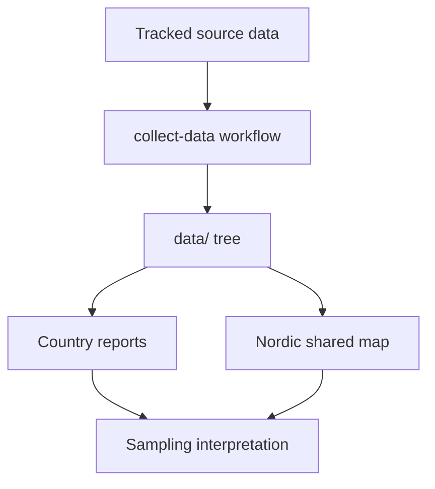

# Foundation

This section gives the reader-facing contract for `bijux-pollenomics` before any commands or code details.

Read this section first if you need to answer:

- what the repository is trying to deliver today
- what sits inside or outside the current repository boundary
- why the shared atlas is the main visible output
- how the product framing differs from later research interpretation work

## Pages in This Section

- [Product overview](product-overview.md)
- [Repository scope](repository-scope.md)
- [Scope and non-goals](scope-and-non-goals.md)
- [Map-first product model](map-first-product-model.md)

## Section Contract

- [Product overview](product-overview.md) explains the delivered evidence workspace and its visible outputs.
- [Repository scope](repository-scope.md) defines the operational boundary the repository is expected to hold.
- [Scope and non-goals](scope-and-non-goals.md) records the work that is deliberately out of scope for now.
- [Map-first product model](map-first-product-model.md) explains why the site opens with the atlas instead of code or command documentation.

## Reading Advice

Move to [Workflows](../workflows/index.md) once you understand the boundary and need rebuild steps. Move to [Data Sources](../data-sources/index.md) or [Outputs](../outputs/index.md) once you need source-specific or artifact-specific detail.

## Honesty Rule

This section is allowed to describe intent, but it still has to stay bounded by current repository behavior. Later research ambitions belong here only when they are explicitly labeled as not yet implemented.

## Purpose

This page explains how to use the foundation section without repeating the details that belong on the pages beneath it.

## Stability

This page is part of the canonical docs spine. Keep it aligned with the current repository behavior and the actual checked-in outputs.
