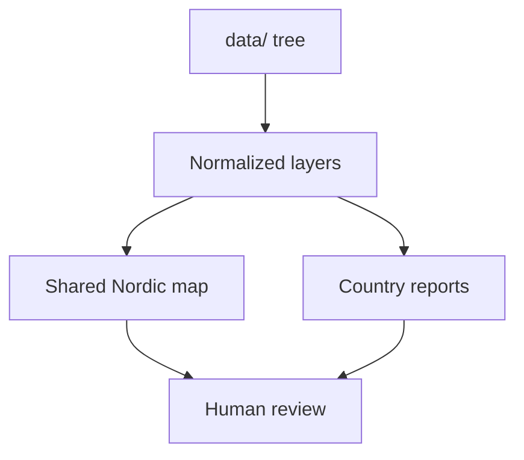

# Map-First Product Model

The documentation homepage is map-first because the shared Nordic map is the fastest honest proof surface for the repository’s combined outputs.

This does **not** mean the map is the only durable artifact.

The map is a view over:

- tracked inputs
- normalized geospatial outputs
- generated report artifacts and context-layer copies assembled into the shared atlas bundle
- documented commands that can reproduce the same state

## Why The Homepage Starts Here

Most readers need an answer to “what does this repository actually produce?” before they need a command list or a module tree. The atlas answers that question faster than prose because it exposes the current evidence stack directly.

## Why Not Start With Code

Starting with code would force most readers to reverse-engineer the repository’s purpose from implementation details. Starting with the map lets readers immediately answer:

- what evidence is being combined
- what geography is being covered
- how filtering works
- what kind of output the repository produces

## Why Not Redirect Away From Documentation Entirely

The homepage embeds the map, but keeps the documentation shell around it, because users also need:

- source explanations
- command references
- artifact layout rules
- architectural boundaries
- development workflow guidance

The docs should not hide the map, and the map should not replace the docs.

## What Map-First Does Not Mean

- it does not mean the atlas is the only artifact that matters
- it does not mean the atlas is the final scientific interpretation
- it does not mean readers should infer undocumented behavior from the UI alone

## Inspection Rule

The homepage leads with the atlas because inspection is the first proof surface for the repository. The supporting pages exist to explain why the visible output should be trusted, where it comes from, and which limits still apply.

## Purpose

This page explains why the documentation experience is intentionally routed through the shared map.
