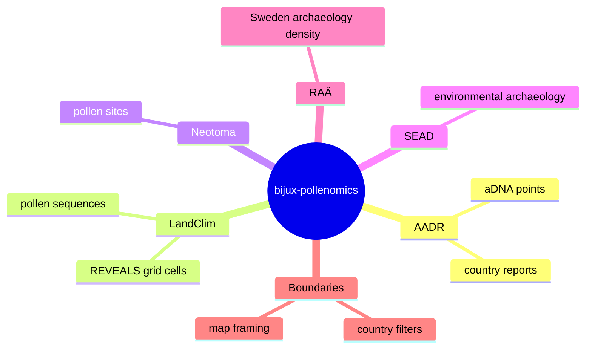

# Product Overview

`bijux-pollenomics` builds a Nordic evidence workspace for inspecting where tracked aDNA, pollen-related, environmental archaeology, and archaeology layers occur together.

The repository is not a hosted analysis service. It is a file-oriented product that keeps the inputs, normalized layers, generated report bundles, and documentation in one reviewable tree.

## Delivered Product Surface

The checked-in workspace combines:

- ancient DNA sample locations from AADR
- Nordic pollen-sequence and REVEALS reconstruction coverage from LandClim
- Nordic pollen and paleoecology locations from Neotoma
- Nordic environmental archaeology locations from SEAD
- Swedish archaeology coverage from RAÄ / Fornsök
- country boundaries used to filter all compatible layers consistently

## How The Product Works

The repository is a pipeline that:

1. collects tracked source inputs
2. normalizes them into a common geospatial shape
3. generates AADR country reports
4. generates a shared Nordic map that combines those reports with the checked-in context layers and can filter them by country and time

The longer-term research goal is to use those layers as one input to later site-selection work. The repository does not rank sites or recommend field locations automatically.

## Intended Readers

- researchers who need to inspect the evidence surface before designing new spatial analysis
- maintainers who need to rebuild the checked-in state and publish outputs reproducibly
- reviewers who need to verify that a visible atlas or report change is grounded in tracked data and code

## Current Deliverables

- tracked source inputs under `data/`
- normalized data products under `data/*/normalized/`
- country report bundles under `docs/report/<country>/`
- a shared Nordic interactive map under `docs/report/nordic-atlas/`
- one MkDocs site that explains and hosts those checked-in artifacts

## Why The Map Is Central

The map is the fastest way to validate whether the repository is producing interpretable spatial structure:

- are the points in the right countries
- do archaeology and pollen layers appear where expected
- can readers filter the evidence set down to one country
- can researchers inspect the current checked-in evidence without reading raw tables first

That is why the docs homepage embeds the shared map before anything else.

## Product Boundary

Use this page to understand the delivered workspace. Use [Repository scope](repository-scope.md) when the question is whether something belongs inside the repository at all, and use [Scope and non-goals](scope-and-non-goals.md) when the question is whether a future-looking idea has been deliberately deferred.

## Purpose

This page explains the delivered product surface so later workflow and architecture pages are read with the right expectations.
