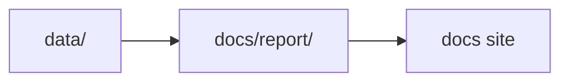

# Repository Scope

This page defines the operational boundary the repository is expected to hold.

## Delivered Capabilities

- tracked source collection for `aadr`, `boundaries`, `landclim`, `neotoma`, `raa`, and `sead`
- one shared Nordic map bundle under `docs/report/nordic-atlas/`
- country report bundles for Sweden, Norway, Finland, and Denmark
- machine-readable collection and report summaries
- one-command rebuilds for data, reports, and the docs site

## Repository Responsibility

The repository is responsible for:

- collecting and normalizing tracked evidence layers into stable files
- publishing those files as reviewable report bundles and one shared atlas
- documenting the command surface, file contracts, and visible limitations needed to understand the checked-in outputs

It is not responsible for completing later interpretation work on behalf of researchers.

## Rebuild Surface

- `make data-prep` rebuilds the tracked data tree
- `make reports` rebuilds the published report bundles
- `make docs` rebuilds the MkDocs site
- `make app-state` rebuilds the checked-in repository outputs end to end

## Boundary Rule

If a feature requires the repository to become something fundamentally different, such as a live ranking service, a hosted application backend, or a genotype-processing warehouse, it should be treated as a scope expansion rather than quietly described as part of the existing product.

## Deliberate Exclusions

- lake distance intersections
- archaeological ranking outside the current RAÄ layer
- automatic site ranking
- offline basemap tiles
- genotype-level processing beyond tracked AADR `.anno` files

## What This Page Is For

Use this page when the argument is about repository responsibility. Use [Product overview](product-overview.md) for the reader-facing outcome and [Scope and non-goals](scope-and-non-goals.md) for the deferred work list.

## Extension Rule

The repository is strongest when it treats the delivered scope as a stable evidence workspace rather than implying that later interpretation and ranking features already exist. New capabilities should be added by extending this boundary deliberately, not by quietly stretching old language to cover unfinished behavior.

## Purpose

This page records the repository boundary so future work can extend it deliberately instead of blurring it.
