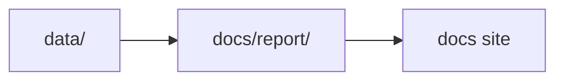

# Repository Scope

This page defines the delivered scope of the repository and the outer boundary it is expected to hold.

## Delivered Capabilities

- tracked source collection for `aadr`, `boundaries`, `landclim`, `neotoma`, `raa`, and `sead`
- one shared Nordic map bundle under `docs/report/nordic-atlas/`
- country report bundles for Sweden, Norway, Finland, and Denmark
- machine-readable collection and report summaries
- one-command rebuilds for data, reports, and the docs site

## Rebuild Surface

- `make data-prep` rebuilds the tracked data tree
- `make reports` rebuilds the published report bundles
- `make docs` rebuilds the MkDocs site
- `make app-state` rebuilds the checked-in repository outputs end to end

## Deliberate Exclusions

- lake distance intersections
- archaeological ranking outside the current RAÄ layer
- automatic site ranking
- offline basemap tiles
- genotype-level processing beyond tracked AADR `.anno` files

## Extension Rule

The repository is strongest when it treats the delivered scope as a stable evidence workspace rather than implying that later interpretation and ranking features already exist. New capabilities should be added by extending this boundary deliberately, not by quietly stretching old language to cover unfinished behavior.

## Purpose

This page records the repository boundary so future work can extend it deliberately instead of blurring it.
