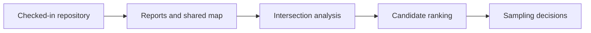

# Scope and Non-Goals

The repository scope is deliberately narrower than the broader scientific ambition around site selection.

This page exists to make the deferred work explicit instead of leaving it to implication.

## In Scope

- collecting tracked source data into the six top-level `data/` categories
- classifying compatible records by country
- generating country-specific AADR reports
- generating one shared Nordic map with multi-country filtering
- documenting the repository so the full state can be rebuilt from a clean checkout

## Deliberately Deferred Work

- lake-buffer intersection scoring
- archaeological site proximity ranking outside the current RAÄ coverage layer
- automated sampling-site recommendation logic
- full genotype processing from `.geno`, `.snp`, and `.ind`
- a production web backend or user account system

The sequence matters. The repository is intentionally building and checking the evidence layers first so later ranking logic can be grounded in verified inputs rather than assumptions.

## Why These Items Stay Out

Without a visible non-goal list, it becomes easy to:

- treat the repository as a general genomics warehouse
- overfit the code to one temporary experiment
- add heavy data that the map and report pipeline never reads
- confuse future research goals with already-delivered capabilities

## Reading Rule

Use [Repository scope](repository-scope.md) when deciding whether a feature belongs inside the repository boundary at all. Use this page when the feature is plausible but intentionally deferred until the current evidence workspace is stronger.

## Purpose

This page defines which plausible next steps are still out of scope until the current pipeline is stronger.
