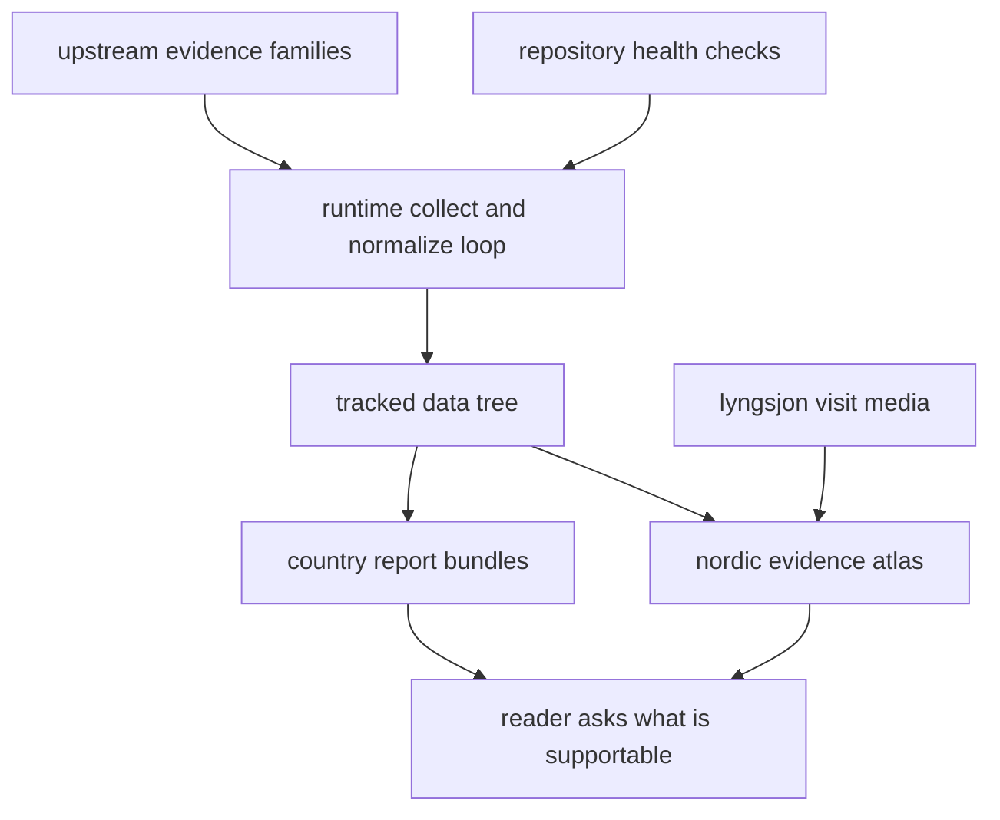

# Bijux Pollenomics

`bijux-pollenomics` is a checked-in Nordic evidence workspace. The repository
collects source-backed records, normalizes them into tracked files, and
publishes those files as country bundles plus one shared atlas that readers can
inspect directly.

The atlas is the fastest honest route into the repository. It shows what is
actually published today: AADR sample points, LandClim pollen sequences and
REVEALS grid cells, Neotoma pollen sites, SEAD sites, Swedish archaeology
density from RAÄ, fieldwork media, and Nordic country boundaries.

<!-- bijux-pollenomics-badges:generated:start -->

<!-- bijux-pollenomics-badges:generated:end -->

  <strong>Start with the atlas, then check the supporting surface that owns the next answer.</strong> The runtime handbook explains how the repository rebuilds outputs, the data handbook explains where layers come from, the fieldwork pages tie one mapped point to a real visit, and the maintainer handbook covers repository-health rules.

  <a class="md-button md-button--primary" href="https://bijux.io/bijux-pollenomics/05-nordic-evidence-atlas/">Open the Nordic Evidence Atlas</a>
  <a class="md-button" href="https://bijux.io/bijux-pollenomics/01-bijux-pollenomics/">Open the package handbook</a>
  <a class="md-button" href="https://bijux.io/bijux-pollenomics/02-bijux-pollenomics-data/">Open the data reference</a>
  <a class="md-button" href="https://bijux.io/bijux-pollenomics/03-bijux-pollenomics-maintain/">Open the maintainer handbook</a>

  <strong>Phone view:</strong> Open the atlas in its own tab for panning, layer toggles, and map controls. The inline embed stays available on larger screens where the full layer stack fits.
  

    <a class="md-button md-button--primary" href="https://bijux.io/bijux-pollenomics/05-nordic-evidence-atlas/">Open the Nordic Evidence Atlas</a>
  

  <iframe src="report/nordic-atlas/nordic-atlas_map.html" title="Nordic Evidence Atlas"></iframe>

## Evidence Flow

Read the site as a chain of evidence, not as a table of contents. A visible
map layer starts in an upstream family, becomes reviewable only after it lands
in the tracked data tree, and becomes public through a report or atlas bundle.
The fieldwork media is intentionally narrow: it gives one mapped point a direct
visit record without pretending to cover the whole Nordic evidence landscape.

The landing page should make one thing immediately clear: visible atlas layers, country reports, and tracked files are different proof surfaces in one chain. If that chain feels decorative instead of operational, readers will assume the site is presentation first and evidence second.

## Start Here

Open the route that matches the real question:

- visible map, layer, point, or polygon: open the
  [Nordic Evidence Atlas](https://bijux.io/bijux-pollenomics/05-nordic-evidence-atlas/)
- runtime commands, rebuild logic, package boundaries, or tests: open
  [bijux-pollenomics](https://bijux.io/bijux-pollenomics/01-bijux-pollenomics/)
- source provenance, normalized file families, or publication bundles: open
  [bijux-pollenomics-data](https://bijux.io/bijux-pollenomics/02-bijux-pollenomics-data/)
- release, docs, CI, or shared command routing: open
  [bijux-pollenomics-maintain](https://bijux.io/bijux-pollenomics/03-bijux-pollenomics-maintain/)

## Fieldwork Record

The repository also carries checked-in field media from the Lyngsjön Lake
sampling visit on 2026-02-26. That material anchors one atlas point to a real
collection day on the lake ice rather than to a database row alone.

  <a class="md-button md-button--primary" href="https://bijux.io/bijux-pollenomics/04-fieldwork/lyngsjon-lake-fieldwork/">Open the fieldwork page</a>
  <a class="md-button" href="gallery/2026-02-26-data-collection.mp4">Open the field video</a>

  <figure class="bijux-media-card">
    
    <figcaption>Lyngsjön Lake, southwest of Kristianstad, during winter field collection on 2026-02-26.</figcaption>
  </figure>

## What This Repository Publishes

- one shared Nordic atlas under `docs/report/nordic-atlas/`
- one checked-in country report bundle for each published country under
  `docs/report/`
- tracked normalized evidence files under `data/`
- one runtime package that rebuilds those outputs from stable commands
- one narrow fieldwork record that ties a mapped point to a real visit

## What This Repository Does Not Claim

- that map proximity alone establishes scientific weight
- that every visible layer has identical provenance quality
- that mutable upstream services will always replay identically
- that one field visit stands in for regional evidence coverage

## Package Handbooks

- [bijux-pollenomics](https://bijux.io/bijux-pollenomics/01-bijux-pollenomics/)
- [bijux-pollenomics-data](https://bijux.io/bijux-pollenomics/02-bijux-pollenomics-data/)
- [bijux-pollenomics-maintain](https://bijux.io/bijux-pollenomics/03-bijux-pollenomics-maintain/)

## First Proof Check

- `docs/report/nordic-atlas/nordic-atlas_map.html` for the visible publication
  surface most readers will inspect first
- `data/` for the tracked normalized evidence tree that feeds the atlas
- `packages/bijux-pollenomics/src/bijux_pollenomics/` for the runtime code that
  collects, normalizes, and publishes
- `packages/bijux-pollenomics-dev/src/bijux_pollenomics_dev/` and `makes/` for
  the repository-health surfaces that protect release, docs, and verification

## Boundary Test

If a claim about the atlas cannot be backed by tracked source provenance,
runtime contracts, checked-in outputs, or maintainer proof, this site should
state that limit directly instead of implying certainty it does not have.
