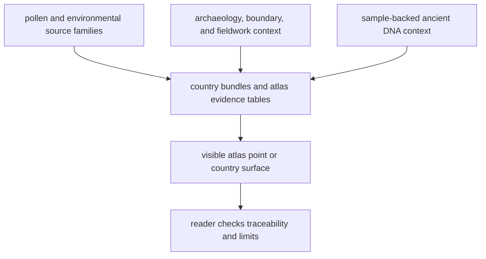

# Bijux Pollenomics

`bijux-pollenomics` is a checked-in pollenomics and environmental evidence
repository with ancient DNA, archaeology, and map products as contextual
surfaces. It gathers pollen-context layers, environmental archaeology context,
boundary geometry, fieldwork material, paper-backed sample evidence, and public
report outputs into one repository that a reader can inspect directly.

The central public question is broader than one atlas layer: which tracked data
families does this repository really own, how strong is each one today, and
which files support the current Nordic outputs without pretending that thin
animal aDNA extraction already equals the whole pollenomics engine?

<!-- bijux-pollenomics-badges:generated:start -->

<!-- bijux-pollenomics-badges:generated:end -->

## Start Here

  <a class="md-button md-button--primary" href="https://bijux.io/bijux-pollenomics/02-bijux-pollenomics-data/">Open the data system guide</a>
  <a class="md-button" href="https://bijux.io/bijux-pollenomics/02-bijux-pollenomics-data/sources/source-comparison/">Open the source comparison</a>
  <a class="md-button" href="https://bijux.io/bijux-pollenomics/05-nordic-evidence-atlas/">Open the Nordic Evidence Atlas</a>
  <a class="md-button" href="https://bijux.io/bijux-pollenomics/report/nordic-atlas/nordic-atlas_map.html">Open the shipped atlas bundle</a>
  <a class="md-button" href="https://bijux.io/bijux-pollenomics/02-bijux-pollenomics-data/outputs/published-reports/">Open the country output reference</a>
  <a class="md-button" href="https://bijux.io/bijux-pollenomics/report/repository_truth_posture.md">Open the repository truth packet</a>
  <a class="md-button" href="https://bijux.io/bijux-pollenomics/01-bijux-pollenomics/">Open the runtime handbook</a>
  <a class="md-button" href="https://bijux.io/bijux-pollenomics/03-bijux-pollenomics-maintain/">Open the maintainer handbook</a>

Read the site in this order:

## What The Repository Publishes

- tracked source trees for pollen, environmental archaeology, boundaries, and
  ancient DNA under `data/`
- one shared atlas view under [`docs/report/nordic-atlas/`](report/nordic-atlas/nordic-atlas_map.html)
- checked country bundles under [`docs/report/`](report/published_reports_summary.json)
- reader-facing data-system pages that explain the source families rather than
  only the current aDNA slice
- public truth and progress packets under [`docs/report/`](report/published_reports_summary.json)

## Fieldwork Record

The fieldwork section is intentionally narrow. It anchors one mapped point to a
real visit without pretending that field media replaces curated sample, paper,
or supplement evidence.

  <a class="md-button md-button--primary" href="https://bijux.io/bijux-pollenomics/04-fieldwork/lyngsjon-lake-fieldwork/">Open the fieldwork page</a>
  <a class="md-button" href="gallery/2026-02-26-data-collection.mp4">Open the field video</a>

  <figure class="bijux-media-card">
    
    <figcaption>Lyngsjön Lake, southwest of Kristianstad, during winter field collection on 2026-02-26.</figcaption>
  </figure>

## What The Repository Does Not Claim

- that map proximity alone establishes scientific weight
- that every visible layer has identical provenance quality
- that a project list alone is enough to justify a mapped point
- that unresolved or region-only geography should be published like exact site evidence
- that the current thin animal aDNA atlas candidate set means the repository is already scientifically broad
- that the repository is already the full cross-evidence pollenomics engine

## Read By Question

- what the runtime rebuilds: [01-bijux-pollenomics](01-bijux-pollenomics/index.md)
- what the tracked data system and source families are: [02-bijux-pollenomics-data](02-bijux-pollenomics-data/index.md)
- how the map points are built and filtered: [05-nordic-evidence-atlas](05-nordic-evidence-atlas/index.md)
- how release and docs integrity are enforced: [03-bijux-pollenomics-maintain](03-bijux-pollenomics-maintain/index.md)
