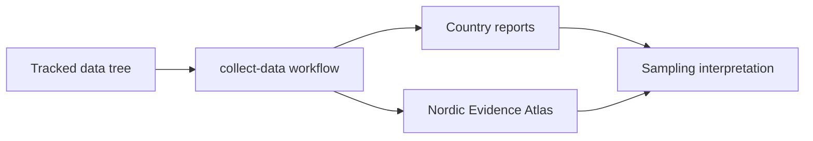
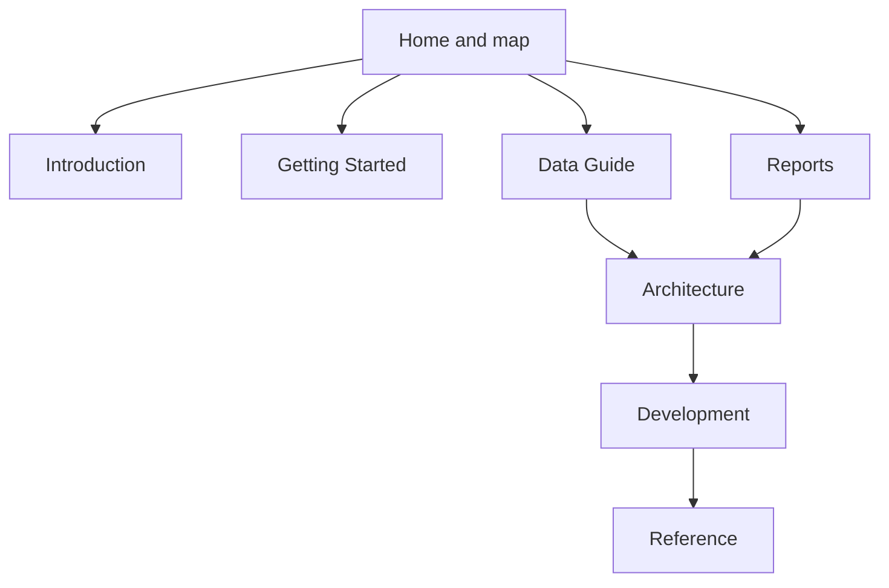

# Docs Index

This is the canonical documentation home for `bijux-pollenomics`.

The first page leads with the checked-in Nordic Evidence Atlas because the atlas is the shortest way to inspect the repository’s current outputs: AADR sample points, LandClim pollen sequences and REVEALS grid cells, Neotoma pollen sites, SEAD sites, Swedish archaeology density from RAÄ, and Nordic country boundaries.

The current atlas groups layers by role, exposes filter state in the URL, and shows the AADR release as one provenance label inside a broader multi-source view.

  <strong>Start with the atlas.</strong> The rest of the docs explains exactly where its layers come from, which commands rebuild it, and which parts of the current behavior are still limited in scope.

  

    <h3>What this site can prove</h3>
    
It can prove which files are checked in, which commands build them, which data sources are currently wired into the repository, and which limitations are intentionally left in place.

  

  

    <h3>What this site cannot prove</h3>
    
It cannot prove that spatial proximity implies sampling priority, that the current evidence stack is scientifically complete, or that upstream services will always return identical results in the future.

  

  <a class="md-button md-button--primary" href="report/nordic-evidence-atlas/nordic-evidence-atlas_v62.0_map.html">Open the Nordic Evidence Atlas</a>
  <a class="md-button" href="03-data-guide/">Read the data guide</a>
  <a class="md-button" href="04-reports/">Read the reports guide</a>
  <a class="md-button" href="06-development/">Read the development workflow</a>

  <iframe src="report/nordic-evidence-atlas/nordic-evidence-atlas_v62.0_map.html" title="Nordic Evidence Atlas"></iframe>

## What This Documentation Set Explains

The docs are organized so a reader can move from the visible output into the supporting explanation they need:

- what the repository produces today
- how the six tracked data categories are collected
- how reports and the shared map are generated
- how the source tree is organized
- how local workflows stay reproducible

## Reading Map

## Canonical Sections

- [Introduction](01-introduction/index.md)
- [Getting Started](02-getting-started/index.md)
- [Data Guide](03-data-guide/index.md)
- [Reports](04-reports/index.md)
- [Architecture](05-architecture/index.md)
- [Development](06-development/index.md)
- [Reference](07-reference/index.md)

## Choose a Path

- trying to understand the product goal: start with [Introduction](01-introduction/index.md)
- trying to reproduce the repository state on a fresh machine: use [Getting Started](02-getting-started/index.md)
- trying to understand one source dataset: go to [Data Guide](03-data-guide/index.md)
- trying to understand the interactive outputs: go to [Reports](04-reports/index.md)
- trying to extend the pipeline safely: read [Architecture](05-architecture/index.md) and [Development](06-development/index.md)
- trying to find exact commands, paths, or artifact names: use [Reference](07-reference/index.md)

## Reading Standard

If a page in this site makes a claim about a command, file, layer, or artifact, that claim should be traceable to code or checked-in outputs in the same repository state. When a limit exists, the docs should say so directly instead of implying missing behavior is already implemented.

## Reading Rule

Use section index pages first when you are entering a topic for the first time. Use reference pages when you need commands, directories, file patterns, or output expectations verified against the current repository state.

## Purpose

This page explains the `bijux-pollenomics` documentation spine and routes readers to the checked-in Nordic Evidence Atlas and the canonical docs that explain it.

## Stability

This page is part of the canonical docs spine. Keep it aligned with the checked-in outputs and the current repository workflow.
