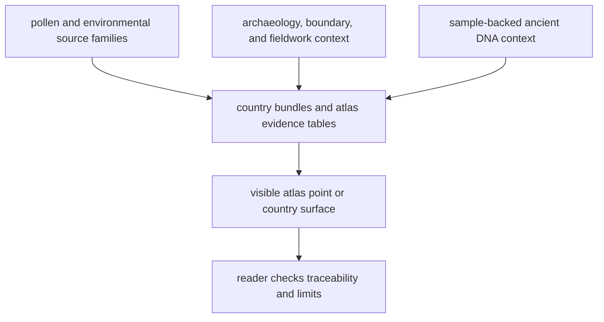

# Bijux Pollenomics

`bijux-pollenomics` publishes public evidence surfaces about Nordic pollenomics,
environmental context, archaeology, boundaries, fieldwork, and animal ancient
DNA. This site is split on purpose:

- the public route explains what readers can inspect and trust today
- the internal route explains how maintainers keep the repository honest

Start on the public side unless you are actively maintaining the repository.

<!-- bijux-pollenomics-badges:generated:start -->

<!-- bijux-pollenomics-badges:generated:end -->

## Start Here

  <a class="md-button md-button--primary" href="public/">Open the public guide</a>
  <a class="md-button" href="01-bijux-pollenomics/">Open the product guide</a>
  <a class="md-button" href="02-bijux-pollenomics-data/">Open the data guide</a>
  <a class="md-button" href="report/">Open the report portal</a>
  <a class="md-button" href="report/how-to-read.md">How to read the report tree</a>
  <a class="md-button" href="05-nordic-evidence-atlas/">Open the atlas guide</a>
  <a class="md-button" href="04-fieldwork/">Open the fieldwork record</a>
  <a class="md-button" href="internal/">Open the internal guide</a>

Read the site in this order:

## Public Surface

- public guide: [public/index.md](public/index.md)
- product guide: [01-bijux-pollenomics](01-bijux-pollenomics/index.md)
- data guide: [02-bijux-pollenomics-data](02-bijux-pollenomics-data/index.md)
- report portal: [report/index.md](report/index.md)
- Nordic atlas guide: [05-nordic-evidence-atlas](05-nordic-evidence-atlas/index.md)
- fieldwork record: [04-fieldwork](04-fieldwork/index.md)

The public side should explain the repository without assuming that the reader
already knows the codebase, package layout, or build system.

## Internal Surface

The internal side is for maintainers. It explains release checks, documentation
integrity, GitHub workflows, and repository health rules.

- internal guide: [internal/index.md](internal/index.md)
- maintainer handbook: [03-bijux-pollenomics-maintain](03-bijux-pollenomics-maintain/index.md)

## Fieldwork Record

The fieldwork section is intentionally narrow. It anchors one mapped point to a
real visit without pretending that field media replaces curated sample, paper,
or supplement evidence.

  <a class="md-button md-button--primary" href="https://bijux.io/bijux-pollenomics/04-fieldwork/lyngsjon-lake-fieldwork/">Open the fieldwork page</a>
  <a class="md-button" href="gallery/2026-02-26-data-collection.mp4">Open the field video</a>

  <figure class="bijux-media-card">
    
    <figcaption>Lyngsjön Lake, southwest of Kristianstad, during winter field collection on 2026-02-26.</figcaption>
  </figure>

## What The Repository Does Not Claim

- that map proximity alone establishes scientific weight
- that every visible layer has identical provenance quality
- that a project list alone is enough to justify a mapped point
- that unresolved or region-only geography should be published like exact site evidence
- that the current narrow animal aDNA atlas candidate surface means the repository is already scientifically broad
- that the repository is already the full cross-evidence pollenomics engine

## Read By Question

- what the runtime rebuilds: [01-bijux-pollenomics](01-bijux-pollenomics/index.md)
- what this repository does and where its limits are:
  [public guide](public/index.md)
- what the tracked data system and source families are: [02-bijux-pollenomics-data](02-bijux-pollenomics-data/index.md)
- how the publication tree is organized for readers: [report portal](report/index.md)
- how the map points, filters, and honesty surfaces work: [05-nordic-evidence-atlas](05-nordic-evidence-atlas/index.md)
- how repository maintenance works: [internal guide](internal/index.md)
