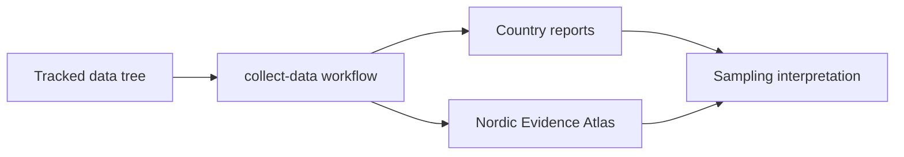
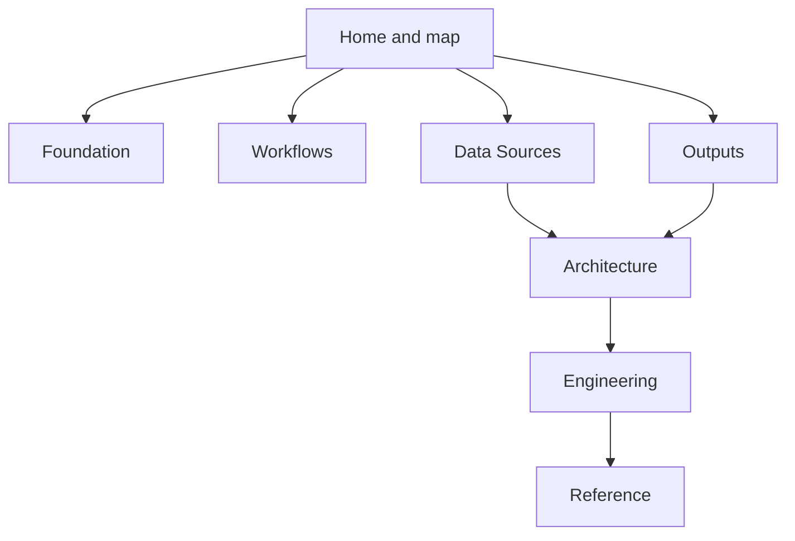

# Docs Index

`bijux-pollenomics` is a static, reviewable evidence workspace. The repository collects tracked Nordic source data, normalizes it into stable files, and publishes those files as country bundles plus one shared interactive atlas.

The homepage leads with the checked-in Nordic Evidence Atlas because it is the fastest way to inspect what the repository currently produces: AADR sample points, LandClim pollen sequences and REVEALS grid cells, Neotoma pollen sites, SEAD sites, Swedish archaeology density from RAÄ, fieldwork media, and Nordic country boundaries.

  <strong>Start with the atlas.</strong> The rest of the site exists to answer four questions: what the repository is for, which commands rebuild it, where the files come from, and which limitations are still intentional.

  

    <h3>What this site proves</h3>
    
Which files are checked in, which commands rebuild them, which source categories feed the atlas, and which boundaries the repository is deliberately holding.

  

  

    <h3>What this site does not prove</h3>
    
That proximity implies sampling value, that the present layers are scientifically complete, or that mutable upstream services will always return identical data in the future.

  

  <a class="md-button md-button--primary" href="report/nordic-atlas/nordic-atlas_map.html">Open the Nordic Evidence Atlas</a>
  <a class="md-button" href="foundation/">Read the product framing</a>
  <a class="md-button" href="workflows/">Read the rebuild workflow</a>
  <a class="md-button" href="reference/">Open the command and layout reference</a>

  <iframe src="report/nordic-atlas/nordic-atlas_map.html" title="Nordic Evidence Atlas"></iframe>

## Start Here

Use the path that matches what you need right now:

- understanding the repository goal and current boundary: start with [Foundation](foundation/index.md)
- reproducing the checked-in state on a fresh machine: use [Workflows](workflows/index.md)
- checking what each tracked dataset contributes: use [Data Sources](data-sources/index.md)
- reviewing the atlas, country bundles, and generated publication tree: use [Outputs](outputs/index.md)
- extending code without breaking repository seams: read [Architecture](architecture/index.md) and [Engineering](engineering/index.md)
- verifying exact commands, directories, and artifact names: use [Reference](reference/index.md)

## Fieldwork Evidence

The website now also carries checked-in field media from the Lyngsjön Lake sampling visit on 2026-02-26. That material anchors one atlas point to a real collection day on the lake ice rather than to database outputs alone.

  <a class="md-button md-button--primary" href="outputs/lyngsjon-lake-fieldwork/">Open the fieldwork page</a>
  <a class="md-button" href="gallery/2026-02-26-data-collection.mp4">Open the field video</a>

  <figure class="bijux-media-card">
    
    <figcaption>Lyngsjön Lake, southwest of Kristianstad, during winter field collection on 2026-02-26.</figcaption>
  </figure>

## What This Documentation Set Explains

The docs are organized so a reader can move from the visible output into the supporting explanation they need:

- what the repository produces today and why
- how the tracked data categories are collected
- how reports and the shared map are generated
- how the code and filesystem are divided by responsibility
- how maintainers verify and review long-lived changes

## Reading Map

## Documentation Sections

- [Foundation](foundation/index.md)
- [Outputs](outputs/index.md)
- [Workflows](workflows/index.md)
- [Data Sources](data-sources/index.md)
- [Architecture](architecture/index.md)
- [Engineering](engineering/index.md)
- [Reference](reference/index.md)

## Purpose

This page routes readers from the checked-in atlas into the documentation sections that explain repository scope, rebuild workflows, data provenance, architecture seams, and exact file contracts.

## Stability

This page is part of the canonical docs spine. Keep it aligned with the checked-in outputs and the current repository workflow.
