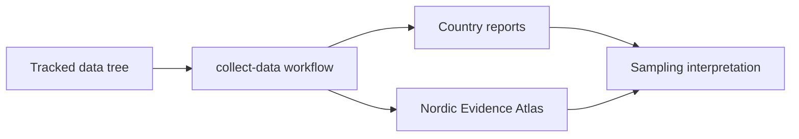
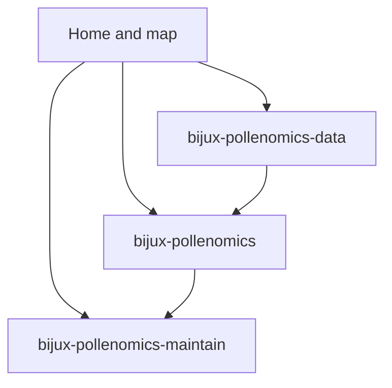

# Bijux Pollenomics

`bijux-pollenomics` is a static, reviewable evidence workspace. The repository collects tracked Nordic source data, normalizes it into stable files, and publishes those files as country bundles plus one shared interactive atlas.

Start here with the checked-in Nordic Evidence Atlas. It is the fastest way to
inspect what the repository currently produces: AADR sample points, LandClim
pollen sequences and REVEALS grid cells, Neotoma pollen sites, SEAD sites,
Swedish archaeology density from RAÄ, fieldwork media, and Nordic country
boundaries.

The page layout now follows the package-handbook pattern used across Bijux
documentation: one handbook for the runtime package, one reference tree for
tracked data and outputs, and one handbook for repository maintenance.

  <strong>Start with the atlas.</strong> The rest of the site exists to answer four questions: what the repository is for, which commands rebuild it, where the files come from, and which limitations are still intentional.

  

    <h3>What this site proves</h3>
    
Which files are checked in, which commands rebuild them, which source categories feed the atlas, and which boundaries the repository is deliberately holding.

  

  

    <h3>What this site does not prove</h3>
    
That proximity implies sampling value, that the present layers are scientifically complete, or that mutable upstream services will always return identical data in the future.

  

  <a class="md-button md-button--primary" href="report/nordic-atlas/nordic-atlas_map.html">Open the Nordic Evidence Atlas</a>
  <a class="md-button" href="bijux-pollenomics/">Open the package handbook</a>
  <a class="md-button" href="bijux-pollenomics-data/">Open the data reference</a>
  <a class="md-button" href="bijux-pollenomics-maintain/">Open the maintainer handbook</a>

  <iframe src="report/nordic-atlas/nordic-atlas_map.html" title="Nordic Evidence Atlas"></iframe>

## Start Here

Use the path that matches what you need right now:

- understanding the runtime package boundary and public contracts: start with
  [bijux-pollenomics](bijux-pollenomics/index.md)
- checking what each tracked dataset contributes and where it lands: use
  [bijux-pollenomics-data](bijux-pollenomics-data/index.md)
- reviewing CI, release, docs, and make-system maintenance rules: use
  [bijux-pollenomics-maintain](bijux-pollenomics-maintain/index.md)
- inspecting the current visible artifact first: open the embedded atlas and the
  checked-in `docs/report/` bundles

## Fieldwork Evidence

The website now also carries checked-in field media from the Lyngsjön Lake sampling visit on 2026-02-26. That material anchors one atlas point to a real collection day on the lake ice rather than to database outputs alone.

  <a class="md-button md-button--primary" href="bijux-pollenomics-data/fieldwork/lyngsjon-lake-fieldwork/">Open the fieldwork page</a>
  <a class="md-button" href="gallery/2026-02-26-data-collection.mp4">Open the field video</a>

  <figure class="bijux-media-card">
    
    <figcaption>Lyngsjön Lake, southwest of Kristianstad, during winter field collection on 2026-02-26.</figcaption>
  </figure>

## What This Documentation Set Explains

The docs are organized so a reader can move from the visible output into the supporting explanation they need:

- what the repository produces today and why
- how the tracked data categories are collected and normalized
- how reports and the shared map are generated
- how the runtime package is divided by responsibility
- how maintainers verify and review long-lived changes

## Reading Map

## Documentation Families

- [bijux-pollenomics](bijux-pollenomics/index.md)
- [bijux-pollenomics-data](bijux-pollenomics-data/index.md)
- [bijux-pollenomics-maintain](bijux-pollenomics-maintain/index.md)

## Current Issues and Migration Notes

- package limits and active risks: [Known Limitations](bijux-pollenomics/quality/known-limitations.md)
- data-tree migration issues: [Migration Issues](bijux-pollenomics-data/foundation/migration-issues.md)
- package risk tracking: [Risk Register](bijux-pollenomics/quality/risk-register.md)

## Purpose

Use this page to move from the checked-in atlas into the runtime, data, and
maintainer handbooks that explain repository scope, rebuild workflows, data
provenance, architecture seams, and exact file contracts.

## Stability

This page is part of the canonical docs spine. Keep it aligned with the checked-in outputs and the current repository workflow.
