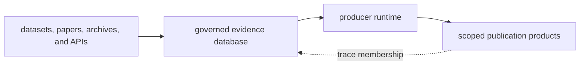
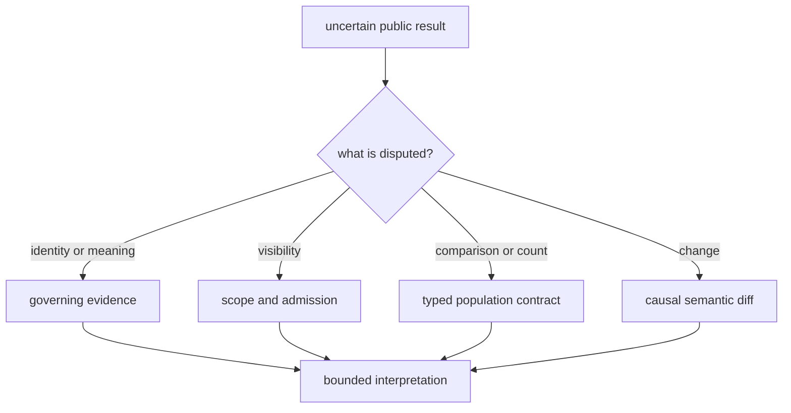
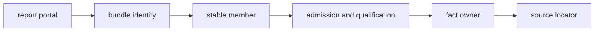
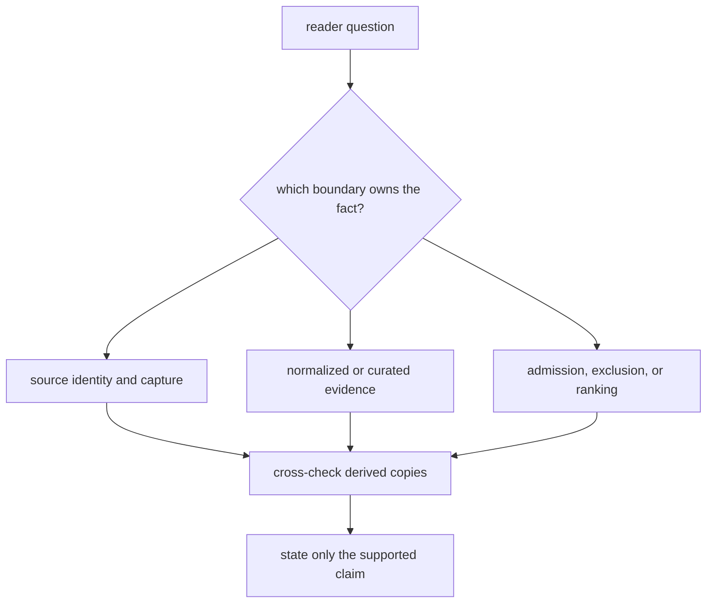
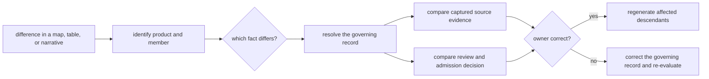
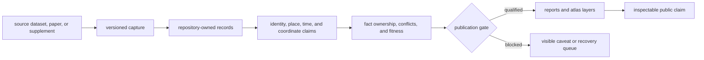
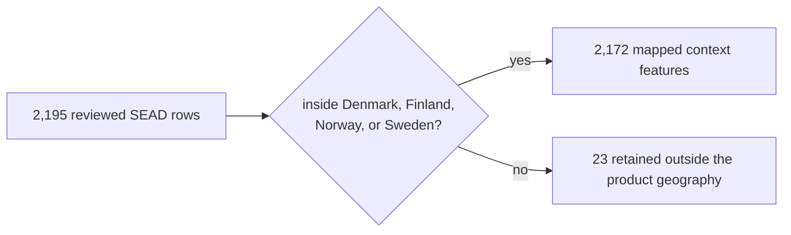
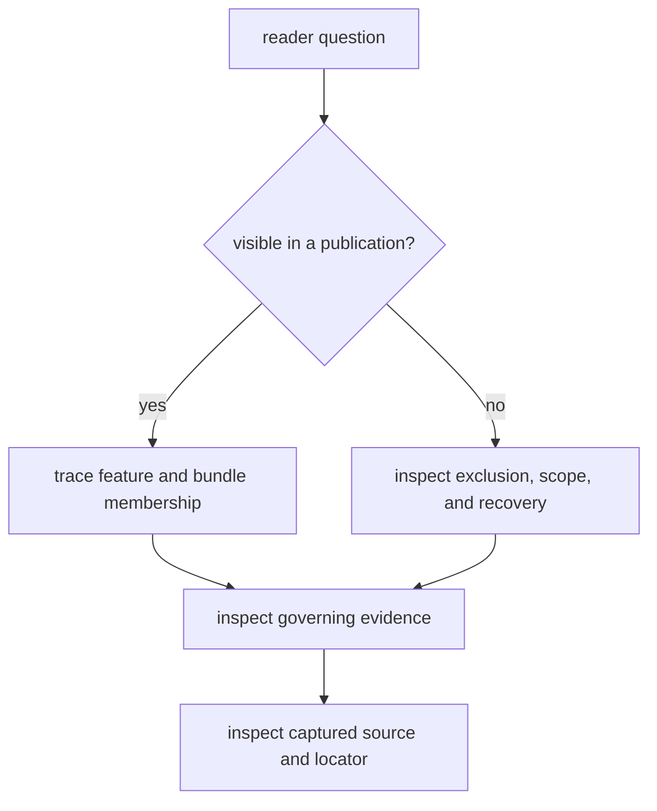
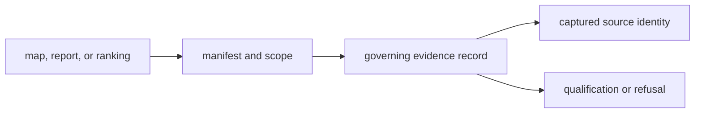
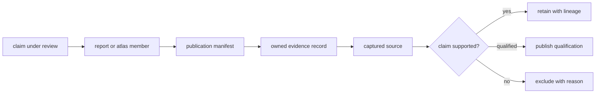

# Bijux Pollenomics

`bijux-pollenomics` connects curated evidence to public maps and reports about
pollen, palaeoenvironmental context, archaeology, hydrography, fieldwork, and
ancient DNA. Every publication belongs to a traceable chain: source capture,
the family-specific preparation stages that are materially present, claim
fitness, product membership, and derived output. A published descendant does
not prove that a missing normalized or review artifact exists.

Evidence is traversable in both directions. A map or country report resolves
backward through product membership, curation, governed facts, and captured
sources. A source correction resolves forward through dependent claims,
admission decisions, and affected publications.

<!-- bijux-pollenomics-badges:generated:start -->

<!-- bijux-pollenomics-badges:generated:end -->

## Current Product Contract

The implemented runtime is an atlas builder and evidence-publication system,
not the complete cross-evidence engine suggested by the broader research
direction.

| Available now | Not a current runtime claim |
| --- | --- |
| named source collection and family-specific preparation evidence | general cross-domain harmonization |
| evidence curation, ambiguity, conflict, recovery, and refusal records | automatic reconciliation of unlike observation units |
| heuristic candidate ranking with declared inputs and sensitivity | general scientific inference or causal interpretation |
| manifested world, regional, country, atlas, and lake products | workflow-wide replay and semantic diff execution |

This boundary is executable through `product-scope` and `surface-map`. A
planned surface remains outside the product until it has an owned interface,
state transition, governed result, and fitness contract.

### Read The Product As Three Surfaces

```mermaid
flowchart LR
    Sources["datasets, papers, archives, and APIs"] --> Database["governed evidence database"]
    Database --> Runtime["producer runtime"]
    Runtime --> Products["scoped publication products"]
    Products -. "trace membership" .-> Database
```

| Surface | Reader question |
| --- | --- |
| governed evidence database | what was captured, prepared, related, disputed, excluded, or left unresolved? |
| producer runtime | which owned transformation, decision, or validation produced this state? |
| publication products | which eligible members support this declared geography, role, and claim? |

The evidence database is not backstage implementation detail. It preserves
the negative and unresolved state that keeps the public layer honest. The
runtime is not the database packaged into a wheel, and a publication is not a
complete export of either. Trust comes from resolving a product member through
the runtime decision to its governing evidence and source.

## Start Here

  <a class="md-button md-button--primary" href="public/pollenomics/">Open the product guide</a>
  <a class="md-button" href="public/pollenomics-data/">Open the data guide</a>
  <a class="md-button" href="public/pollenomics-data/database/">Inspect the evidence database</a>
  <a class="md-button" href="public/pollenomics-data/curation/">Inspect evidence curation</a>
  <a class="md-button" href="report/">Open the report portal</a>
  <a class="md-button" href="report/how-to-read/">How to read the report tree</a>
  <a class="md-button" href="public/nordic-atlas/">Open the atlas guide</a>
  <a class="md-button" href="public/fieldwork/">Open the fieldwork record</a>

## Choose By Outcome

| You want to… | Begin here | Identify first | Leave with… |
| --- | --- | --- | --- |
| understand what Bijux Pollenomics is | [product guide](public/pollenomics/index.md) | the claim and evidence family in question | product responsibilities, interfaces, and limits |
| understand how the database earns trust | [evidence database](public/pollenomics-data/database/index.md) | typed object, relation, and repository revision | identity, fact ownership, state, and projection boundaries |
| understand the complete data lifecycle | [data guide](public/pollenomics-data/index.md) | source-native unit and governed record identity | source, curation, evidence, and publication boundaries |
| explain an admission, qualification, or refusal | [curation guide](public/pollenomics-data/curation/index.md) | object identity, claim dimension, and intended product | governing evidence, decision rule, outcome, and recovery condition |
| inspect the published state | [report portal](report/index.md) | bundle manifest and member ID | maps, tables, reviews, refusals, and their shared scope |
| evaluate one visible feature | [Nordic atlas](public/nordic-atlas/index.md) | feature ID, layer role, and point class | coordinate posture, time posture, admission, and traceability |
| evaluate a lake-priority result | [Sweden lake priorities](public/nordic-atlas/sweden-lake-priorities/index.md) | lake registry ID, scenario, and model version | ranking meaning, stability, and missing field evidence |
| inspect a direct visit | [fieldwork](public/fieldwork/index.md) | event ID, date, location, and media identity | situated observation and its claim boundary |

### Choose By Uncertainty

When the object is already visible but its meaning is uncertain, start at the
boundary that owns the uncertainty:

| Uncertainty | Resolve first | Do not infer from |
| --- | --- | --- |
| “What exactly is this marker?” | feature identity, evidence role, and bundle membership | icon, color, label, or popup density |
| “Why is an expected record missing?” | capture scope, normalization membership, admission, product scope, and active filters | non-visibility alone |
| “Can these two layers be compared?” | observation units, lineage independence, spatial support, and temporal posture | co-location in one viewport |
| “What does this count measure?” | observation unit, eligible population, exclusions, scope, and governing authority | a headline total |
| “Why did this result change?” | source, normalization, curation, admission, analysis, and rendering diffs in causal order | regeneration timestamp or changed appearance |
| “Can this rank drive fieldwork?” | scenario, weights, sensitivity, missing field evidence, and decision owner | ordinal position alone |

```mermaid
flowchart TD
    Uncertainty["uncertain public result"] --> Kind{"what is disputed?"}
    Kind -->|identity or meaning| Evidence["governing evidence"]
    Kind -->|visibility| Decision["scope and admission"]
    Kind -->|comparison or count| Contract["typed population contract"]
    Kind -->|change| Diff["causal semantic diff"]
    Evidence --> Claim["bounded interpretation"]
    Decision --> Claim
    Contract --> Claim
    Diff --> Claim
```

This route keeps the polished publication useful for discovery while moving a
consequential interpretation to the narrowest authority that can support it.

## Take A Three-Minute Evidence Tour

The shortest complete tour begins with one published object and ends at the
captured material that supports it:

1. Open the [report portal](report/index.md) and choose a geographic bundle.
2. Read the bundle manifest before opening its map; record the version, scope,
   and stable member identifier.
3. Follow the member through the [publication model](public/pollenomics-data/publications/index.md)
   to its evidence or traceability row and admission outcome.
4. Resolve the row through the [evidence database](public/pollenomics-data/database/index.md)
   to its fact owner, source-native identity, and captured locator.

```mermaid
flowchart LR
    Portal["report portal"] --> Manifest["bundle identity"]
    Manifest --> Member["stable member"]
    Member --> Decision["admission and qualification"]
    Decision --> Owner["fact owner"]
    Owner --> Capture["source locator"]
```

The return path is equally important. A corrected source fact changes its
owned evidence record first, then every dependent decision and publication is
re-evaluated. If the trace stops at a popup, summary count, or narrative
sentence, the audit is incomplete.

For a concrete sample-level route, use the animal evidence records: begin with
an atlas feature, resolve its accountability row, then inspect project-owned
sample identity, locality, chronology, coordinate provenance, and supporting
material. For a contextual source, begin with the published site or grid cell
and preserve that source family's observation unit and temporal posture.

## Find The Authority

Reader-visible information often crosses several files, but each fact has one
governing owner. Start with the disputed question and follow that owner before
interpreting a convenient copy.

| Question | Governing surface | Derived surfaces to cross-check |
| --- | --- | --- |
| Which upstream object entered the repository? | source-family capture, identity, and retrieval record | collection summary and normalized record |
| What does a normalized field mean? | source-family contract and normalization record | review tables and publication rows |
| Which animal sample is this? | project-owned sample foundation | species view, atlas candidate, and report member |
| How precise are its place and time? | sample locality, chronology, and coordinate evidence | GeoJSON feature, table row, and narrative |
| Why is it visible in one product? | admission decision and bundle manifest | rendered map, country page, and summary count |
| Why is a known record absent? | exclusion, ambiguity, recovery, or scope decision | readiness and truth-posture summaries |
| What does a lake rank mean? | ranking manifest, method inputs, and sensitivity evidence | shortlist map and fieldwork-preparation packet |

```mermaid
flowchart TB
    Question["reader question"] --> Owner{"which boundary owns the fact?"}
    Owner --> Source["source identity and capture"]
    Owner --> Evidence["normalized or curated evidence"]
    Owner --> Decision["admission, exclusion, or ranking"]
    Source --> CrossCheck["cross-check derived copies"]
    Evidence --> CrossCheck
    Decision --> CrossCheck
    CrossCheck --> Wording["state only the supported claim"]
```

When two surfaces disagree, the owning record is the starting point for
diagnosis, not permission to select the value that looks most plausible.

### Resolve A Disagreement

A disagreement is a lineage problem until the governing records show
otherwise. Start from the published member, identify the fact in dispute, and
walk to the layer that owns that fact. Derived copies help locate the break;
they do not become authoritative because they are newer or easier to read.

```mermaid
flowchart LR
    Difference["difference in a map, table, or narrative"] --> Member["identify product and member"]
    Member --> Fact{"which fact differs?"}
    Fact --> Owner["resolve the governing record"]
    Owner --> Source["compare captured source evidence"]
    Owner --> Decision["compare review and admission decision"]
    Source --> Outcome{"owner correct?"}
    Decision --> Outcome
    Outcome -->|yes| Descendants["regenerate affected descendants"]
    Outcome -->|no| Authority["correct the governing record and re-evaluate"]
```

| Disagreement | Start with | Then inspect |
| --- | --- | --- |
| product count | bundle manifest and eligible population | exclusions, qualifications, geography, and duplicate policy |
| identity or label | source-native key and governed identity record | aliases, relations, and normalization rule |
| coordinate | locality and coordinate evidence owner | source wording, supplied versus derived basis, precision, and conflicts |
| chronology | sample or context chronology owner | dating basis, calibration, interval normalization, and comparability review |
| country or region | geography registry and product scope | boundary version, spatial rule, and member geometry |
| narrative wording | claim-language and release-readiness contract | evidence posture, refusal, and visible caveat |

The public site is the reader-facing interpretation, generated reports are
inspectable product state, and the governing record owns the underlying fact.
A defensible correction changes the owner, re-runs its dependent decisions,
and regenerates descendants; editing only a rendered page conceals the break.

## From Source To Public Claim

```mermaid
flowchart LR
    Source["source dataset, paper, or supplement"] --> Capture["versioned capture"]
    Capture --> Normalize["repository-owned records"]
    Normalize --> Evidence["identity, place, time, and coordinate claims"]
    Evidence --> Curate["fact ownership, conflicts, and fitness"]
    Curate --> Gate{"publication gate"}
    Gate -->|qualified| Reports["reports and atlas layers"]
    Gate -->|blocked| Review["visible caveat or recovery queue"]
    Reports --> Reader["inspectable public claim"]
```

Source files are never promoted merely because they can be plotted. The
publication gate evaluates the evidence appropriate to each family. Boundary
geometry can frame a map without becoming scientific evidence; pollen and
archaeology layers retain their own temporal semantics; and animal aDNA needs
sample-level support before an exact point or chronology can be asserted.

### Database Preparation Is Evidence Work

The database is prepared through explicit changes in responsibility, not by
flattening every source into a common table:

| Boundary | Decision made | Evidence retained |
| --- | --- | --- |
| capture | which upstream members and relations were actually obtained | source release, locator, native identity, retrieval context, bytes or response identity, and access outcome |
| normalization | how a native member becomes addressable without losing source meaning | typed repository key, native value, transformation rule, null state, units, geometry, time basis, and evidence role |
| curation | which evidence governs identity, place, time, taxonomy, or another disputed fact | competing claims, owner, decision reason, precision, conflict, and recovery condition |
| admission | whether one governed member supports one named product claim | eligible population, rule result, qualification or exclusion, and product membership |
| publication | how admitted claims become a reader-visible bundle | manifest, feature identity, lineage links, caveats, and scope |

The transitions remain queryable in both directions. A captured row can be
retained without a normalized point; a normalized member can remain unresolved
or excluded; and a publication can be regenerated without becoming the owner
of its source facts. This is why preparation artifacts, review ledgers, and
refusals are first-class database results rather than intermediate debris.

## How A Claim Earns Trust

| Reader question | Evidence required |
| --- | --- |
| Is this the source record that was acquired? | source identity, version, retrieval context, and content lineage |
| Does the normalized record preserve what the source actually said? | field mapping, durable identifiers, null handling, and transformation notes |
| Is the location or date precise enough for this use? | locality, coordinate, chronology, and precision evidence owned by the record |
| Why is the record visible—or absent? | publication rule, admission result, exclusion reason, and product scope |
| Can the public claim be reproduced? | manifest membership, governed inputs, command contract, and checked-in output |

No single map popup answers all five questions. Consequential interpretation
continues from publication to evidence and then to the governing source.

### A Count Audit In Practice

The checked-in SEAD state contains 2,195 reviewed inventory rows and 2,172
mapped Nordic features. The 23-row difference is not deduplication and not
silent evidence loss: those records retain coordinates but do not fall within
the four publication-country boundary geometries.

```mermaid
flowchart LR
    Inventory["2,195 reviewed SEAD rows"] --> Boundary{"inside Denmark, Finland,<br/>Norway, or Sweden?"}
    Boundary -->|yes| Mapped["2,172 mapped context features"]
    Boundary -->|no| Outside["23 retained outside the product geography"]
```

This is how a number becomes trustworthy: define the observation unit, name
the candidate population, identify the selection rule, and account for every
non-member. A percentage that omitted the 23 retained records or called them
failed normalization would describe a different—and incorrect—process.

Animal preparation requires a different audit because three prominent counts
belong to three contracts:

| Count | Population | Defensible statement |
| ---: | --- | --- |
| 894 | sample-foundation preparation rows | grounding and blockers are classified across 10 species and 40 projects |
| 868 | recovered project sample-master identities | these source rows resolve to final governed sample identities |
| 234 | animal point-product members | 233 sample-backed points and one qualified project-context feature satisfy the current spatial contract |

These are related evidence surfaces, not a numerator and denominator. The
foundation includes 502 fully grounded and 256 partially grounded rows plus
136 rows blocked by metadata, location detail, or chronology. The publication
surface answers a narrower spatial question and includes one member that is
explicitly not part of the recovered-sample population.

### Carry A Reusable Evidence Packet

| Claim being reused | Minimum packet |
| --- | --- |
| one published feature | product version and scope, stable member and evidence identifiers, source lineage, place and time posture, admission result, and caveats |
| a count or coverage statement | observation unit, numerator, eligible population, exclusions, geography, source version, and governing manifest or review |
| a cross-layer comparison | both feature identities, evidence roles, spatial support, temporal compatibility, comparison rule, and source-specific limits |
| a lake priority | SVAR identity, ranking surface, scenario or aggregate definition, weights, source inputs, sensitivity evidence, and required field review |
| an absence | expected identity, capture scope, product scope, filter state, recovery posture, and exclusion or refusal reason |

A screenshot, ordinal rank, or narrative sentence can orient a reader, but it
cannot replace this packet. Reuse is defensible when another reader can recover
the product population, the governing evidence, and the qualification without
reconstructing undocumented context.

## Collection At A Glance

| Evidence family | Checked-in posture | Reader-safe interpretation |
| --- | --- | --- |
| LandClim | 492 site sequences; 482 carry numeric BP intervals | time-aware pollen context at the sequence level |
| Neotoma | 200 sites; 170 are numerically comparable, 5 contextual-only, and 25 unresolved | pollen context with explicit temporal posture |
| SEAD | 2,195 reviewed inventory rows; 2,172 mapped Nordic features; no numeric intervals | archaeology context, not same-period support |
| RAÄ | density source covering 761,917 published Swedish sites | Sweden-specific spatial archaeology context |
| SVAR | 40,565 candidate lakes | hydrographic identity and selection units, not scientific evidence weight |
| animal sample foundation | 894 preparation rows | grounding and blocker posture, not sample or publication membership |
| animal aDNA | 868 recovered sample rows across 40 projects | curated sample evidence with uneven project completeness |
| animal atlas points | 234 reviewed rows | a conservative publication subset, not the size of the source collection |

The collection is intentionally larger than any one publication. Governed
records may remain contextual, unresolved, excluded, or queued for recovery
when their evidence cannot support the requested public representation.

### Why The Site Names Seven And Eight Families

The collection summary covers seven collector-managed families: AADR,
boundaries, LandClim, Neotoma, RAÄ, SEAD, and SVAR. The data system describes
eight contracted families because animal ancient DNA enters through a curated
source library of archive projects, papers, supplements, samples, localities,
chronology, and coordinates.

Both counts are correct at their own boundary. Seven identifies the pinned
collector state; eight identifies the full evidence system. Neither identifies
the membership of a world, regional, country, or lake product, which is
declared separately by its manifest and admission records.

The `source-support` command describes the seven collector adapters and their
declared geographic reach. It is a capability inventory, not a collection,
fitness, or completeness verdict. Current material state is reported by the
collection and evidence-state surfaces; claim fitness is decided by the named
product contract.

### Current Integrity Boundaries

The collection is reviewable because incompleteness remains explicit:

| Boundary | Current state | Reader-safe conclusion |
| --- | --- | --- |
| SVAR normalized authority | the capture manifest and summary report 40,565 lakes, but the contracted complete normalized GeoJSON is absent from this checkout | audit published lake rows through their retained SVAR fields; do not claim the full registry is locally traversable |
| human AADR evidence lifecycle | v66 annotation captures and retained human-facing report products exist, but the governed Homo sapiens normalized and review layers have no member artifacts | inspect the retained product at its version; do not claim a complete current path from AADR capture through normalized and reviewed human evidence |
| source-specific review | LandClim, RAÄ, and boundary captures, normalized layers, and publications exist without their contracted review artifacts | interpret the normalized sources at their declared roles; do not describe publication as carrying source-specific review support |
| animal project denominators | four of 40 tracked projects have trustworthy expected sample counts | 868 recovered rows demonstrate recovered identity, not complete project recovery |
| SEAD temporal support | the current site inventory has no numeric intervals | use SEAD as spatial archaeology context, not same-period evidence |
| field observation coverage | one dated Lyngsjön visit is published | inspect that event; do not generalize it to the lake or region |

These are different failure boundaries. Missing normalized evidence concerns
rebuildability, a missing review surface concerns demonstrated fitness, the
animal gap concerns denominator knowledge, the SEAD gap concerns temporal
comparability, and the fieldwork limit concerns observation coverage. A single
“complete” or “incomplete” label would erase the decisions a reader needs to
make.

The [revision and state model](public/pollenomics-data/database/revision-and-state-model.md),
[SVAR guide](public/pollenomics-data/sources/svar.md), [sample records](public/pollenomics-data/evidence/sample-records.md),
[temporal semantics](public/pollenomics-data/evidence/temporal-semantics.md),
and [fieldwork record](public/fieldwork/index.md) expose the governing detail.

## Evidence Surfaces

| Surface | What it preserves | Where to begin |
| --- | --- | --- |
| Source families | upstream identity, acquisition, version, license, and refresh posture | [Sources](public/pollenomics-data/sources/index.md) |
| Curation decisions | fact ownership, admission, conflicts, qualifications, refusals, and recovery conditions | [Curation](public/pollenomics-data/curation/index.md) |
| Evidence dimensions | normalized records plus locality, chronology, coordinate, and temporal semantics | [Evidence](public/pollenomics-data/evidence/index.md) |
| Publications | derived world, regional, country, and lake views | [Publications](public/pollenomics-data/publications/index.md) |
| Atlas interpretation | layer meaning, point posture, filters, and visible limits | [Nordic atlas](public/nordic-atlas/index.md) |
| Field observations | a dated, situated record from Lyngsjön Lake | [Fieldwork](public/fieldwork/index.md) |

```mermaid
flowchart TD
    Reader["reader question"] --> Published{"visible in a publication?"}
    Published -->|yes| Trace["trace feature and bundle membership"]
    Published -->|no| Absence["inspect exclusion, scope, and recovery"]
    Trace --> Evidence["inspect governing evidence"]
    Absence --> Evidence
    Evidence --> Source["inspect captured source and locator"]
```

This route treats visibility and absence as claims that both require evidence.
It also prevents a generated report from becoming the authority for a fact
that belongs to a project record, source-family dataset, or source artifact.

## Evidence Maturity

| Domain | Published role | Current limit |
| --- | --- | --- |
| pollen and environmental archaeology | scientific context in tracked reports and maps | source families retain different coverage and temporal resolution |
| boundaries and hydrography | geographic framing, lake identity, and regional selection | framing does not add scientific support to a nearby record |
| human ancient DNA | versioned AADR metadata context | genotype analysis is outside the runtime |
| animal ancient DNA | sample-backed candidate evidence with visible review | incomplete recovery, broad locality, or weak chronology can block exact publication |
| field observations | direct evidence for a specific visit | one visit does not generalize to site suitability |
| Sweden lake priorities | reproducible decision-support ranking | bathymetry, access, permits, and field verification remain external requirements |

## Interpretation Order

Use a publication for orientation, its manifest for product identity, the
evidence record for scientific qualification, and the captured source for
origin. For an absent feature, begin with scope, exclusion, and recovery rather
than assuming biological absence. For a derived ranking, retain the model and
sensitivity evidence as well as the ordinal result.

```mermaid
flowchart LR
    View["map, report, or ranking"] --> Product["manifest and scope"]
    Product --> Evidence["governing evidence record"]
    Evidence --> Source["captured source identity"]
    Evidence --> Limit["qualification or refusal"]
```

This order keeps the convenient surface useful without allowing it to outrank
the evidence that gives the result meaning.

## Read A Number As A Typed Claim

Before comparing a count, percentage, date, distance, or rank, resolve five
properties:

| Property | Example |
| --- | --- |
| observation unit | project, sample, site, sequence, grid cell, lake, or publication feature |
| population | captured, normalized, reviewed, admitted, excluded, or unresolved records |
| scope | source release, species, geography, temporal window, and product |
| evidence posture | direct, contextual, framing, decision support, or accountability |
| authority | manifest, governed record, review ledger, or source artifact that owns the value |

For example, 2,195 SEAD rows describe the reviewed source inventory, while
2,172 describe mapped Nordic context features. The difference is meaningful
and visible; it must not be silently presented as data loss or ignored in a
coverage percentage.

## Current Publication Family

| Publication | Use it for | Read beside it |
| --- | --- | --- |
| [World evidence surface](report/world/README.md) | broadest shared evidence posture | [world publication contract](report/world/world_map_publication_contract.md) |
| [Europe-plus](report/regions/europe-plus/README.md) | regional selection beyond one country | [Europe-plus traceability](report/regions/europe-plus/europe-plus_point_traceability.md) |
| [Nordic](report/regions/nordic/README.md) | shared Nordic evidence and country comparison | [Nordic scientific review](report/regions/nordic/nordic_scientific_review.md) |
| [Country bundles](report/scopes/index.md) | national samples, citations, warnings, and context | [geography subset validation](report/publication_geography_subset_validation.md) |
| [Sweden lake priorities](public/nordic-atlas/sweden-lake-priorities/index.md) | candidate ranking and sensitivity | [fieldwork preparation](report/countries/sweden/sweden_lake_fieldwork_preparation_v66.md) |
| [Lyngsjön fieldwork](public/fieldwork/lyngsjon-lake-fieldwork/index.md) | one dated site visit and its situated observations | [fieldwork evidence boundary](public/fieldwork/index.md) |

A publication should be read with the artifact that exposes its membership,
traceability, review, or refusal. The narrative gives orientation; the
companion surface establishes why the visible subset and its caveats exist.

## What The Repository Does Not Claim

- that map proximity alone establishes scientific weight
- that every visible layer has identical provenance quality
- that a project list alone is enough to justify a mapped point
- that unresolved or region-only geography should be published like exact site evidence
- that the current narrow animal aDNA atlas candidate surface means the repository is already scientifically broad
- that the repository is already the full cross-evidence pollenomics engine

## Reproduce Or Challenge A Result

The public guides explain meaning and limits. The checked-in report tree shows
the derived result. Source and evidence pages expose the supporting lineage.
When a claim is disputed, begin with the publication manifest and work
upstream; when a source changes, begin with its capture contract and work
forward.

```mermaid
flowchart LR
    Question["claim under review"] --> Output["report or atlas member"]
    Output --> Manifest["publication manifest"]
    Manifest --> Evidence["owned evidence record"]
    Evidence --> Source["captured source"]
    Source --> Decision{"claim supported?"}
    Decision -->|yes| Retain["retain with lineage"]
    Decision -->|qualified| Caveat["publish qualification"]
    Decision -->|no| Refuse["exclude with reason"]
```
