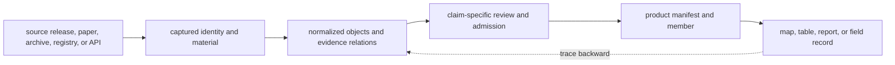

# Bijux Pollenomics

`bijux-pollenomics` connects curated evidence to public maps and reports about
pollen, palaeoenvironmental context, archaeology, hydrography, fieldwork, and
ancient DNA. Its database preserves captured source identity, family-specific
preparation, scientific decisions, publication membership, and the gaps that
prevent stronger claims.

<!-- bijux-pollenomics-badges:generated:start -->

<!-- bijux-pollenomics-badges:generated:end -->

## Start Here

  <a class="md-button md-button--primary" href="public/pollenomics/">Open the product guide</a>
  <a class="md-button" href="public/pollenomics-data/">Open the data guide</a>
  <a class="md-button" href="public/pollenomics-data/domain-language/">Learn the domain language</a>
  <a class="md-button" href="public/pollenomics-data/database/">Inspect the evidence database</a>
  <a class="md-button" href="report/">Open the report portal</a>
  <a class="md-button" href="report/how-to-read/">How to read the report tree</a>
  <a class="md-button" href="public/nordic-atlas/">Open the atlas guide</a>
  <a class="md-button" href="public/fieldwork/">Inspect fieldwork evidence</a>

| Question | Governing route | Identity to retain |
| --- | --- | --- |
| What does the product implement? | [product guide](public/pollenomics/index.md) | runtime version and product-scope contract |
| What does a database term mean? | [domain language](public/pollenomics-data/domain-language.md) | object type, stable ID, and claim dimension |
| How was evidence acquired and prepared? | [data system](public/pollenomics-data/index.md) | source family, source member, stage, and data revision |
| Why was a record admitted, qualified, or refused? | [curation](public/pollenomics-data/curation/index.md) | governed object, decision, proposed use, and reason |
| What belongs to a public product? | [report portal](report/index.md) | manifest, member ID, geography, role, and caveat |
| What does an atlas marker establish? | [Nordic atlas](public/nordic-atlas/index.md) | feature ID, point class, coordinate posture, and time posture |
| What supports a lake ranking? | [lake priorities](public/nordic-atlas/sweden-lake-priorities/index.md) | lake ID, model, scenario, candidate population, and readiness state |

## Current Product Contract

The implemented runtime is an atlas builder and evidence-publication system.
The broader research direction must not be read as a claim that the repository is already the full cross-evidence pollenomics engine.

| Available now | Outside the current runtime claim |
| --- | --- |
| named source collection and source-preserving preparation | general cross-domain harmonization |
| governed objects, relations, conflicts, qualifications, and refusals | automatic reconciliation of unlike observation units |
| declared ranking models and sensitivity outputs | general causal or scientific inference |
| manifested world, regional, country, atlas, and fieldwork products | workflow-wide semantic replay and interpretation |

`product-scope` and `surface-map` expose this boundary in machine-readable
form. Planned behavior becomes product behavior only after it has an owned
interface, state transition, governed output, and evidence-fitness contract.

## From Source To Public Claim

```mermaid
flowchart LR
    Source["source release, paper, archive, registry, or API"] --> Capture["captured identity and material"]
    Capture --> Evidence["normalized objects and evidence relations"]
    Evidence --> Decision["claim-specific review and admission"]
    Decision --> Manifest["product manifest and member"]
    Manifest --> View["map, table, report, or field record"]
    View -. "trace backward" .-> Evidence
```

The chain is reversible. A reader can move backward from a visible member to
its decision, evidence, capture, and upstream identity. A source correction
moves forward through affected objects, decisions, manifests, and views.

The wheel supplies producer behavior; `data/` supplies governed evidence
state; `report/` supplies checked-in publication state. A package version,
data revision, and product manifest answer different reproducibility questions.

## How A Claim Earns Trust

Resolve five questions for a consequential claim:

1. **Identity:** which source, evidence object, decision, and product member is
   being discussed?
2. **Meaning:** what observation unit and evidence role does the object carry?
3. **Space:** what geometry, basis, method, and precision are supported?
4. **Time:** what source expression, evidence class, interval, and
   comparability posture are supported?
5. **Membership:** why did the named product admit, qualify, exclude, or refuse
   the object?

No single map popup answers all five questions. Use the popup for orientation,
then follow its stable identity through the manifest and governing evidence.

| Claim | Minimum supporting packet | Insufficient substitute |
| --- | --- | --- |
| a source object was captured | source identity, version, retrieval context, member locator, and digest | citation or filename alone |
| two records identify the same object | stable identities, typed relation, evidence locator, and resolution decision | matching labels or nearby coordinates |
| a location is exact | locality evidence, coordinate provenance, method, precision, and conflict outcome | plotted point or decimal count |
| a time comparison is numeric | evidence class, common basis, normalized interval, precision, and comparability decision | contextual period label |
| a record belongs in a product | governed evidence, admission decision, scope, manifest membership, and caveat | presence in a normalized file |

## Evidence Surfaces

| Surface | Answers | Does not answer |
| --- | --- | --- |
| [source families](public/pollenomics-data/sources/index.md) | what entered, under which identity, role, and access conditions | record-level publication fitness |
| [database](public/pollenomics-data/database/index.md) | objects, relations, fact ownership, revisions, and coherent state | whether every object belongs in a product |
| [evidence](public/pollenomics-data/evidence/index.md) | identity, locality, coordinate, chronology, taxonomy, and join support | universal comparability across domains |
| [curation](public/pollenomics-data/curation/index.md) | claim-specific conflicts, decisions, recovery, admission, and refusal | new source-native facts |
| [publications](public/pollenomics-data/publications/index.md) | versioned scope, members, non-members, caveats, and renderings | stronger evidence than the database contains |
| [atlas](public/nordic-atlas/index.md) | role-aware spatial comparison and traceability | association, contemporaneity, or causation from proximity |
| [fieldwork](public/fieldwork/index.md) | dated visits, locations, media, and bounded observations | lake-wide conditions or sampling readiness |

## Read Counts As Typed Claims

Counts are meaningful only with their observation unit, population, scope, and
revision. Captured rows, normalized objects, reviewed claims, eligible members,
published members, map features, and display aggregates are not interchangeable
denominators.

An example from animal evidence illustrates the difference: a project recovery
count, species-owned sample-foundation count, and admitted atlas-point count
describe different governed populations. Their disagreement is expected until
an identity-level reconciliation proves otherwise.

Before reusing a number, retain:

- observation unit and stable identity namespace;
- source or database revision;
- geographic, temporal, taxonomic, and product scope;
- eligibility, exclusion, unresolved, and missingness rules; and
- the manifest or review surface that owns the denominator.

## Current Integrity Boundaries

The public products remain deliberately smaller than the collected evidence:

- animal sample, locality, chronology, coordinate, and source-recovery gaps
  remain qualified, excluded, or release-blocking;
- SEAD currently supports inventory and spatial context, not numeric temporal
  comparison;
- RAÄ is Sweden-specific and supplies no equivalent Nordic registry coverage;
- modern boundaries frame publication scope without adding scientific weight;
- lake rankings are evidence-richness decision support, not field readiness or
  coring-site selection; and
- field visits document bounded observations without validating nearby layers.

These are product facts, not footnotes. Start with the
[release refusal](report/repository_final_release_refusal.md) and relevant
review surfaces before strengthening public language.

## Reproduce Or Challenge A Result

1. Name the product manifest and stable member.
2. Recover the admission decision and governing evidence IDs.
3. Inspect source identity, locality, coordinate, chronology, role, and caveat.
4. Confirm the database and runtime revisions used by the product.
5. Recompute only through the owner of the disputed transition.
6. Compare identities, semantics, decisions, populations, and manifested
   descendants—not only files or rendered appearance.

For installed behavior, continue to [operations](public/pollenomics/operations/index.md).
For tracked evidence, continue to [Pollenomics Data](public/pollenomics-data/index.md).
For checked-in products, continue to the [report portal](report/index.md).
