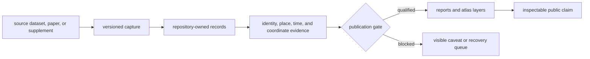

# Bijux Pollenomics

`bijux-pollenomics` connects curated evidence to public maps and reports about
pollen, palaeoenvironmental context, archaeology, hydrography, fieldwork, and
ancient DNA. Every publication belongs to a traceable chain: source capture,
normalization, evidence review, release qualification, and derived output.

The site is useful in both directions. Start with a map or country report to
understand the published result, or start with a source family and follow its
records forward to see what the repository is prepared to claim.

<!-- bijux-pollenomics-badges:generated:start -->

<!-- bijux-pollenomics-badges:generated:end -->

## Start Here

  <a class="md-button md-button--primary" href="public/pollenomics/">Open the product guide</a>
  <a class="md-button" href="public/pollenomics-data/">Open the data guide</a>
  <a class="md-button" href="report/">Open the report portal</a>
  <a class="md-button" href="report/how-to-read/">How to read the report tree</a>
  <a class="md-button" href="public/nordic-atlas/">Open the atlas guide</a>
  <a class="md-button" href="public/fieldwork/">Open the fieldwork record</a>

## From Source To Public Claim

```mermaid
flowchart LR
    Source["source dataset, paper, or supplement"] --> Capture["versioned capture"]
    Capture --> Normalize["repository-owned records"]
    Normalize --> Evidence["identity, place, time, and coordinate evidence"]
    Evidence --> Gate{"publication gate"}
    Gate -->|qualified| Reports["reports and atlas layers"]
    Gate -->|blocked| Review["visible caveat or recovery queue"]
    Reports --> Reader["inspectable public claim"]
```

Source files are never promoted merely because they can be plotted. The
publication gate evaluates the evidence appropriate to each family. Boundary
geometry can frame a map without becoming scientific evidence; pollen and
archaeology layers retain their own temporal semantics; and animal aDNA needs
sample-level support before an exact point or chronology can be asserted.

## Evidence Surfaces

| Surface | What it preserves | Where to begin |
| --- | --- | --- |
| Source families | upstream identity, acquisition, version, license, and refresh posture | [Sources](public/pollenomics-data/sources/index.md) |
| Curated evidence | normalized records plus locality, chronology, coordinate, and ambiguity decisions | [Evidence](public/pollenomics-data/evidence/index.md) |
| Publications | derived world, regional, country, and lake views | [Publications](public/pollenomics-data/publications/index.md) |
| Atlas interpretation | layer meaning, point posture, filters, and visible limits | [Nordic atlas](public/nordic-atlas/index.md) |
| Field observations | a dated, situated record from Lyngsjön Lake | [Fieldwork](public/fieldwork/index.md) |

## What Is Strong Today

- the repository already publishes tracked pollen, archaeology, boundary, and
  fieldwork context as reviewable files plus public report surfaces
- world, Europe-plus, Nordic, and country bundles are one publication family,
  not disconnected products
- the Sweden lake ranking packet and optional Nordic lake overlays now make
  lake prioritization visible without hiding the underlying evidence packet

## What Is Still Constrained

- animal aDNA extraction and the strongest claims that depend on deeper sample
  recovery remain less mature than the rest of the repository
- visible map proximity still does not substitute for chronology review, source
  posture, or field verification
- lake ranking surfaces are decision-support outputs, not bathymetry or coring
  plans

## Choose A Route

- use the [product guide](public/pollenomics/index.md) when you need the
  overall answer: what the repository is for and how the outputs fit together
- use the [data guide](public/pollenomics-data/index.md) when you need the
  evidence answer: what is in scope, how it is governed, and what remains weak
- use the [report portal](report/index.md) when you want the checked-in public
  outputs first
- use the [Nordic atlas guide](public/nordic-atlas/index.md) when you need map
  behavior, filters, point posture, and overlay caveats
- use the [fieldwork record](public/fieldwork/index.md) when you want one real
  visited location instead of a generalized public summary

Choose the route that matches the claim you need to evaluate. Publications
provide orientation; evidence and source pages provide the narrower support
needed for scientific or operational decisions.

## Fieldwork Record

The fieldwork section is intentionally narrow. It anchors one mapped point to a
real visit without pretending that field media replaces curated sample, paper,
or supplement evidence.

  <a class="md-button md-button--primary" href="https://bijux.io/bijux-pollenomics/public/fieldwork/lyngsjon-lake-fieldwork/">Open the fieldwork page</a>
  <a class="md-button" href="gallery/2026-02-26-data-collection.mp4">Open the field video</a>

  <figure class="bijux-media-card">
    
    <figcaption>Lyngsjön Lake, southwest of Kristianstad, during winter field collection on 2026-02-26.</figcaption>
  </figure>

## What The Repository Does Not Claim

- that map proximity alone establishes scientific weight
- that every visible layer has identical provenance quality
- that a project list alone is enough to justify a mapped point
- that unresolved or region-only geography should be published like exact site evidence
- that the current narrow animal aDNA atlas candidate surface means the repository is already scientifically broad
- that the repository is already the full cross-evidence pollenomics engine

## Read By Question

- what the runtime rebuilds: [product guide](public/pollenomics/index.md)
- what this repository publishes and where its limits are:
  [documentation home](index.md)
- what the tracked data system and source families are:
  [data guide](public/pollenomics-data/index.md)
- how the publication tree is organized: [report portal](report/index.md)
- how the map points, filters, and honesty surfaces work:
  [Nordic atlas guide](public/nordic-atlas/index.md)
