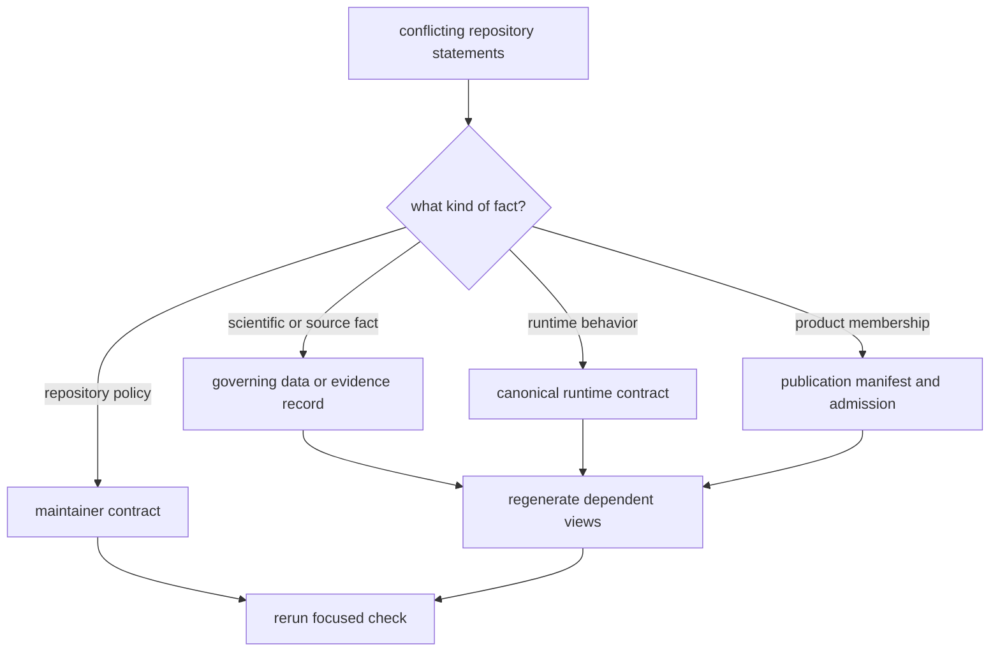
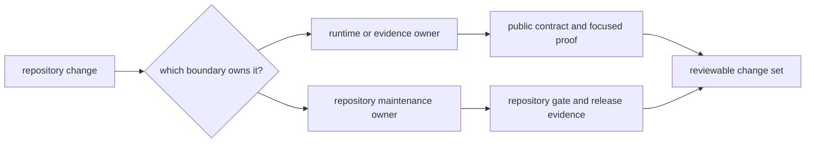

# Internal Guide

The internal surface owns repository operation: validation policy, generated
state, workflow behavior, release evidence, and documentation integrity. It
does not redefine the scientific meaning published in the public data and
atlas guides.

## Start Here

  <a class="md-button md-button--primary" href="maintain/">Open the maintainer handbook</a>
  <a class="md-button" href="pollenomics-dev/documentation-integrity/">Open documentation integrity</a>
  <a class="md-button" href="pollenomics-dev/quality-gates/">Open quality gates</a>
  <a class="md-button" href="pollenomics-dev/release-support/">Open release support</a>

## Ownership Map

| Concern | Owner | Governing entry point |
| --- | --- | --- |
| repository-wide maintenance | maintainer handbook | [Maintenance](maintain/index.md) |
| focused repository operations | `bijux-pollenomics-dev` | [Operator guide](pollenomics-dev/index.md) |
| documentation navigation and claim integrity | documentation integrity checks | [Documentation integrity](pollenomics-dev/documentation-integrity.md) |
| validation selection and proof | quality gates | [Quality gates](pollenomics-dev/quality-gates.md) |
| GitHub Actions and release evidence | release support | [Release support](pollenomics-dev/release-support.md) |
| Make target contracts | Make handbook | [Make system](maintain/makes/index.md) |

## Authority Precedence

Repository maintenance often encounters the same statement in source code,
governed data, generated reports, public prose, and a check. Resolve the
disagreement at the surface that owns the fact:

A generated report, documentation sentence, or integrity check can reveal a
conflict but cannot become a substitute authority. Correcting the consumer
alone leaves the next regeneration free to restore the same defect.

## Route A Repository Change

| Changed surface | Primary review | Required companion evidence |
| --- | --- | --- |
| runtime source or CLI | runtime package tests and public contract review | affected command, API, data, or publication documentation |
| collected or normalized data | source-family and data-contract validation | collection summary, hashes, coverage review, and generated diff |
| animal evidence | project and sample integrity review | locality, chronology, coordinate, exclusion, and release-gate surfaces |
| generated reports | publication and subset validation | manifest membership, traceability, warnings, and scientific review |
| public documentation | documentation integrity and strict site build | links to the governing product, evidence, or source surface |
| workflow or release behavior | GitHub workflow and release-support review | retained job evidence, package selection, and release contract |
| shared Make behavior | Make system contract review | expanded target ownership and affected package lane |

Maintenance checks may coordinate product contracts, but a repository-health
helper cannot become the owner of scientific normalization, evidence meaning,
or publication semantics.

## Diagnose By Symptom

| Symptom | Inspect first | Then verify |
| --- | --- | --- |
| public count or claim changed unexpectedly | governing evidence record and producer diff | report membership, narrative, and claim audit |
| map point disappeared | exclusion, coordinate, locality, chronology, and scope surfaces | point traceability and publication gate |
| source refresh deleted records | staging result, replacement rule, hashes, and normalized diff | source-family contracts and dependent publications |
| docs build fails | reported page, link, plugin, or asset error | navigation, redirects, local assets, and strict build |
| docs build passes but prose is wrong | audience, governing link, and claim evidence | language and breadth contracts plus human review |
| release gate refuses | exact failing dimension and evidence anchor | owning package, workflow, scientific, or recovery proof |

## Public And Internal Boundary

Public pages govern reader interpretation of sources, evidence, publications,
atlas features, and fieldwork. Internal pages govern how maintainers preserve
those contracts while changing code or generated state. An internal diagnostic
may block a release or reveal drift; it does not become the scientific
authority for a public record.

Readers evaluating a scientific or publication claim should return to the
[documentation home](../index.md) and follow the claim upstream through the
data system.
