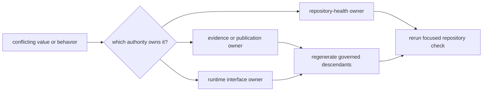
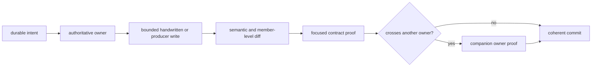

# Internal Guide

This handbook is for people changing the repository. It explains where a
change belongs, which state is authoritative, and what evidence is needed to
review or release it. Scientific interpretation remains in the public data,
atlas, and fieldwork guides; runtime behavior remains with the runtime package
and its governed contracts.

## Reader And Maintainer Surfaces

The MkDocs reader navigation contains the public handbook and governed
reports. `docs/internal/` is an unlisted repository handbook: maintainers can
build and inspect it with the same documentation toolchain, but public pages
must not depend on it to explain a scientific claim or product.

| Surface | Consumer | Content that belongs there |
| --- | --- | --- |
| `docs/index.md`, `docs/public/` | evidence users, researchers, and operators | product meaning, evidence lineage, use, interpretation, and limits |
| `docs/report/` | readers reviewing a published product | checked-in maps, manifests, tables, exclusions, and traceability records |
| `docs/internal/` | repository maintainers | producer ownership, validation selection, workflow behavior, and release evidence |
| package `README.md` files | installers and integrators | distribution purpose, installation boundary, and package-owned interfaces |
| `artifacts/` | the person running a local command | disposable previews, logs, test output, and local diagnostics |

A governed report can be public even when its production procedure is
internal. Conversely, a local site preview is not a publication merely because
it renders the same Markdown.

## Maintainer Routes

  <a class="md-button md-button--primary" href="maintain/">Open the maintainer handbook</a>
  <a class="md-button" href="pollenomics-dev/">Inspect repository checks</a>
  <a class="md-button" href="pollenomics-dev/quality-gates/">Select a quality gate</a>
  <a class="md-button" href="maintain/gh-workflows/verification-and-release/">Review release evidence</a>

| Need | Governing route |
| --- | --- |
| classify a repository change and its write boundary | [Maintainer handbook](maintain/index.md) |
| run or extend a repository-health check | [`bijux-pollenomics-dev`](pollenomics-dev/index.md) |
| choose focused proof for a changed contract | [Quality gates](pollenomics-dev/quality-gates.md) |
| maintain reader navigation and claim boundaries | [Documentation integrity](pollenomics-dev/documentation-integrity.md) |
| understand Make target ownership | [Make system](maintain/makes/index.md) |
| inspect automation and publication evidence | [GitHub workflows](maintain/gh-workflows/index.md) |

## Authority Map

Repository facts often appear in several places. Correct the owner first and
then regenerate or revise its consumers.

| Fact | Authority | Derived consumers |
| --- | --- | --- |
| acquired source identity and payload | source-family collection record under `data/` | collection summary, normalized records, reports, and prose |
| scientific normalization or exclusion | runtime contract plus governed evidence record | atlas members, tables, warnings, and documentation |
| publication membership | product manifest and admission decision | map layers, counts, report indexes, and reader narratives |
| runtime command or API behavior | `bijux-pollenomics` implementation and canonical interface contract | examples, frozen API representations, and operator guides |
| repository-health rule | `bijux-pollenomics-dev` check and maintainer contract | local validation and workflow findings |
| release event | tagged revision and retained workflow publication evidence | badges, package indexes, containers, and GitHub release pages |

Changing a generated table, rendered badge, or prose sentence alone is not a
correction when its governing input remains wrong.

## Select The Operation

| Intent | Allowed state transition | Evidence before handoff |
| --- | --- | --- |
| inspect | no governed writes | owner, input, observed state, and bounded question |
| validate | disposable output under `artifacts/` | command, selected inputs, revision, result, and warnings |
| edit | one handwritten owner and required contract companions | semantic diff and focused proof |
| regenerate | declared governed output roots from their producer | producer invocation, input diff, member-level output diff, and focused proof |
| publish | accepted revision to an external publication surface | trigger identity, immutable version, job evidence, and published artifact identity |

Validation does not authorize regeneration. Regeneration does not authorize
publication. Keep those transitions explicit so a reviewer can distinguish a
diagnostic run from a repository mutation and a local proof from an external
release.

## Review A Change

Use member identities before totals when reviewing data and publications. Use
canonical metadata before rendered presentation when reviewing badges or
navigation. Use the canonical schema before its frozen representation and
digest when reviewing an interface.

## Handoff Evidence

A complete maintainer handoff records:

- the changed owner and intended state transition;
- handwritten and generated paths, identified separately;
- the exact focused commands and results;
- warnings, active refusals, and broader lanes intentionally not run;
- the worktree and commit state; and
- any external publication identity, only when publication actually occurred.

“The docs pass” or “CI is green” is not enough. Name the contract that was
checked and the evidence it supplies. A passing documentation build proves
rendering and link integrity; it does not establish source completeness or
scientific sufficiency.
