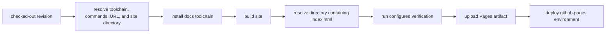

# Docs Deployment

`deploy-docs.yml` converts one repository revision into a verified GitHub Pages
bundle and deploys that exact bundle. It runs only by manual dispatch or
`workflow_call`; a merge to `main` does not trigger it directly in this
repository.

`deploy-docs.yml` builds the strict MkDocs site before any Pages artifact is
accepted. The workflow follows the shared Bijux docs contract: repository
targets own installation and rendering, while `mkdocs.shared.yml` supplies the
strict validation, Material theme, plugins, Markdown extensions, shared
assets, and client-side behavior consumed by the repository configuration.

## Deployment Contract

The build job has read access to repository contents and write authority for
the Pages artifact identity token. The deploy job writes only to the
`github-pages` environment. Concurrency is grouped by Git ref and cancels an
older in-progress deployment for the same ref.

## Configuration Resolution

The workflow resolves configuration from an optional repository environment
file, repository variables or environment values, and workflow defaults. It
discovers Make targets when commands are not explicitly configured.

| Value | Repository behavior |
| --- | --- |
| site URL | defaults to `https://bijux.io/bijux-pollenomics/` |
| install command | discovers `gh-docs-install`, `docs-install`, or `install` |
| build command | discovers `gh-docs-build`, `docs-check`, `docs`, or `series-docs-build` |
| verification command | discovers `gh-docs-verify` or `docs-verify` when available |
| site directory | accepts the configured directory and known artifact-root fallbacks, including `artifacts/root/docs/site` |
| Python | configured or inferred from the Python/MkDocs repository, defaulting to 3.11 |
| Node and Rust | installed only when repository files or explicit configuration require them |

For this repository, the discovered documentation path is the Make-owned
strict build, and the MkDocs configuration writes the persistent preview under
`artifacts/root/docs/site`. The workflow accepts that directory only when it
contains `index.html`.

## Build And Deploy Are Separate Proofs

| Stage | Proves | Failure means |
| --- | --- | --- |
| command resolution | an executable documentation build route was found | repository configuration or target ownership is incomplete |
| site build | MkDocs and its configured plugins completed for the revision | content, navigation, links, assets, plugin behavior, or environment failed |
| artifact resolution | one candidate directory contains a site root | build output and declared site-directory contract disagree |
| optional verification | the repository’s configured post-build contract passed | rendered output failed a repository-specific assertion |
| Pages bundle validation | the selected directory and `index.html` exist | no deployable bundle was produced |
| Pages deployment | GitHub accepted the uploaded bundle for the environment | publication failed even though the local bundle may be valid |

A successful local strict build is strong pre-deployment evidence, but it is
not a Pages deployment. Conversely, rerunning deployment cannot correct a
broken link or unsupported claim in the checked-out revision.

## Ref Safety

A manual dispatch is rejected unless it runs from `main`, `master`, or a `v*`
tag. The reusable-call path can deploy when called by another workflow, so the
caller owns ref selection. Maintainers must record both the source revision and
the workflow run; the mutable Pages URL alone is not enough to identify what
was published.

## Evidence To Retain

- workflow run URL and event type;
- source commit SHA and Git ref;
- resolved site URL, build command, verification command, and site directory;
- build and verification results, including warnings;
- Pages artifact and deployment job results; and
- the deployed page URL reported by the `github-pages` environment.

If deployment fails after upload, preserve the successful build evidence and
retry only the failed publication boundary. If the build or verification
fails, correct the documentation or its owning configuration first and build a
new bundle from the corrected revision.
