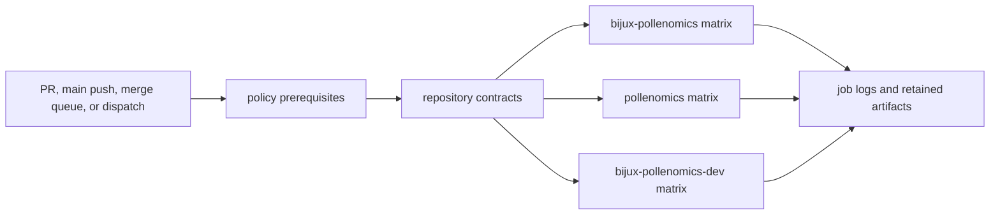

# GitHub Workflows

GitHub Actions enforces repository contracts and publishes accepted artifacts.
It does not replace local diagnosis, scientific review, or an explicit release
decision. Every workflow result must be interpreted through its trigger,
revision, inputs, permissions, and retained outputs.

## Workflow Inventory

| Workflow | Trigger | Responsibility | External write authority |
| --- | --- | --- | --- |
| `verify.yml` | pull request to `main`, path-scoped push to `main`, merge queue, or manual dispatch | policy prerequisite, repository contracts, and package matrix | none |
| `ci.yml` | reusable `workflow_call` only | tests, checks, lint, and retained package artifacts for one package | none |
| `github-policy.yml` | pull request, push to `main` or `v*` tag, and merge queue | managed GitHub state, shared checksums, and pinned actions | none |
| `pr-approval-policy.yml` | pull-request lifecycle and review events | owner approval or `owner-self-signoff` label enforcement | none |
| `bijux-std.yml` | pull request, push to `main`, merge queue, or manual dispatch | shared-standard and generated report checks | none |
| `deploy-docs.yml` | manual dispatch or reusable call | build, verify, bundle, and deploy GitHub Pages | Pages deployment |
| `release-artifacts.yml` | reusable call only | build package distributions and SBOM-bearing release bundles | Actions artifacts only |
| `release-pypi.yml` | manual dispatch or reusable call | build and publish selected Python distributions | PyPI |
| `release-ghcr.yml` | manual dispatch or reusable call | build and publish versioned release bundles with ORAS | GHCR package namespace |
| `release-github.yml` | manual dispatch or reusable call | build assets and create a GitHub release | repository releases |
| `automerge-pr.yml` | pull-request automation events | repository merge policy | pull-request merge state when its policy permits |

No release workflow in this repository has a direct tag-push trigger. A `v*`
tag can supply the release identity when a workflow is called in tag context,
but the publication still requires a manual dispatch or an owning caller.

## Verification Topology

`verify.yml` first waits for policy and standards prerequisites, then runs
repository contracts, and only then calls `ci.yml` for each package. The
package matrix is explicit:

| Package | Test lane | Check targets |
| --- | --- | --- |
| `bijux-pollenomics` | Python 3.11 | quality, security, API, OpenAPI drift, build, and SBOM |
| `pollenomics` | Python 3.11 | quality, security, build, and SBOM |
| `bijux-pollenomics-dev` | Python 3.11 | quality, security, build, and SBOM |

The reusable CI workflow uploads test, lint, and check artifacts from each
package’s declared artifact directory for 14 days. An absent upload can be
valid when a check produced no files; the job result and command log remain
part of the proof.

## Generated Workflow Ownership

The verification, CI, policy, deployment, and release workflows carry
standards-sync notices. They are managed consumer copies. Repository-specific
release selection lives in `.github/release.env`; shared workflow behavior
belongs to the upstream standards source and must not be patched locally.

When a workflow result is surprising:

1. distinguish repository configuration from shared workflow implementation;
2. inspect the resolved inputs and package matrix in the job log;
3. reproduce the repository-owned command locally when practical;
4. correct the owning repository contract or upstream standard; and
5. retain the exact run and revision used to prove convergence.

## Interpret A Result

| Result | Supported conclusion | Unsupported conclusion |
| --- | --- | --- |
| `verify.yml` passes | the configured repository and package contracts passed for that revision | unconfigured scientific questions were evaluated |
| policy workflow passes | managed GitHub files, checksums, and action pins agree | the product is ready to publish |
| docs deployment passes | one built Pages bundle was deployed | every scientific claim is complete or current |
| release artifact build passes | selected distributions and release assets were staged | PyPI, GHCR, or GitHub publication occurred |
| publication workflow passes | the selected external surface accepted its artifacts | the other release surfaces contain the same version |

Use [docs deployment](deploy-docs.md) for the Pages contract and [verification
and release](verification-and-release.md) for release identities, matrices,
ordering, and recovery.
