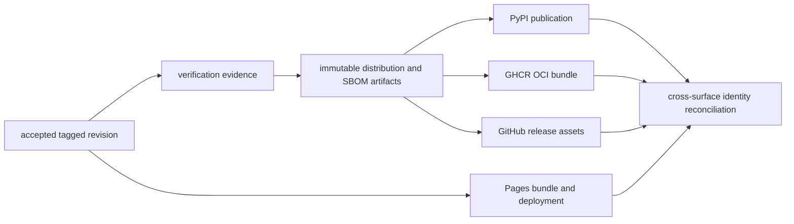

# Verification and Release

A release is a set of independent publications tied to one accepted version
and revision. Repository verification, artifact construction, PyPI
publication, GHCR publication, GitHub release creation, and documentation
deployment produce different evidence. Success in one lane must not be used as
evidence that another lane ran.

## Verification Surface

Verification proves that a named revision satisfies the repository, package,
documentation, data, and publication contracts selected by the workflow. Its
evidence includes the source SHA, resolved environment, invoked gates, exact
results, warnings, and retained artifacts. It does not publish a distribution
or waive a scientific refusal.

## Release Surface

Release workflows consume an already accepted revision and immutable staged
artifacts. Each external destination owns a separate publication result. A
green PyPI upload says nothing about GHCR, GitHub Release, Pages deployment, or
the scientific posture of bundled evidence unless those surfaces are
independently reconciled.

## Repository Release Set

`.github/release.env` enables release publication for two distributions:

| Distribution | Build products | PyPI | GHCR | GitHub release assets |
| --- | --- | --- | --- | --- |
| `bijux-pollenomics` | wheel, source distribution, and SBOM outputs | selected | selected | selected |
| `pollenomics` | wheel, source distribution, and SBOM outputs | selected; token auth is configured | selected | selected |

`bijux-pollenomics-dev` is tested and built in verification, but it is absent
from the release matrices and is not selected for these publication workflows.
That distinction is deliberate: a package can be a verified repository
component without being part of the public release set.

## Trigger And Version Contract

The PyPI, GHCR, and GitHub release workflows accept manual dispatch and
reusable calls. They do not run directly on tag push. When enabled, each
requires a release tag beginning with `v`; a manual dispatch that resolves to
disabled publication or an empty package matrix fails instead of reporting a
misleading no-op success.

The release identity must resolve to the same tagged commit and version across
all selected surfaces. Before publication, retain:

- tag and commit SHA;
- selected package matrix;
- resolved package versions;
- verification run for the tagged revision;
- wheel, source-distribution, and SBOM identities; and
- active scientific or product refusals.

An artifact filename is not sufficient version evidence. The publication
guard checks that built distributions carry the publishable requested version
and rejects development, local, or mismatched versions.

## Reusable Workflow Pressure

Manual dispatch and reusable calls must preserve the same input, version,
artifact, permission, and result contracts. A caller may select a package
matrix or provide trusted credentials; it must not bypass publication guards,
substitute an unrelated build, or turn a disabled matrix into a successful
release report.

Reusable workflow evidence must retain both identities: the caller revision
that requested publication and the reusable workflow revision that performed
it. This makes policy changes and artifact provenance reviewable without
pretending that a workflow name alone identifies behavior.

## Artifact Construction

`release-artifacts.yml` is the shared builder used by the three publication
workflows. For each selected package it:

1. installs the package toolchain;
2. runs the configured build and SBOM targets;
3. stages wheel and source-distribution files as `<package>-pypi-dist`;
4. stages all distribution files and recognized production/development SBOMs
   as `<package>-release`; and
5. retains both Actions artifacts for 14 days.

The staged artifacts are the handoff between build and publication jobs. A
publication lane must consume the artifacts from its own run or explicitly
identified compatible run, not rebuild an untracked local approximation.

## Publication Surfaces

| Workflow | Consumed artifact | External identity | Authority |
| --- | --- | --- | --- |
| `release-pypi.yml` | `<package>-pypi-dist` | Python distribution name and normalized version | uploads wheel and source distribution using resolved trusted-publisher or token mode |
| `release-ghcr.yml` | `<package>-release` | `ghcr.io/<repository>/<package>:<v-tag>` plus normalized tag and optional `latest` | publishes a tarred release bundle as an OCI artifact through ORAS |
| `release-github.yml` | `<package>-release` | GitHub release for the `v*` tag | attaches staged assets and optional release notes |
| `deploy-docs.yml` | Pages site bundle | `github-pages` deployment URL | publishes rendered documentation, independently of package releases |

GHCR is an artifact publication surface here, not evidence that a runnable
service container was built or deployed.

## Release Order

The diagram expresses evidence dependency, not an automatic workflow chain.
The repository does not currently orchestrate these workflows from one tag
event. The release operator must dispatch or call the intended lanes and then
reconcile their results.

## Cross-Surface Reconciliation

After publication, verify:

- PyPI exposes both selected distribution names at the intended version;
- GHCR contains each selected package bundle at the `v*` tag and normalized
  version tag, plus `latest` only when configured;
- the GitHub release points to the same tag and contains the expected assets;
- SBOM assets correspond to the published distribution build; and
- documentation deployment records the intended source SHA when it is part of
  the release communication.

Do not declare a complete release from a green build job. Record every selected
surface as published, failed, or intentionally omitted.

## Failure Recovery

| Failure boundary | Safe response |
| --- | --- |
| verification | correct the owner and create new evidence before building release artifacts |
| version or artifact guard | correct versioning or rebuild from the intended tag; never rename files to bypass the guard |
| PyPI upload | inspect whether the immutable version already exists; do not overwrite or silently substitute another build |
| GHCR upload | retry the failed package identity after confirming the staged bundle and tag |
| GitHub release | preserve staged assets; replace an existing release only when the workflow’s explicit deletion option is intended |
| docs deployment | distinguish build failure from Pages publication failure and retry only the failed boundary |

Every retry must retain the same release identity or explicitly become a new
version. A partial release is an observable state to reconcile, not a reason to
hide successful publications or weaken remaining gates.
