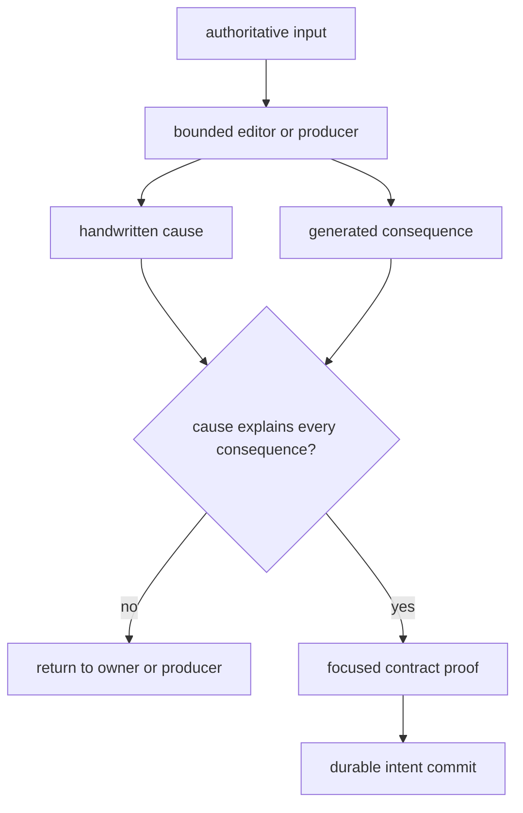

# Maintainer Handbook

Repository maintenance begins with ownership, not with a convenient command.
Choose the surface that has authority to make the intended change, constrain
its writes, review its consequences, and retain proof at the same boundary.

## Classify The Change

| Change | Authoritative input | Expected governed descendants | Primary proof |
| --- | --- | --- | --- |
| reader explanation | selected Markdown under `docs/index.md` or `docs/public/` | navigation or redirects only when routes change | focused documentation contracts and strict build |
| source refresh | one source-family collection root | normalized records, collection summaries, and dependent products declared by that producer | source identity, hashes, coverage, replacement behavior, and normalized diff |
| curation decision | claim owner, evidence locator, conflict or recovery record, and intended use | normalized views, eligibility, exclusions, and affected products | claim semantics, ownership, disposition, and descendant agreement |
| animal evidence | project, sample, chronology, locality, coordinate, and review records | eligible point products and release posture | animal integrity and publication admission contracts |
| atlas or fieldwork product | governed publication inputs and manifest | map layers, tables, warnings, and traceability views | member identities, exclusions, geography, scenario behavior, and product checks |
| runtime interface | runtime implementation and canonical contract | examples and frozen interface representations | package tests plus compatibility and documentation review |
| repository check | `bijux-pollenomics-dev` implementation and maintainer contract | local and workflow findings | maintainer-package tests and the affected repository contract |
| release behavior | workflow definition and version contract | PyPI, GHCR, GitHub, or documentation publication evidence | workflow-specific validation and retained job result |

If a change fits more than one row, split independent intents or name the
causal chain explicitly. A source correction and its required regenerated
atlas members may be inseparable; an unrelated prose rewrite is not.

## Governed State And Build State

| State | Location | Review status |
| --- | --- | --- |
| collected and curated evidence | `data/` | governed; review source identity and scientific semantics |
| published reports | `docs/report/` | governed; review manifests, members, warnings, and traceability |
| reader documentation | `docs/index.md`, `docs/public/` | governed prose; review claims against evidence owners |
| canonical interface | `apis/bijux-pollenomics/v1/` | governed compatibility surface |
| maintainer guidance | `docs/internal/` | governed repository procedure, absent from reader navigation |
| local command output | `artifacts/` | disposable diagnostics; never commit as evidence authority |
| distribution build output | `dist/` within a release job or its retained artifact | publishable only after version and content guards pass |

Generated does not mean disposable. Files under `docs/report/` are checked-in
publication state and require semantic review. Files under `artifacts/` are
local run products and must not be cited as the repository’s durable evidence.

## Execute A Bounded Change

1. Identify the authoritative input and every declared output root.
2. Inspect the worktree before invoking a writer.
3. Use the smallest owner-specific command that can perform the transition.
4. Inspect handwritten and generated diffs separately.
5. Compare identifiers, exclusions, warnings, and changed claims before totals.
6. Run the narrowest check that proves the changed contract.
7. Add companion checks only where the diff crosses another owner.
8. Commit the coherent intent while its evidence is still attributable.



Producer success is necessary but insufficient. A mechanically valid report
can still contain the wrong geography, an unsupported admission, or a changed
warning posture.

### Preserve The Decision Chain

For data and publication work, keep four records distinguishable:

| Record | Durable purpose |
| --- | --- |
| source evidence | identifies the captured material and what it states |
| curation decision | establishes ownership, precision, conflict, and fitness for a declared use |
| producer result | materializes normalized, review, or publication descendants |
| verification evidence | demonstrates agreement for the named contract at one revision |

The producer does not retroactively become the source, and verification does
not become the scientific decision. Keeping the chain explicit allows a later
source correction to reopen the right decision without rewriting unrelated
history.

### Documentation-Only Change Protocol

A reader-documentation change is bounded only when it does not alter governed
data, generated reports, runtime interfaces, or package metadata. Review it as
a claim-bearing change even though it has no runtime write:

1. Name the public claim or maintainer procedure being corrected and its
   authoritative evidence.
2. Edit only the reader or maintainer pages that own the explanation. Do not
   hand-edit `docs/report/` to make a prose claim agree.
3. Check relative links, navigation reachability, Mermaid identifiers, and the
   public-language contract for the changed pages.
4. Build with strict MkDocs settings into `artifacts/docs-site` so local output
   remains outside governed documentation roots.
5. Inspect the semantic diff for strengthened claims, lost qualifications,
   audience leakage, and duplicated authority.
6. Commit one coherent documentation intent with its focused results.

```bash
.venv/bin/mkdocs build --strict --site-dir artifacts/docs-site
.venv/bin/pytest -q \
  packages/bijux-pollenomics/tests/unit/test_public_artifact_language.py \
  packages/bijux-pollenomics/tests/regression/test_repository_contracts.py::RepositoryContractRegressionTests::test_docs_mermaid_diagrams_avoid_reserved_node_ids
```

These commands prove site construction, the selected public-language rules,
and the repository's Mermaid constraint. They do not prove that every source
is complete or that every generated report is current. Add a domain check only
when the prose depends on that contract; record broad lanes as not run rather
than implying that focused proof covered them.

## Recover A Missing Governed Artifact

Treat a contract-declared required artifact that is absent as an integrity
incident, even when downstream reports still render:

1. Identify the contract row, owning source family, required lifecycle layer,
   and every published consumer.
2. Preserve existing downstream products and record which fields still retain
   traceability; do not delete them merely because their authority is missing.
3. Stop claims that require complete local traversal of the absent authority.
   Keep narrower claims that remain supported by retained member-level lineage.
4. Inspect the captured source identity, retrieval manifest, hashes, licenses,
   replacement policy, and producer before running any writer.
5. Recreate the artifact only through the declared producer into its governed
   output root. Never synthesize an empty file, placeholder, or hand-authored
   approximation to satisfy path existence.
6. Validate schema, record identities, counts, spatial or temporal semantics,
   and the relation between the recovered authority and existing consumers.
7. Regenerate affected descendants only after the authority passes its own
   contract, then review additions, removals, changed qualifications, and
   product membership before totals.
8. Retain the integrity disclosure until the recovered state and every
   required descendant are committed together or in an explicitly ordered,
   reviewable chain.

```mermaid
flowchart LR
    Missing["required authority absent"] --> Bound["bound supported claims"]
    Bound --> Capture["verify capture and producer"]
    Capture --> Recover["producer-owned recovery"]
    Recover --> Validate["authority validation"]
    Validate --> Descendants["regenerate affected descendants"]
    Descendants --> Review["identity and semantic review"]
    Review --> Close["remove disclosure with evidence"]
```



Path existence alone does not close the incident. Closure requires recovered
identity, source lineage, semantic validity, and agreement with every contract
that declared or consumed the artifact.

## Choose The Command Surface

| Need | Route |
| --- | --- |
| local environment, checks, reports, or package targets | [Make system](makes/index.md) |
| understand target delegation and output roots | [Make system contracts](makes/make-system-contracts.md) |
| repository-health implementation | [`bijux-pollenomics-dev`](../pollenomics-dev/index.md) |
| validation selection and release stops | [Quality gates](../pollenomics-dev/quality-gates.md) |
| GitHub Actions trigger and evidence ownership | [GitHub workflows](gh-workflows/index.md) |
| release ordering and publication proof | [Verification and release](gh-workflows/verification-and-release.md) |

Make is a routing layer, not an authority. Read the delegated command and its
write boundary before using a broad target. A maintainer check may detect a
scientific mismatch, but the correction still belongs to the evidence,
runtime, or publication owner.

## Diagnose Without Masking The Failure

| Symptom | First inspection | Durable response |
| --- | --- | --- |
| published count changed | governing record identities and producer diff | correct the input or accept the explained membership change, then regenerate |
| point disappeared | admission, coordinate, chronology, geography, and exclusion evidence | correct the owning evidence or retain the exclusion |
| refresh deleted records | acquisition identity, replacement policy, staging output, and normalized diff | repair the collector or explicitly accept the source change |
| public prose outruns evidence | claim, governing source, qualification, and product manifest | narrow the claim or strengthen the evidence owner |
| generated file is stale | canonical input and producer | run or correct the producer; do not hand-edit the symptom |
| external service is unavailable | command boundary, credentials, and unchanged governed state | record the environmental failure and rerun condition |
| release refuses | exact guard, evidence anchor, and owning package or product | satisfy the owner or retain the refusal |

Never weaken a check merely to remove a useful finding. An unavailable service
is not proof that evidence regressed, and a green renderer is not proof that a
scientific statement is supported.

## Commit And Handoff

Before each commit, inspect both unstaged and staged diffs; stage only the
current intent; confirm generated files came from their declared producer; and
record the focused proof. The commit subject names the enduring surface and
result, not the order in which the work was delivered.

The handoff must distinguish checks that ran, checks intentionally omitted,
warnings observed, and active refusals. Slow repository-wide lanes are release
evidence when the release contract requires them; they are not a substitute
for selecting the focused contract for a documentation-only or single-owner
change.
