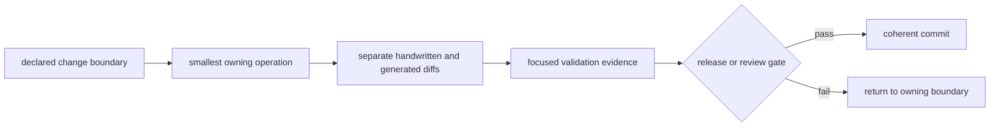

# Maintainer Handbook

The maintainer handbook connects repository operations to their owning
contracts. It covers local command routing, generated-state review, workflow
evidence, documentation integrity, and release stops. Scientific behavior
remains owned by the runtime and governed evidence surfaces.

## Ownership Routes

- executable repository checks:
  [bijux-pollenomics-dev](../pollenomics-dev/index.md)
- repository-governance overview:
  [repository governance](../pollenomics-dev/repository-governance.md)
- maintainer package operating rules:
  [operating guidelines](../pollenomics-dev/operating-guidelines.md)
- executable review stops:
  [quality gates](../pollenomics-dev/quality-gates.md)
- future-country onboarding contract:
  [country onboarding playbook](../pollenomics-dev/future-country-onboarding-playbook.md)
- local maintainer commands:
  [makes](makes/index.md)
- command-routing boundary:
  [make system contracts](makes/make-system-contracts.md)
- GitHub automation:
  [gh-workflows](gh-workflows/index.md)
- workflow verification and release map:
  [verification and release](gh-workflows/verification-and-release.md)

## State Review Matrix

| State | Authoritative root | Review requirement |
| --- | --- | --- |
| local environment and logs | `artifacts/` | diagnostic only; never publication authority |
| collected and curated evidence | `data/` | source identity, normalized diff, review posture, and contract validation |
| generated public products | `docs/report/` | manifests, subsets, traceability, warnings, and narrative consistency |
| reader documentation | `docs/public/` and `docs/index.md` | reader language, governing links, navigation, and strict build |
| maintainer documentation | `docs/internal/` | repository-specific ownership and executable guidance |
| API compatibility | `apis/bijux-pollenomics/v1/` | canonical schema, pinned representation, and hash agreement |

## Mutation Classes

| Change class | Expected writes | Review boundary |
| --- | --- | --- |
| narrative-only documentation | selected handwritten Markdown | audience, links, claims, navigation, and strict rendering |
| source collection | one owned source-family tree and collection contracts | acquisition identity, hashes, replacement, normalization, and downstream impact |
| animal foundation refresh | governed animal project, sample, evidence, review, and dependent publication surfaces | identity, locality, chronology, coordinates, exclusions, and release posture |
| report publication | declared `docs/report/` product families | manifests, parent-child subsets, traceability, visual members, rankings, and caveats |
| API contract change | canonical schema, pinned representation, and digest | compatibility intent and consumer-visible diff |
| repository policy change | maintainer code, documentation, and affected workflow contracts | ownership, failure behavior, retained proof, and release consequence |

Do not broaden a write set merely because a convenience target is available.
Use the operation that owns the intended state transition, then review every
governed descendant it is designed to change.

## Change Sequence

Generated success does not replace diff review. A report refresh can complete
while changing an unintended geography; a documentation build can pass while
wording outruns evidence; a release workflow can be structurally valid while a
scientific refusal remains active.

## Commit Boundary

A coherent maintenance commit contains one durable intent, its necessary
handwritten and governed consequences, and focused verification evidence. Keep
independent documentation, source refresh, report regeneration, and repository
policy intents separate when they can be reviewed independently.

Before committing:

1. inspect unstaged and staged diffs independently;
2. confirm no unrelated user work is staged;
3. verify generated changes came from the owning producer;
4. run the narrowest contract that proves the intent;
5. record skipped broader checks and active warnings; and
6. confirm the worktree state expected after the commit.

The commit subject names the durable surface and result. It does not encode the
delivery sequence, temporary context, or an implementation diary.
