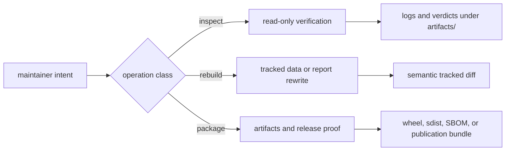

# Make and Local Commands

The root `Makefile` is the repository's operational entrypoint. Its targets
fall into three materially different classes: checks that inspect the current
revision, rebuilds that replace governed repository state, and packaging or
publication operations that create release artifacts. Choose the class before
running the command.

## Choose The Narrowest Command

| Intent | Command | Repository effect | Evidence to retain |
| --- | --- | --- | --- |
| inspect available commands | `make help` | none | target name and description |
| validate Make ownership and layout | `make check-make-layout` | none | layout verdict |
| validate documentation | `make docs-check` | generated files under `artifacts/` only | strict MkDocs and hygiene verdict |
| run regression evidence | `make test-regression` | test artifacts only | failing node, assertion, and artifact path |
| verify distributions | `make package-verify` | build and smoke artifacts | wheel and sdist identities plus smoke results |
| refresh source and curated data | `make data-prep` | rewrites tracked `data/` state | source identity, hashes, counts, and semantic diff |
| refresh report products | `make reports` | rewrites tracked `docs/report/` state | input revision, product manifests, counts, and exclusions |
| rebuild the governed application state | `make app-state` | rewrites `data/`, `docs/report/`, and built docs | one reconciled review across all descendants |

`make check` is the broad repository verification flow. It is useful before a
release or a wide change, but it is not the default diagnostic for a focused
documentation or data-contract edit. Start at the smallest owner that can
produce a decisive verdict, then expand only when the changed dependency
surface requires it.

## Governed Rebuilds Need Custody

`data-prep`, `reports`, and `app-state` are not checks. They invoke repository
producers and may replace checked-in evidence or publication outputs. Before
accepting a rebuild:

1. record the starting commit and confirm the worktree is understood;
2. identify the source release, collection contract, and intended output root;
3. inspect additions, removals, count changes, null-state changes, and
   admission changes by evidence owner;
4. distinguish expected source movement from unexplained semantic drift;
5. run the focused validators for every changed governed surface; and
6. commit the producer contract and its generated descendants with an
   explicit, reviewable relationship.

A successful process exit does not approve a tracked rewrite. Acceptance
depends on whether source identity, fact ownership, lifecycle posture, and
publication accounting still reconcile.

## Failure Triage

| Failure boundary | First inspection | Escalate when |
| --- | --- | --- |
| environment bootstrap | `root-check-env`, lock state, Python and `uv` identities | the frozen environment cannot be reconstructed |
| package gate | package profile under `makes/packages/` and the named failing test | the failure crosses package ownership |
| docs gate | MkDocs error, link target, generated-source owner, and docs hygiene output | fixing the page would require changing governed data or a shared shell |
| data rebuild | source capture, staging output, replacement contract, and first semantic diff | the producer cannot explain a tracked change |
| report rebuild | product manifest, eligible population, exclusions, and traceability | a public count or member lacks a governing decision |
| release proof | built artifact identity, package metadata, and smoke environment | wheel and source distribution disagree |

Do not repair a failing gate by weakening the assertion, deleting a refusal,
or editing a generated descendant. Follow the failure to its owning source and
preserve the rejected state until the owner is corrected.

Continue with [Make system contracts](make-system-contracts.md) for rule
placement and dependency ownership, and [quality gates](../../pollenomics-dev/quality-gates.md)
for the evidence expected from each verification surface.
