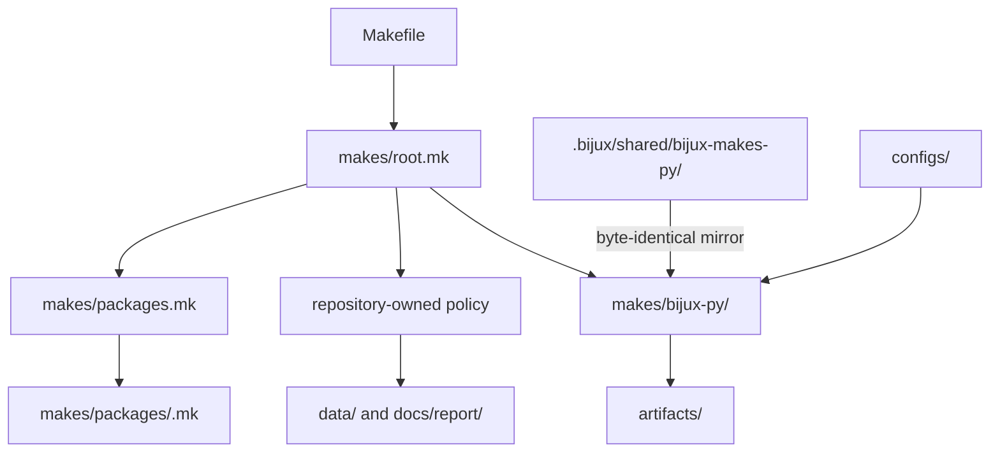
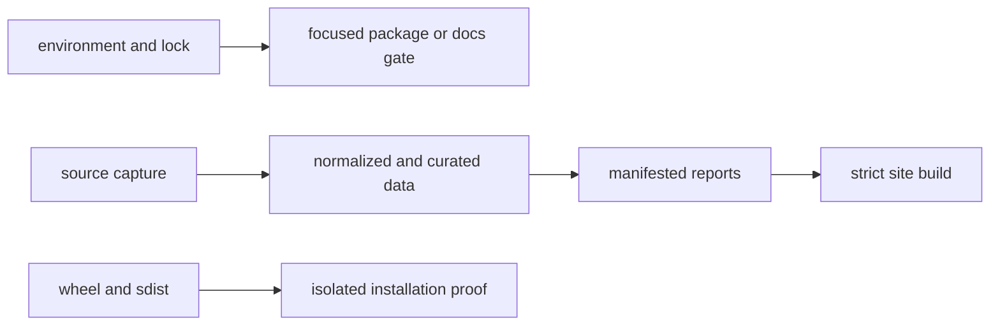

# Make System Contracts

The `makes/` tree routes durable repository operations to the layer that owns
them. Root orchestration, repository policy, shared Python gates, and
package-local declarations remain separate so a command has one explainable
implementation and one evidence boundary.

## Main Files And Ownership Model

| Layer | Owns | Must not own |
| --- | --- | --- |
| `Makefile` | stable repository entrypoint | workflow implementation |
| `makes/root.mk` | repository orchestration, tracked-state producers, package and report entrypoints | copied shared gate recipes |
| `makes/bijux-py/` | synchronized lint, test, quality, security, docs, build, API, and SBOM machinery | Pollenomics-specific data semantics |
| `makes/env.mk` | repository environment paths and defaults | package implementation policy |
| `makes/packages.mk` | package catalogue and dispatch membership | leaf-package gate logic |
| `makes/packages/<package>.mk` | package identity, paths, and narrow overrides | duplicated repository orchestration |
| `makes/publish.mk` and `makes/api-freeze.mk` | repository-owned publication and API policy | generic cross-repository machinery |
| `configs/` | tool policy consumed by shared gates | command recipes |

The local `makes/bijux-py/` tree is managed synchronized content. Change the
shared owner and refresh the mirror; do not patch a downstream copy to make one
repository green.

## Repository Layout And Entry Points

| Entry point | Intended caller | Delegates to | Mutation expectation |
| --- | --- | --- | --- |
| root `Makefile` | people, CI, and repository automation | named targets in `makes/root.mk` | visible in target help and prerequisites |
| `makes/root.mk` | root target routing | shared recipes, package profiles, or repository producers | may route tracked writes only through a named governed target |
| `makes/packages.mk` | package dispatch | one declared package profile | no scientific or release logic |
| `makes/packages/<package>.mk` | package-scoped checks and builds | package toolchain and narrow overrides | package artifacts under declared roots |
| `makes/publish.mk` | explicit release intent | version and publication guards | external mutation only after qualified artifacts exist |

Entry points are stable routes, not duplicate implementations. A package
profile may declare identity and narrow behavior; it must not copy a root
producer or synchronized gate merely to avoid delegation.

## Contract Rule

Every target declares five properties, whether or not they are written as
metadata:

| Property | Required question |
| --- | --- |
| intent | what durable repository outcome does the target own? |
| inputs | which source, configuration, package, or governed revision does it consume? |
| mutation | does it write only `artifacts/`, rewrite tracked state, or publish externally? |
| evidence | which verdict, report, manifest, or diff proves the outcome? |
| failure | what state is preserved and which owner receives the finding? |

A target whose mutation class is unclear is unsafe even when its recipe is
short. A target whose output has no named reviewer evidence is an alias, not a
verification contract.

## Dependency Direction

Dependencies encode trust order. Environment and configuration checks precede
package execution; source preparation precedes report publication; build
precedes distribution validation; generated artifacts never become implicit
inputs to their own producer.

Use prerequisites when the upstream result is part of the target's contract.
Do not use a prerequisite merely to share implementation; place shared logic
in an owned recipe or helper instead. Hidden dependencies make a narrow check
surprisingly expensive and make tracked mutations difficult to review.

## Read-Only And Mutating Targets

| Class | Examples | Allowed output |
| --- | --- | --- |
| inspection | `help`, `list`, `check-make-layout`, `lock-check` | terminal verdict or `artifacts/` evidence |
| focused verification | `docs-check`, `test-regression`, `package-check` | reproducible logs and build/test artifacts |
| governed rebuild | `data-prep`, `reports`, `app-state` | declared tracked outputs plus review artifacts |
| release preparation | `build`, `sbom`, `package-verify` | versioned artifacts under `artifacts/` |
| external publication | publish and deploy targets | remote state only under explicit release intent |

Never attach a tracked-state producer to a target presented as read-only.
Never make a release target depend on an unreviewed tracked rewrite. When a
rebuild is required, expose it as a named boundary and review its semantic diff
before downstream publication.

## Authoring And CI Pressure

Local and CI routes must reach the same owner with the same policy inputs.
CI may add credentials, matrix selection, caches, or retained artifacts; it
must not depend on a hidden implementation that maintainers cannot reproduce.
Likewise, a local convenience target must not omit a contract that the
workflow later treats as release evidence.

### Add Or Change A Rule

1. Locate the narrowest durable owner using the ownership table.
2. Name the target by repository outcome rather than delivery history.
3. Declare prerequisites in trust order and keep mutation visible.
4. Route generated logs and transient products under `artifacts/`.
5. Add help text that states the actual operation, not an implementation
   detail.
6. Validate `make help`, `make check-make-layout`, and the target's focused
   success and failure paths.
7. When tracked state changes, prove source identity and semantic descendants
   rather than accepting a byte diff alone.

## Review A Rule Change

| Review question | Refusal condition |
| --- | --- |
| Is there exactly one durable owner? | logic is copied across profiles or shared and repository layers |
| Is the mutation class visible? | a check can rewrite tracked data or publish externally |
| Are inputs pinned or recoverable? | the result depends on ambient tools, mutable sources, or undocumented state |
| Does failure preserve evidence? | the recipe deletes the failing output or converts failure into success |
| Does local execution match CI ownership? | CI uses a private command path maintainers cannot reproduce |
| Is generated content changed through its producer? | a descendant is hand-edited without updating the owning rule or generator |

The review closes when command ownership, inputs, mutation, evidence, and
failure behavior are all recoverable from the repository. A green target is
necessary, but it is not enough when the route hides what changed.

Use `make help` for the active target catalogue, `make check-make-layout` for
structural validation, and [Make and local commands](index.md) for operational
selection and rebuild custody.
