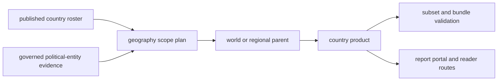
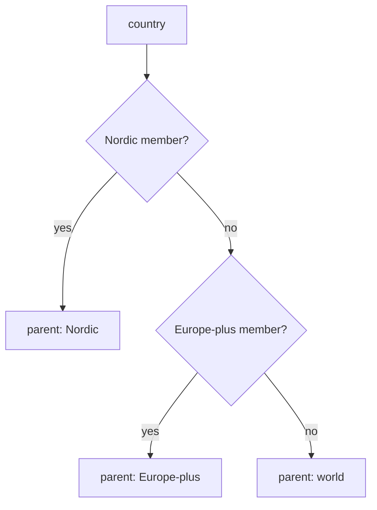
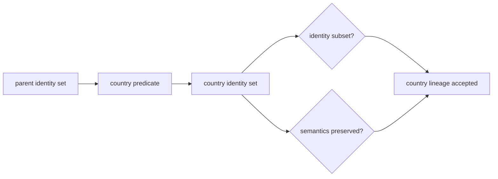

# Country Publication Onboarding

Country publication extends the governed geography graph. It is not a request
for a custom renderer, a copied report tree, or a locally curated fork. The
country enters through the published roster and evidence state; shared
producers derive its scope, bundle, lineage, reviews, and report routes.

## Ownership Model

| Responsibility | Authority |
| --- | --- |
| country admission to publication | published country roster in `bijux_pollenomics.config` |
| world, region, and country parentage | `build_published_geography_plan()` |
| record-to-country resolution | governed political-entity fields and boundary logic |
| country artifact generation | shared reporting services and bundle publishers |
| product identity | country bundle manifest and geography registry |
| lineage proof | publication geography subset validation |
| scientific meaning | source, evidence, curation, and publication contracts inherited from the parent |

No country page owns the scientific facts it displays. Country products
select and present governed members while preserving their upstream authority.

## Admission Preconditions

An additional country is ready for producer execution only when:

- its canonical name and slug resolve through the shared geography model;
- the roster assigns it to the intended publication family;
- source-family rows use governed political-entity values that can select it;
- applicable world or regional parents exist;
- the shared country output contract covers required artifacts;
- no source-specific shortcut is needed to fabricate membership; and
- unsupported evidence families can remain absent or explicitly empty without
  inventing completeness.

If evidence discovery is incomplete, record that as acquisition or recovery
work. Do not admit a country merely to create an empty directory or navigation
entry.

## Scope And Parent Selection

`build_published_geography_plan()` derives parentage from the roster and the
governed regional definitions:

Parent selection is configuration, not a renderer condition. A country can
move only when the governed geography definition changes, and that change
requires re-evaluating every affected child and subset relation.

## Evidence Readiness By Family

Country support is evaluated per source family because the sources do not
share coverage, observation units, or admission rules.

| Evidence family | Country readiness question |
| --- | --- |
| AADR | do captured release rows resolve to the country under the AADR publication contract? |
| animal ancient DNA | do admitted or qualified candidates carry governed political-entity and lineage evidence? |
| LandClim and Neotoma | are site records inside scope with preserved sequence and temporal semantics? |
| SEAD | are contextual sites assigned without inventing chronology? |
| RAÄ | is the country within the Sweden-only source boundary? |
| SVAR | is the use inside the Sweden lake-registry scope and are contracted lifecycle prerequisites present? |
| boundaries | does the governed geometry support containment and framing at the declared version? |

An absent RAÄ or SVAR layer outside Sweden is not a publication defect. It is a
source-scope consequence. The country guide must not imply uniform source
coverage merely because the shared producer can build the directory.

## Producer Contract

The shared producer owns the complete country directory under
`docs/report/countries/<country-slug>/`. A coherent generated product includes
the artifacts required by the active country contracts, which can include:

- bundle manifest and summary;
- structured sample, locality, animal, and context members;
- citations, warnings, and exclusions;
- map contract, map rendering, and traceability;
- country-specific analytical sidecars when governed inputs exist; and
- scientific review and product-readiness surfaces.

Do not create one of these descendants manually. Correct the roster,
geography model, source evidence, product contract, or producer that owns the
missing state, then regenerate its declared output root.

## Member And Non-Member Accounting

Country publication is complete only when visible membership and expected
absence are both explainable:

| Population | Required accounting |
| --- | --- |
| parent members inside country scope | admitted country member or product-specific non-member reason |
| parent members outside country scope | explicit scope exclusion through the governed geography relation |
| known country evidence below admission strength | qualification, refusal, exclusion, or recovery condition |
| source families without country coverage | source-scope statement rather than a synthetic empty population |
| admitted members hidden by default controls | manifest membership distinct from browser visibility |

Totals are reviewed after identities. A matching count cannot prove that the
country selected the correct members or preserved their meaning.

## Subset And Meaning Validation

The country must pass the checks recorded in
`docs/report/publication_geography_subset_validation.json`:

- country membership is permitted by the parent scope;
- animal member identities remain a subset of the parent population;
- human member identities remain a subset of the parent population; and
- inherited records preserve evidence role, locality, coordinate basis,
  temporal posture, and material qualification.

Structural subset success does not prove scientific completeness. Source
coverage, recovery, curation, and release posture remain separate evidence.

## Reader Contract

Public pages should explain the country as one narrower product in the shared
geographic lineage. Country-specific prose is justified only for material
scientific context, source availability, warnings, or analytical products. It
must not duplicate the common publication model or expose repository
production procedure.

The public [geographic publication lineage](../../public/pollenomics-data/publications/geographic-lineage.md)
defines parent-child meaning. The generated country landing page owns the
country's manifested products, counts, citations, warnings, and review links.

## Verification Matrix

| Changed surface | Focused evidence |
| --- | --- |
| roster or parentage | geography plan tests and registry diff |
| political-entity resolution | source-family selection tests with positive, negative, and ambiguous cases |
| country producer | expected artifact inventory and package-owned tests |
| product membership | member-level diff, exclusions, and typed count reconciliation |
| geographic lineage | subset validation against the immediate parent |
| public routes | report portal contract, links, and strict documentation build |
| release posture | affected scientific reviews, warnings, and repository refusal dimensions |

The verification result records the exact roster, parent, country slug,
source versions, member identities, non-member reasons, and generated bundle.
Do not accept the product from directory presence or map rendering alone.

## Worked Route: Germany

Germany belongs to Europe-plus rather than Nordic. A defensible addition
therefore follows this route:

1. admit `Germany` through the published country roster;
2. confirm the geography plan assigns `europe_plus` as its parent;
3. confirm governed evidence rows resolve to Germany without custom aliases;
4. generate the shared country bundle under `docs/report/countries/germany/`;
5. validate German human and animal identities against Europe-plus;
6. retain source-family limits for unavailable or inapplicable layers; and
7. expose the manifested country product through the report portal.

If any requirement needs a Germany-specific renderer branch, copied schema,
or manually curated output row, the shared ownership model is incomplete and
the onboarding must be refused until that boundary is corrected.

## Handoff Evidence

Record the roster and parent change, governed evidence inputs, producer-owned
output root, member and non-member diff, subset results, focused tests,
documentation result, warnings, and any publication or release guard that
remains active.

Use the generated [country onboarding contract](../../../report/publication_country_onboarding_contract.md),
[geography registry](../../../report/publication_geography_registry.md), and
[subset validation](../../../report/publication_geography_subset_validation.md)
as the checked-in evidence companions.
