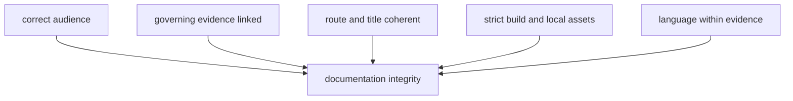
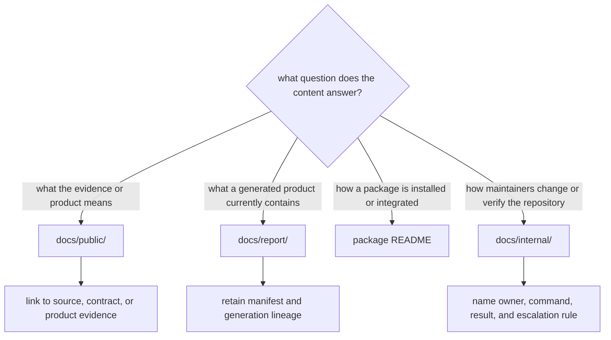

# Documentation Integrity

Documentation integrity means that audience, authority, navigation, and
rendering agree. A strict site build is necessary, but it cannot detect a
reader page that quietly became a commit checklist or a polished claim that no
longer reaches its evidence owner.

## Audience Boundaries

| Surface | Audience | Required content | Content that belongs elsewhere |
| --- | --- | --- | --- |
| `docs/index.md` | public reader | repository purpose, evidence journey, product routes, and material limits | repository maintenance procedure |
| `docs/public/` | public reader and technical integrator | scientific meaning, interfaces, operations, products, provenance, and interpretation | commit sequencing, test-file selection, and policy narration |
| `docs/report/` | public reader and auditor | governed generated products, manifests, warnings, exclusions, and review posture | handwritten replacement for upstream evidence |
| `docs/internal/` | maintainer | ownership, change procedure, exact checks, release evidence, and workflow diagnosis | independent scientific claims |
| package README files | package consumer | identity, supported boundary, examples, and compatibility | repository-wide narrative copied into every package |

Public technical documentation may name commands, schemas, and modules when a
reader needs them. The boundary violation is not technical depth; it is prose
whose only purpose is directing repository maintenance.

## Integrity Model

## Shared Site Contract

`mkdocs.shared.yml` is the shared Bijux docs theme contract consumed by the
repository MkDocs configuration. It governs strict validation, directory URLs,
the Material theme, navigation behavior, search, Mermaid rendering, shared CSS,
and shared JavaScript. Repository navigation and content remain locally owned.

Repository strict MkDocs builds prove that the combined configuration can
render; they do not prove that every governed asset is intentional. Confirm
local assets named by the configuration, especially the logo, styles,
JavaScript, and the browser icon set under `docs/assets/site-icons/`. The icon
directory must retain the favicon and touch-icon files expected by browsers and
deployment surfaces.

Shared shell files are managed inputs. If their contract is wrong, correct the
shared owner and refresh the repository copy through its governed route rather
than hand-editing generated shared content.

## Review Procedure

1. Identify the intended reader and the question the document answers.
2. Confirm every scientific or operational statement against the owning
   source, schema, command, evidence record, or publication contract.
3. Remove delivery history, documentation self-commentary, maintainer
   sequencing, and internal test paths from public prose.
4. Check links from the landing page through the edited section and onward to
   governed evidence or products.
5. Confirm navigation labels, page titles, and headings describe the same
   durable concept.
6. Run the narrowest relevant documentation contracts, then build MkDocs in
   strict mode.

### Audit Numbers As Database Claims

Counts and percentages require the same ownership review as code-generated
artifacts. Before accepting a number in public prose, record:

| Property | Review question |
| --- | --- |
| observation unit | is the count of source rows, samples, sites, projects, claims, or product members? |
| population | captured, foundation, recovered, reviewed, eligible, admitted, excluded, or unresolved? |
| scope and revision | which source release, species, geography, product, and repository state does it describe? |
| authority | which manifest, review, registry, or evidence artifact owns the value? |
| reconciliation | are non-members and differences from adjacent counts explained by identity? |
| claim ceiling | what completeness, coverage, or scientific interpretation remains unsupported? |

For example, the 894 animal foundation rows, 868 recovered sample-master
identities, and 234 published point members are three governed populations.
Documentation integrity requires naming their units and contracts; making the
numbers visually consistent would be a scientific error.

### Test The Reader Journey

For an entrypoint or major section, verify that a reader can move through a
complete question without encountering maintainer narration:

| Journey stage | Reader must be able to identify |
| --- | --- |
| orientation | product, observation unit, scope, and supported question |
| evidence | source identity, governed object, role, place, time, and precision |
| curation | fact owner, conflict posture, admission outcome, and recovery condition |
| publication | manifest, member identity, geography, warnings, and exclusions |
| interpretation | supported statement, unsupported inference, and material limit |

If the only route to one of these answers is a test name, commit note, backlog,
or internal handbook, the public journey is incomplete. Add the domain answer
to the owning public page and keep implementation procedure internal.

## Place Content By Decision Owner

Use ownership, not sensitivity or technical depth, to choose a destination:

Public pages may contain exact CLI examples, schemas, paths, limitations, and
audit routes. They should not contain commit instructions, branch hygiene,
test-module selection, generated-diff acceptance, or narration about how the
page ought to be written. Internal pages may describe those procedures, but
must link scientific claims back to the public or governed evidence owner
rather than becoming a competing authority.

Public command examples also need a safe write boundary. Inspection examples
may read governed state, but learning or evaluation examples for state-changing
commands should use explicit isolated roots under `artifacts/`. Procedures that
intentionally replace checked-in `data/` or `docs/report/` state belong in the
maintainer workflow that owns the complete regeneration and review transaction.

### Reject Public Audience Leaks

Review public Markdown as published product content, not as a note to its
author. Remove or relocate sentences that discuss what the page should cover,
future editing plans, test selection, commit structure, internal review roles,
or documentation quality itself. Preserve domain-facing statements about
evidence limits, recovery conditions, interfaces, and safe operation; those
are part of the reader contract.

The audit asks a simple question: could the sentence stand unchanged on the
public site for a reader who has no repository-maintenance context? If not,
move the durable maintainer decision here and put the actual domain answer on
the owning public page.

## Trace A Claim Across Documentation

For each material claim, verify a complete route:

| Link | Integrity question |
| --- | --- |
| landing to explanation | can the intended reader find the concept by its domain name? |
| explanation to evidence reference | are object, role, denominator, place, time, and precision defined? |
| evidence reference to governed artifact | does the path identify the authoritative source or record rather than a copied narrative? |
| artifact to publication | do manifest, admission, and traceability explain visible membership? |
| publication back to limits | can the reader discover exclusions, incomplete recovery, and unsupported claims? |

A route is incomplete when it ends at prose that merely repeats a number.
Counts must resolve to their population and observation unit; maps must resolve
to membership and provenance; absence statements must resolve to scope,
recovery, evidence, or admission state.

The public curation route begins at
`docs/public/pollenomics-data/curation/`. It owns explanations of admission,
conflict, and recovery meaning. Internal pages may explain how to change or
verify those contracts, but should link back rather than copy the scientific
explanation.

## Focused Verification

The main documentation contracts live in:

- `packages/bijux-pollenomics/tests/regression/test_docs_breadth.py` for
  repository narrative and route breadth;
- `packages/bijux-pollenomics/tests/regression/test_repository_contracts.py`
  for navigation, redirects, Mermaid, local assets, and language constraints;
- `packages/bijux-pollenomics/tests/unit/test_data_reference_docs.py` for data
  reference boundaries;
- `packages/bijux-pollenomics/tests/unit/test_public_artifact_language.py` for
  forbidden public-output terminology;
- `packages/bijux-pollenomics-dev/tests/test_badge_sync.py` for badge identity.

Use `make docs` for the repository-owned strict build, or direct MkDocs output
to `artifacts/` during focused diagnosis. Do not regenerate data or reports to
prove a narrative-only change.

Keep runtime and maintainer-package test trees in separate pytest invocations.
Both use a top-level `tests` package name, so mixing them in one process can
produce collection errors that obscure the real documentation result.

## Acceptance Evidence

An accepted documentation change records:

- the pages and audience boundary changed;
- the governing implementation, data, or product surfaces inspected;
- the focused contracts executed and their exact result;
- the strict site-build result;
- any unexecuted broader gate and why it was unnecessary or deferred.

Current cross-repository posture remains inspectable in the [repository truth
posture](../../report/repository_truth_posture.md), [repository claim
audit](../../report/repository_claim_audit.md), and [repository scientific
progress audit](../../report/repository_scientific_progress_audit.md).
