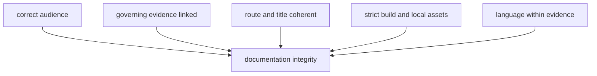

# Documentation Integrity

Documentation integrity means that audience, authority, navigation, and
rendering agree. A strict site build is necessary, but it cannot detect a
reader page that quietly became a commit checklist or a polished claim that no
longer reaches its evidence owner.

## Audience Boundaries

| Surface | Audience | Required content | Content that belongs elsewhere |
| --- | --- | --- | --- |
| `docs/index.md` | public reader | repository purpose, evidence journey, product routes, and material limits | repository maintenance procedure |
| `docs/public/` | public reader and technical integrator | scientific meaning, interfaces, operations, products, provenance, and interpretation | commit sequencing, test-file selection, and policy narration |
| `docs/report/` | public reader and auditor | governed generated products, manifests, warnings, exclusions, and review posture | handwritten replacement for upstream evidence |
| `docs/internal/` | maintainer | ownership, change procedure, exact checks, release evidence, and workflow diagnosis | independent scientific claims |
| package README files | package consumer | identity, supported boundary, examples, and compatibility | repository-wide narrative copied into every package |

Public technical documentation may name commands, schemas, and modules when a
reader needs them. The boundary violation is not technical depth; it is prose
whose only purpose is directing repository maintenance.

## Integrity Model

## Review Procedure

1. Identify the intended reader and the question the document answers.
2. Confirm every scientific or operational statement against the owning
   source, schema, command, evidence record, or publication contract.
3. Remove delivery history, documentation self-commentary, maintainer
   sequencing, and internal test paths from public prose.
4. Check links from the landing page through the edited section and onward to
   governed evidence or products.
5. Confirm navigation labels, page titles, and headings describe the same
   durable concept.
6. Run the narrowest relevant documentation contracts, then build MkDocs in
   strict mode.

## Focused Verification

The main documentation contracts live in:

- `packages/bijux-pollenomics/tests/regression/test_docs_breadth.py` for
  repository narrative and route breadth;
- `packages/bijux-pollenomics/tests/regression/test_repository_contracts.py`
  for navigation, redirects, Mermaid, local assets, and language constraints;
- `packages/bijux-pollenomics/tests/unit/test_data_reference_docs.py` for data
  reference boundaries;
- `packages/bijux-pollenomics/tests/unit/test_public_artifact_language.py` for
  forbidden public-output terminology;
- `packages/bijux-pollenomics-dev/tests/test_badge_sync.py` for badge identity.

Use `make docs` for the repository-owned strict build, or direct MkDocs output
to `artifacts/` during focused diagnosis. Do not regenerate data or reports to
prove a narrative-only change.

## Acceptance Evidence

An accepted documentation change records:

- the pages and audience boundary changed;
- the governing implementation, data, or product surfaces inspected;
- the focused contracts executed and their exact result;
- the strict site-build result;
- any unexecuted broader gate and why it was unnecessary or deferred.

Current cross-repository posture remains inspectable in the [repository truth
posture](../../../report/repository_truth_posture.md), [repository claim
audit](../../../report/repository_claim_audit.md), and [repository scientific
progress audit](../../../report/repository_scientific_progress_audit.md).
