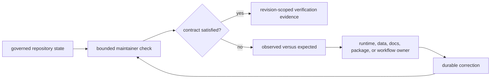
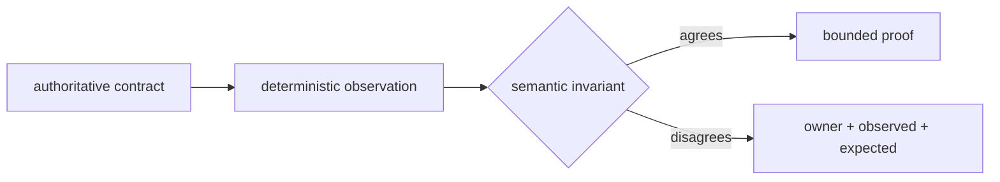
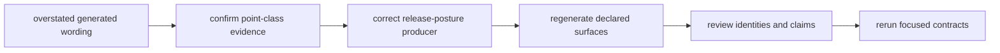

# bijux-pollenomics-dev

`bijux-pollenomics-dev` is the maintainer-only package for executable
repository-health policy. It checks interface freezes, dependency analysis,
documentation presentation, managed license assets, versions, and publication
guards. Its outputs are findings about repository state, never scientific
observations.

The public [domain language](../../public/pollenomics-data/domain-language.md)
continues to govern objects, claims, decisions, and publications. A maintainer
finding observes whether those governed surfaces agree; it does not create a
new evidence posture.

Regular users install `bijux-pollenomics`. Maintainers use this package through
repository tests and workflow commands when the question is whether declared
repository contracts agree at a specific revision.

## Implemented Modules

| Module | Responsibility | Mutation behavior |
| --- | --- | --- |
| `api.freeze_contracts` | compare the canonical API schema, pinned JSON, and stored digest | read-only; reports disagreement |
| `api.openapi_drift` | compare the current OpenAPI field surface with its Git baseline | read-only; reports added or removed fields |
| `docs.badge_sync` | render managed README badge blocks from package and repository metadata | check mode is read-only; synchronization rewrites only declared badge targets |
| `quality.deptry_scan` | merge repository dependency-analysis policy and invoke the package scan | writes transient merged configuration through its controlled execution path |
| `release.license_assets` | compare or synchronize package license and notice assets | check mode is read-only; synchronization writes declared package assets |
| `release.version_resolver` | derive a package version from its metadata and Git history | read-only |
| `release.publication_guard` | reject non-publishable versions or mismatched distribution artifacts | read-only against the selected `dist/` directory |
| `trusted_process` | run explicitly assembled subprocess commands without shell expansion | execution primitive; callers own scope and outputs |

The package deliberately has no scientific collector, normalizer, evidence
reviewer, ranking engine, atlas publisher, or fieldwork decision module.

## Authority Boundary

| Finding | What the package may decide | What remains product-owned |
| --- | --- | --- |
| API freeze mismatch | canonical, pinned, and digest representations disagree | intended runtime compatibility and API semantics |
| badge mismatch | managed presentation differs from metadata-derived rendering | package identity and release history |
| dependency finding | declared package imports or dependency policy disagree | architecture change that resolves the finding |
| license asset mismatch | package copies differ from the governed repository assets | licensing decision itself |
| version or artifact mismatch | selected artifacts are not publishable as the requested version | whether a release should occur |
| report or documentation contract finding | repository routes or declared relations disagree | scientific truth and publication meaning |

The check identifies disagreement. It must not acquire authority by rewriting
the scientific rule or weakening an assertion around an unsupported state.

## Finding Taxonomy

A repository-health failure needs a type as well as a message. The type
determines who can correct it and what a rerun proves:

| Finding type | Example | Owning response | What clears it |
| --- | --- | --- | --- |
| authority mismatch | canonical schema and frozen representation differ | decide the intended canonical state, then regenerate its derivative | focused contract comparison agrees |
| missing governed state | required data or publication member is absent | recover it through the declared owner or retain an explicit refusal | required identity and lineage are present |
| stale generated state | inputs changed without corresponding outputs | rerun the bounded producer and review member-level changes | producer output converges and semantic diff is accepted |
| evidence conflict | two captured claims disagree | evidence owner records precedence, qualification, or refusal | conflict is accounted for, not necessarily erased |
| environment failure | credential, service, or tool is unavailable | preserve repository state and record the rerun condition | same check executes with its required environment |
| publication refusal | evidence does not support the requested release claim | strengthen the evidence owner or keep the release blocked | named scientific guard is satisfied |

An environment failure is not a stale-file finding, and a publication refusal
is not a tooling defect. Conflating them encourages unsafe responses such as
regenerating from incomplete inputs, weakening a scientific guard, or treating
an unavailable network service as evidence loss.

A useful finding reports the owner, observed state, expected invariant,
affected identities, and a non-destructive next inspection. A proposed write
belongs in the owning workflow, not in the checker merely because the checker
found the problem.

### Interpret Check Results Without Collapsing Causes

| Result class | Meaning | Repository response |
| --- | --- | --- |
| contract satisfied | the selected invariant agrees for the named inputs and revision | retain bounded verification evidence; do not generalize to unchecked contracts |
| contract violation | the check evaluated its inputs and found governed disagreement | route observed and expected state to the named owner |
| invalid invocation | arguments, paths, or requested mode do not satisfy the command contract | correct invocation; make no claim about repository state |
| unavailable environment | a tool, credential, service, or platform prerequisite prevented evaluation | preserve governed state and record the exact rerun condition |
| publication refusal | the repository was evaluated correctly and evidence does not support the requested release claim | keep the refusal until its evidence owner changes and the guard is reevaluated |

These outcomes must remain distinguishable in diagnostics and handoff. Treating
an unavailable environment as a passing or failing scientific check, or a
publication refusal as a tooling crash, removes the information needed to
choose a safe next action.

## Use Check Mode Before Write Mode

Badge and license synchronization support an explicit write mode. Run their
check mode first, inspect the named targets, and use synchronization only when
the governed metadata or asset is correct. After writing, review every changed
target and rerun the check.

| Operation class | Before | After |
| --- | --- | --- |
| read-only contract check | identify revision, inputs, and expected owner | retain command, result, and warnings |
| managed synchronization | verify authority and declared target set | review all targets and prove convergence in check mode |
| external command wrapper | inspect constructed arguments and output root | retain exit status and bounded output evidence |
| publication guard | select exact version and distribution directory | retain version and artifact identities; publish only in the owning workflow |

A synchronizer succeeding only proves that it rendered its inputs. It does not
prove those inputs are scientifically correct or that an external publication
succeeded.

## Design A Durable Check

Repository checks remain useful when their contract survives changes in prose,
layout, and incidental execution details:

| Property | Durable design |
| --- | --- |
| input identity | accept or discover one explicit repository root, revision, contract, and governed target set |
| assertion | compare semantic fields, identities, membership, or declared relationships |
| diagnostics | name observed state, expected invariant, owner, and affected paths or members |
| ordering | sort findings and serialized members deterministically |
| path handling | report repository-relative paths and keep disposable output under `artifacts/` |
| mutation | default to read-only; expose write mode only for a declared generated surface |
| exit behavior | distinguish contract disagreement from unavailable environment or invalid invocation |

Avoid checks that pass only because an explanatory paragraph contains one
fragile phrase when a schema field, link target, heading contract, manifest
member, or structured relation can express the real invariant. Prose checks
remain appropriate for prohibited overclaims and other language boundaries
whose meaning is itself the contract.

## Route A Finding

| Signal | Correct owner | Required evidence |
| --- | --- | --- |
| canonical API and digest differ | runtime interface owner | compatibility decision plus regenerated freeze and focused test |
| badge family or package name differs | package metadata owner | metadata diff plus checked synchronization |
| public claim differs from a report | evidence or publication owner | source/member review plus corrected descendant and claim |
| expected report route is absent | report producer or documentation route owner | product generation or route correction plus focused contract |
| artifact version differs from release version | build/version owner | rebuilt artifact identities and publication guard result |
| command cannot evaluate its inputs | operational environment | exact environmental failure, unchanged governed state, and rerun condition |

### Worked Route: Generated Wording Overstates A Point Class

Suppose a generated release gate says that every published animal point has
sample support, while point traceability identifies one member as provisional
project context. The inconsistency crosses several surfaces, but it has one
repair route:

1. Confirm that the feature, evidence row, and traceability record agree on the
   provisional class; do not promote the record to make the prose true.
2. Locate the runtime producer that assembled the release-gate statement. The
   generated JSON or Markdown is an observed symptom, not the handwritten
   correction point.
3. Change the producer so its aggregation preserves point classes and produces
   claim-specific wording.
4. Regenerate the declared gate and every companion representation from the
   same governed inputs.
5. Compare member identities and posture before rerunning the public-language,
   animal-foundation, and repository-contract checks.

The maintainer package may detect or report this mismatch. It must not rewrite
the gate, weaken the language check, or redefine the scientific point class.

## Verification Record

Report each maintainer check with:

- the exact invariant and owning module;
- repository revision and governed inputs;
- observed and expected state when it fails;
- focused command, exit status, and warnings;
- changed targets when a synchronizer runs; and
- the owner responsible for the correction.

Use [quality gates](quality-gates.md) to select proof, [documentation
integrity](documentation-integrity.md) for route and audience contracts, and
[release support](release-support.md) for publication prerequisites. Report
broader lanes as intentionally unexecuted when they are unrelated or too
expensive for the changed boundary; do not describe a focused result as proof
that the entire repository is green.
