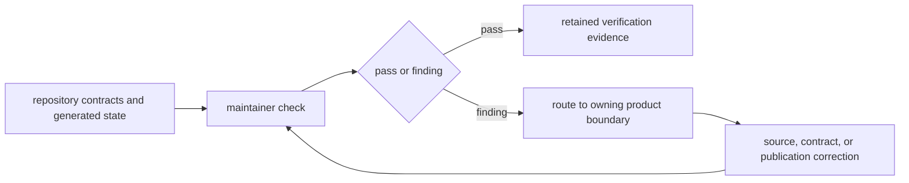

# bijux-pollenomics-dev

`bijux-pollenomics-dev` owns executable repository-health policy. It validates
documentation integrity, release support, badges, governed report routes, and
repository truth contracts without taking ownership of collection, scientific
normalization, evidence review, ranking, or publication behavior.

## Ownership Boundary

| Concern | `bijux-pollenomics-dev` role | Product owner |
| --- | --- | --- |
| public and internal navigation | detect missing, crossed, or stale routes | documentation owners |
| generated report inventory | verify expected governed surfaces and audiences | runtime reporting package |
| badges and package identity | verify synchronized repository presentation | release and package metadata |
| release readiness | aggregate repository evidence and enforce stops | affected runtime and workflow owners |
| source or evidence semantics | no authority | `bijux-pollenomics` runtime and governed data contracts |
| atlas membership or scientific claim | no authority | evidence and publication contracts |

## Maintainer Evidence Flow

A failing maintainer check identifies drift; it does not authorize a local
exception or rewrite the scientific rule. Correction belongs where the
disputed behavior or claim is owned.

## Handbook Routes

| Question | Route |
| --- | --- |
| Which operating invariants apply to maintainer work? | [Operating guidelines](operating-guidelines.md) |
| Which gate supplies proof for a changed boundary? | [Quality gates](quality-gates.md) |
| How are reader, maintainer, report, and generated routes kept distinct? | [Documentation integrity](documentation-integrity.md) |
| How does a new country enter the publication geography? | [Country onboarding](future-country-onboarding-playbook.md) |
| Which evidence supports verification and release? | [Release support](release-support.md) |
| Which repository contracts must remain aligned? | [Repository governance](repository-governance.md) |
