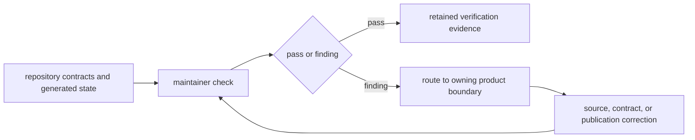
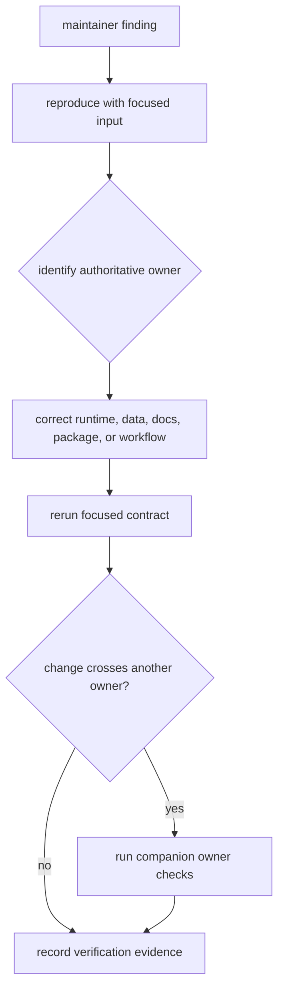

# bijux-pollenomics-dev

`bijux-pollenomics-dev` owns executable repository-health policy. It validates
documentation integrity, release support, badges, governed report routes, and
repository truth contracts without taking ownership of collection, scientific
normalization, evidence review, ranking, or publication behavior.

## Ownership Boundary

| Concern | `bijux-pollenomics-dev` role | Product owner |
| --- | --- | --- |
| public and internal navigation | detect missing, crossed, or stale routes | documentation owners |
| generated report inventory | verify expected governed surfaces and audiences | runtime reporting package |
| badges and package identity | verify synchronized repository presentation | release and package metadata |
| release readiness | aggregate repository evidence and enforce stops | affected runtime and workflow owners |
| source or evidence semantics | no authority | `bijux-pollenomics` runtime and governed data contracts |
| atlas membership or scientific claim | no authority | evidence and publication contracts |

## Maintainer Evidence Flow

A failing maintainer check identifies drift; it does not authorize a local
exception or rewrite the scientific rule. Correction belongs where the
disputed behavior or claim is owned.

## Check Families

| Check family | Reads | Proves | Does not prove |
| --- | --- | --- | --- |
| documentation integrity | navigation, routes, reader language, links, diagrams, and local assets | documentation structure and declared claims remain internally coherent | scientific completeness |
| API freeze | canonical schema, pinned form, and digest | published interface representation has not drifted silently | implementation correctness for every input |
| package identity | metadata, badges, dependency direction, and compatibility surface | canonical, alias, and maintainer identities remain aligned | release publication succeeded |
| repository operations | Make targets and documented command ownership | operators are routed to existing owned commands | every broad lane must run for every change |
| report inventory | generated registry, manifests, and expected product paths | required governed products remain discoverable | their scientific claims are automatically correct |
| release support | licenses, packages, workflows, repository truth, and active refusals | release prerequisites and stops are explicit | evidence weakness may be waived |

## Respond To A Finding

If a generated artifact is stale, correct or run its producer. If a scientific
claim is unsupported, change the evidence or retain the refusal. If a public
page contains internal procedure, move the procedure here and leave the public
page focused on reader use and interpretation.

## Handbook Routes

| Question | Route |
| --- | --- |
| Which operating invariants apply to maintainer work? | [Operating guidelines](operating-guidelines.md) |
| Which gate supplies proof for a changed boundary? | [Quality gates](quality-gates.md) |
| How are reader, maintainer, report, and generated routes kept distinct? | [Documentation integrity](documentation-integrity.md) |
| How does a new country enter the publication geography? | [Country onboarding](future-country-onboarding-playbook.md) |
| Which evidence supports verification and release? | [Release support](release-support.md) |
| Which repository contracts must remain aligned? | [Repository governance](repository-governance.md) |

## Verification Discipline

Use a focused check when one contract and one owner changed. Add companion
checks when navigation, package identity, generated state, or release posture
also changed. The strict documentation build belongs with public navigation or
rendering changes; it does not require collection or report regeneration for a
narrative-only edit.

Retain failures and warnings in the handoff. Unknown pytest marks, external
tool warnings, intentionally skipped slow lanes, and active scientific release
refusals are part of the verification record, even when the focused contract
passes.
