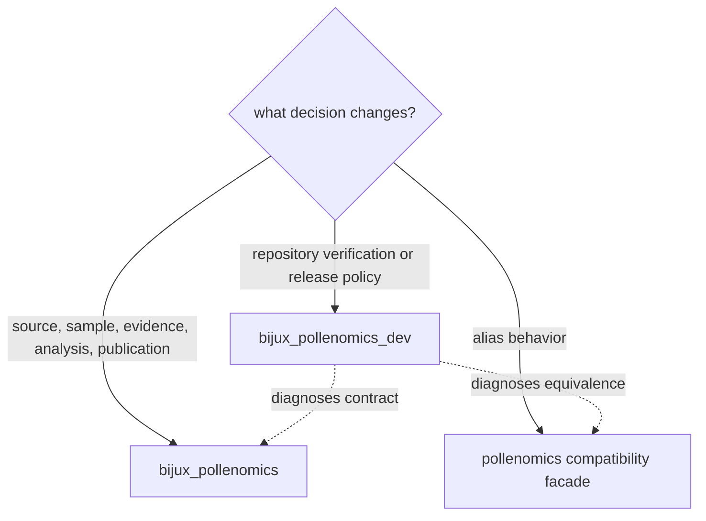
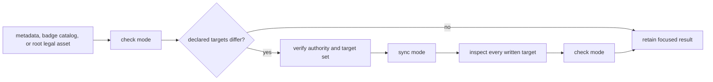

# Operating Guidelines

`bijux-pollenomics-dev` turns repository contracts into explicit diagnostics.
It verifies runtime, data, documentation, packaging, and release boundaries
without becoming the owner of their scientific behavior.

## Ownership Test

A check belongs in the maintainer package when it evaluates repository state
or policy and can name the owning contract it is checking. Scientific intake,
normalization, evidence fitness, ranking, and publication remain runtime work
even when a maintainer check detects their drift.

## Diagnostic Contract

Every maintainer check should define:

- the governed input it reads;
- the invariant or policy it evaluates;
- whether it is strictly read-only;
- its success and failure exit behavior;
- the evidence retained for diagnosis;
- the runtime, data, documentation, package, or workflow owner responsible for
  correction.

Checks should report the disputed object and contract. A generic failure that
only says the repository is unhealthy creates another ambiguity layer.

## Mutation Boundaries

Maintainer verification is read-only unless a command explicitly owns a
governed synchronization or release artifact. Transient output belongs under
`artifacts/`. Runtime evidence belongs under `data/`; public products belong
under `docs/report/`; shared managed standards are not handwritten downstream.

Do not make a failing check pass by deleting evidence, weakening a claim gate,
ignoring a return code, or teaching the check to accept two conflicting
authorities.

### Preflight Every Repository Operation

Before execution, classify the operation rather than relying on a familiar
target name:

| Preflight field | Required answer |
| --- | --- |
| intent | inspect, validate, synchronize, regenerate, build, or publish |
| authority | exact contract or source of truth the operation consumes |
| input identity | revision, versions, roots, configuration, credentials, and network dependencies |
| write boundary | complete governed targets and disposable output locations |
| failure behavior | whether prior governed state is retained, partially written, or requires recovery |
| acceptance evidence | semantic diff, member identities, focused checks, warnings, and exclusions |

A command that writes only `artifacts/` is not automatically harmless if its
result will be used to justify a governed change. Conversely, a state-changing
producer is reviewable when its authority, complete target set, and rollback or
replacement behavior are explicit.

## Check And Synchronize Deliberately

Only badge blocks and package legal-asset copies currently expose maintainer
synchronization modes. Their control flow is explicit:

Do not run synchronization as a generic repair. If the authority is wrong,
synchronization distributes the wrong state consistently. Correct the owner
first, then materialize its declared descendants.

`trusted_process` is an execution primitive, not a scope grant. Callers must
assemble arguments without shell expansion, set the working directory and
output destination explicitly, propagate the exit status, and retain enough
diagnostic context to identify the invoked tool.

## Verification Selection

| Changed owner | First maintainer evidence |
| --- | --- |
| public or internal documentation | focused documentation contract and strict site build |
| package identity or alias | package metadata and runtime-equivalence checks |
| API description | schema validation, pinned rendering, and digest agreement |
| repository dependency policy | dependency and lock checks |
| generated public state | owning semantic contract plus reviewed governed diff |
| release posture | package, license, workflow, and repository-truth gates |

Expand verification when the change crosses owners. Do not run broad gates by
habit when a focused contract answers the question, and do not use a focused
check to claim coverage of an unrelated boundary.

## Review Generated State Causally

Generated diffs should be explained from owner to descendant:

1. inspect the handwritten or governed input change;
2. confirm the producer and its complete write boundary;
3. compare manifests and stable member identities;
4. classify field changes by semantics, precision, role, and null posture;
5. reconcile warnings, exclusions, and recovery records;
6. review rendered summaries and totals last.

An unchanged count can conceal member replacement or weakened evidence. A
large rendered diff can come from one legitimate template correction. File
volume is therefore not a substitute for causal review.

Never hide an unexplained generated difference by excluding the path, relaxing
the assertion, or accepting both old and new authorities. If the producer
cannot explain its output, preserve the finding and repair the ownership or
generation contract.

## Handoff Record

The maintainer record makes verification reconstructable without private
context:

| Field | Required content |
| --- | --- |
| repository state | branch, base commit, head commit, and whether the worktree is clean |
| changed authority | runtime, data, documentation, package, workflow, or release contract |
| commit boundaries | ordered subjects and the durable intent of each |
| verification | exact command, exit status, pass count, and material warnings |
| omitted proof | broader lane not executed and the scope or cost reason |
| mutations | governed roots, generated targets, or external state changed |
| residual risk | known failure, incomplete evidence, warning, or deferred owner |

Warnings remain visible even when they are expected. A skipped broad gate is
not described as passing. A focused pass is reported only for the contract it
actually exercised.
