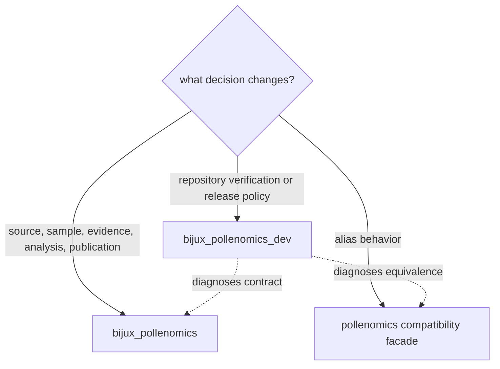

# Operating Guidelines

`bijux-pollenomics-dev` turns repository contracts into explicit diagnostics.
It verifies runtime, data, documentation, packaging, and release boundaries
without becoming the owner of their scientific behavior.

## Ownership Test

A check belongs in the maintainer package when it evaluates repository state
or policy and can name the owning contract it is checking. Scientific intake,
normalization, evidence fitness, ranking, and publication remain runtime work
even when a maintainer check detects their drift.

## Diagnostic Contract

Every maintainer check should define:

- the governed input it reads;
- the invariant or policy it evaluates;
- whether it is strictly read-only;
- its success and failure exit behavior;
- the evidence retained for diagnosis;
- the runtime, data, documentation, package, or workflow owner responsible for
  correction.

Checks should report the disputed object and contract. A generic failure that
only says the repository is unhealthy creates another ambiguity layer.

## Mutation Boundaries

Maintainer verification is read-only unless a command explicitly owns a
governed synchronization or release artifact. Transient output belongs under
`artifacts/`. Runtime evidence belongs under `data/`; public products belong
under `docs/report/`; shared managed standards are not handwritten downstream.

Do not make a failing check pass by deleting evidence, weakening a claim gate,
ignoring a return code, or teaching the check to accept two conflicting
authorities.

## Verification Selection

| Changed owner | First maintainer evidence |
| --- | --- |
| public or internal documentation | focused documentation contract and strict site build |
| package identity or alias | package metadata and runtime-equivalence checks |
| API description | schema validation, pinned rendering, and digest agreement |
| repository dependency policy | dependency and lock checks |
| generated public state | owning semantic contract plus reviewed governed diff |
| release posture | package, license, workflow, and repository-truth gates |

Expand verification when the change crosses owners. Do not run broad gates by
habit when a focused contract answers the question, and do not use a focused
check to claim coverage of an unrelated boundary.

## Handoff Record

The maintainer record states the changed contract, commit boundaries, exact
checks, skipped checks, remaining warnings, and whether governed state was
rewritten. This makes verification evidence reconstructable without relying
on delivery history or private context.
