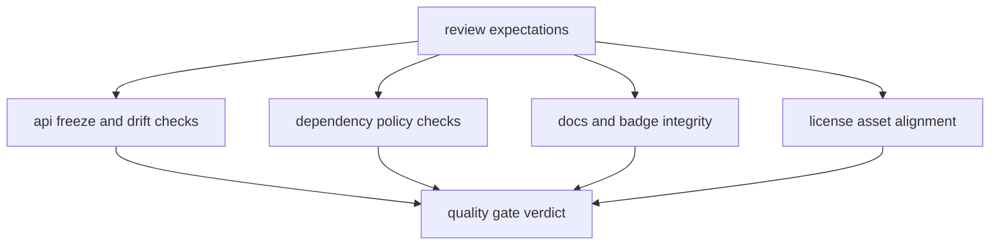

# Quality Gates

`bijux-pollenomics-dev` supports repository quality by turning review rules
into executable checks.

## Quality Gate Model

These gates are proof surfaces, not chores. Each helper turns one review
expectation into an executable stop condition before repository drift escapes
into broader publication claims.

## Current Gates

- API freeze and schema drift checks
- dependency policy checks
- docs and badge integrity checks
- release support and license alignment checks
- repository truth and publication-claim checks where runtime outputs demand it

## Executable Gate Ownership

| Gate | Direct module or repository route | Reads | May write |
| --- | --- | --- | --- |
| API freeze | `python -m bijux_pollenomics_dev.api.freeze_contracts --repo-root .` | `apis/*/v1/schema.yaml`, pinned JSON, stored digest | no |
| OpenAPI field drift | `python -m bijux_pollenomics_dev.api.openapi_drift --repo-root .` | current schema and preceding Git revision | no |
| badge integrity | `python -m bijux_pollenomics_dev.docs.badge_sync check` | badge catalog and package metadata | only the separate `sync` mode writes managed blocks |
| license assets | `python -m bijux_pollenomics_dev.release.license_assets check` | root and package legal assets | only the separate `sync` mode writes package copies |
| dependency policy | `bijux_pollenomics_dev.quality.deptry_scan` through package quality routes | root policy, package metadata, and imports | transient merged configuration only |
| package version | `bijux_pollenomics_dev.release.version_resolver` | package metadata, Hatch result, and tags | no |
| publication eligibility | `bijux_pollenomics_dev.release.publication_guard` | resolved version and optional distribution directory | no |
| documentation rendering | `make docs` or a strict MkDocs build under `artifacts/` | nav, Markdown, assets, links, and plugins | rendered site under `artifacts/` |

The direct modules are useful for bounded diagnosis. Repository Make routes
remain the integration surface when prerequisite setup, shared configuration,
or multiple owners are intentionally part of the proof.

## Test Layers

Choose the narrowest layer that owns the risk. Broader execution is warranted
when a change crosses boundaries, not as a substitute for identifying the
affected contract.

| Layer | Location | Use it for |
| --- | --- | --- |
| unit | `tests/unit/` | command parsing, normalization, data layout, geometry, rendering, and other focused behavior |
| regression | `tests/regression/` | tracked repository contracts, documentation conventions, workflow assumptions, and stable artifact expectations |
| end to end | `tests/e2e/` | installed command paths and complete operator-visible effects |

Representative anchors include
`tests/unit/test_command_line.py`, `tests/unit/test_data_layout.py`,
`tests/unit/test_reporting_artifacts.py`,
`tests/regression/test_repository_contracts.py`, and
`tests/e2e/test_cli.py`.

## Select Proof By Changed Boundary

| Changed surface | First proof | Expansion condition |
| --- | --- | --- |
| parser, helper, or normalization rule | owning unit test module | add regression coverage when a tracked contract changes |
| repository or documentation contract | focused regression test | add a strict site build when navigation, links, or rendering can change |
| command wiring or installed behavior | focused end-to-end case | add unit coverage when the defect belongs to an internal rule |
| package metadata or distribution | package check and source-install smoke | add release checks when published metadata changes |
| governed data or report output | owning semantic tests and reviewed artifact diff | add publication checks when membership or exclusions change |

Run unit, regression, and end-to-end suites separately when package test trees
share import names. This keeps collection deterministic and preserves a clear
failure owner. Full gates remain appropriate for release qualification and
genuinely cross-cutting changes.

## Classify A Failure Before Expanding

| Failure signal | First owner to inspect | Do not infer |
| --- | --- | --- |
| MkDocs cannot resolve a page | nav target, Markdown link, or generated docs source | that scientific evidence is invalid |
| claim-language contract fails | public wording and its governing evidence posture | that deleting the assertion is an acceptable correction |
| badge check reports drift | package metadata or badge catalog, then generated block | that the release itself failed |
| API freeze differs | canonical schema intent, pinned representation, and digest | that the pin should be handwritten to match |
| OpenAPI removal is reported | compatibility decision and schema version | that every additive schema change is breaking |
| license copy differs | root legal authority and declared package targets | that package-local wording owns the licence decision |
| pytest collection imports the wrong `tests` tree | invocation composition and package boundary | that the tests themselves are defective |

Expand only after the first owner is understood. A broader gate can reveal
secondary consequences, but it cannot assign the primary correction owner.

## Acceptance Record

For each completed change, record the exact checks run, their result, and any
intentionally deferred proof. A passing command is evidence for its owned
boundary; it is not evidence that every repository surface was exercised.
