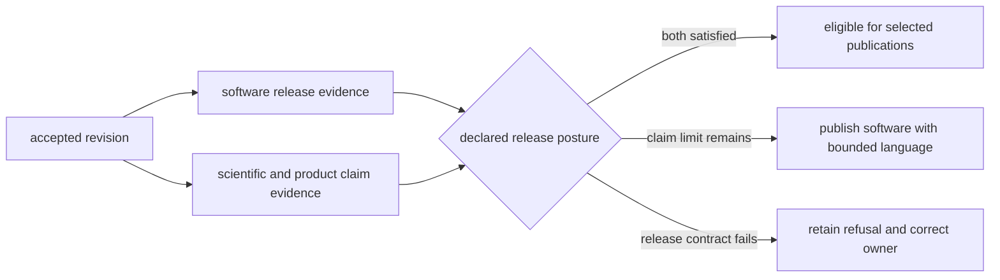

# Release Support

Release support connects an accepted repository revision to explicit package,
artifact, documentation, and scientific-claim evidence. It does not publish by
itself and does not turn a green software build into scientific readiness.

## Two Independent Questions

| Question | Governing evidence |
| --- | --- |
| Can this revision produce publishable software artifacts? | version resolution, package build, metadata, license assets, artifact guard, and install smoke |
| Can this revision use the proposed product language? | repository truth posture, claim audit, product contracts, scientific reviews, exclusions, and active refusals |

Both can pass, both can fail, or they can disagree. A technically publishable
wheel may accompany a product that must retain qualified language. A strong
evidence release can still be blocked by a version mismatch or malformed
distribution.

## Maintainer-Owned Release Checks

| Module or route | Establishes | Does not establish |
| --- | --- | --- |
| `release.version_resolver` | version derived from package metadata and Git identity | that artifacts were built from the intended revision |
| `release.publication_guard` | requested artifacts carry a publishable matching version | external publication success |
| `release.license_assets check` | package legal copies match root authorities | a new licensing decision |
| `docs.badge_sync check` | managed badge blocks match declared metadata | package availability on an external registry |
| package build and smoke routes | wheel and source distribution build and install under their declared checks | scientific evidence sufficiency |
| documentation strict build | configured site renders from the revision | deployed Pages identity or claim truth |

The public release set contains `bijux-pollenomics` and `pollenomics`.
`bijux-pollenomics-dev` is verified as a repository component but is not a
selected public distribution in the release matrices.

## Release-Facing Review Order

Review broad posture, then the narrow gate that owns the proposed statement:

1. [repository product model](../../../report/repository_product_model.md);
2. [repository credibility dashboard](../../../report/repository_credibility_dashboard.md);
3. [repository truth posture](../../../report/repository_truth_posture.md);
4. [repository claim audit](../../../report/repository_claim_audit.md);
5. relevant source, animal, atlas, or publication review;
6. [repository final release refusal](../../../report/repository_final_release_refusal.md).

If a refusal still blocks final language, neither README polish nor a passing
package build closes it. Strengthen the governing evidence or retain the
qualified claim.

## Pre-Publication Packet

| Packet member | Required identity |
| --- | --- |
| revision | branch or tag, commit SHA, clean accepted tree, and verification run |
| release set | selected package names and intended external surfaces |
| version | requested tag and resolved version for every selected distribution |
| artifacts | wheel, source distribution, SBOM, checksums or retained Actions artifact identities |
| repository checks | exact focused and release-wide commands, results, and warnings |
| scientific posture | active qualifications, exclusions, refusal surfaces, and approved wording |
| publication outcome | PyPI, GHCR, GitHub release, and docs states recorded independently |

Do not rebuild an untracked local approximation after approval and call it the
same release. Publication lanes consume the staged artifacts associated with
the accepted revision and version.

## Direct Release Stops

- [repository generated output policy](../../../report/repository_generated_output_policy.md)
- [repository governance artifact review](../../../report/repository_governance_artifact_review.md)
- [repository final release refusal](../../../report/repository_final_release_refusal.md)
- [animal publication release gate](../../../report/animal_publication_release_gate.md)

Each stop names its own scope. Report it as passed, failed, blocked, or not run;
do not collapse several stops into an unqualified “release ready” label.

## Partial Publication And Recovery

A release can be partial because package and documentation surfaces publish
independently. Record successful surfaces and failed surfaces without implying
rollback where an external registry is immutable.

| Failure | Safe recovery |
| --- | --- |
| version or artifact mismatch | rebuild from the intended tag; never rename an artifact to bypass the guard |
| PyPI already contains the version | reconcile the immutable publication; create a new version for changed bytes |
| GHCR or GitHub publication fails | retry against the same staged artifact and release identity when supported |
| docs deployment fails | separate site build evidence from Pages publication evidence and retry the failed boundary |
| scientific refusal remains | publish only language that the accepted posture supports or defer the affected claim |

See [verification and release](../maintain/gh-workflows/verification-and-release.md)
for workflow triggers, artifact construction, external identities, and
cross-surface reconciliation.
