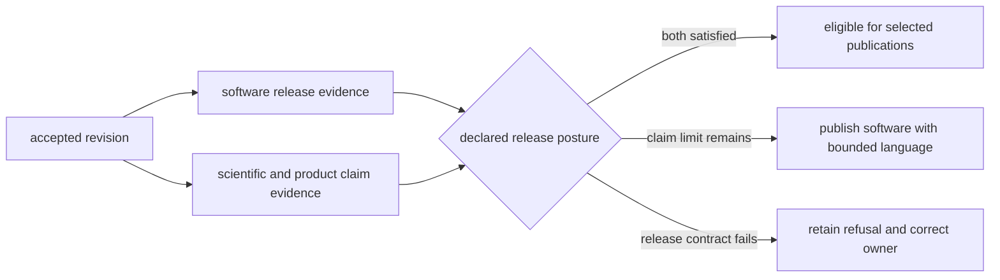

# Release Support

Release support connects an accepted repository revision to explicit package,
artifact, documentation, and scientific-claim evidence. It does not publish by
itself and does not turn a green software build into scientific readiness.

## Two Independent Questions

| Question | Governing evidence |
| --- | --- |
| Can this revision produce publishable software artifacts? | version resolution, package build, metadata, license assets, artifact guard, and install smoke |
| Can this revision use the proposed product language? | repository truth posture, claim audit, product contracts, scientific reviews, exclusions, and active refusals |

Both can pass, both can fail, or they can disagree. A technically publishable
wheel may accompany a product that must retain qualified language. A strong
evidence release can still be blocked by a version mismatch or malformed
distribution.

## Maintainer-Owned Release Checks

| Module or route | Establishes | Does not establish |
| --- | --- | --- |
| `release.version_resolver` | version derived from package metadata and Git identity | that artifacts were built from the intended revision |
| `release.publication_guard` | requested artifacts carry a publishable matching version | external publication success |
| `release.license_assets check` | package legal copies match root authorities | a new licensing decision |
| `docs.badge_sync check` | managed badge blocks match declared metadata | package availability on an external registry |
| package build and smoke routes | wheel and source distribution build and install under their declared checks | scientific evidence sufficiency |
| documentation strict build | configured site renders from the revision | deployed Pages identity or claim truth |

The public release set contains `bijux-pollenomics` and `pollenomics`.
`bijux-pollenomics-dev` is verified as a repository component but is not a
selected public distribution in the release matrices.

## Release-Facing Review Order

Review broad posture, then the narrow gate that owns the proposed statement:

1. [repository product model](../../../report/repository_product_model.md);
2. [repository credibility dashboard](../../../report/repository_credibility_dashboard.md);
3. [repository truth posture](../../../report/repository_truth_posture.md);
4. [repository claim audit](../../../report/repository_claim_audit.md);
5. relevant source, animal, atlas, or publication review;
6. [repository final release refusal](../../../report/repository_final_release_refusal.md).

If a refusal still blocks final language, neither README polish nor a passing
package build closes it. Strengthen the governing evidence or retain the
qualified claim.

## Pre-Publication Packet

| Packet member | Required identity |
| --- | --- |
| revision | branch or tag, commit SHA, clean accepted tree, and verification run |
| release set | selected package names and intended external surfaces |
| version | requested tag and resolved version for every selected distribution |
| artifacts | wheel, source distribution, SBOM, checksums or retained Actions artifact identities |
| repository checks | exact focused and release-wide commands, results, and warnings |
| scientific posture | active qualifications, exclusions, refusal surfaces, and approved wording |
| publication outcome | PyPI, GHCR, GitHub release, and docs states recorded independently |

Do not rebuild an untracked local approximation after approval and call it the
same release. Publication lanes consume the staged artifacts associated with
the accepted revision and version.

## Direct Release Stops

- [repository generated output policy](../../../report/repository_generated_output_policy.md)
- [repository governance artifact review](../../../report/repository_governance_artifact_review.md)
- [repository final release refusal](../../../report/repository_final_release_refusal.md)
- [animal publication release gate](../../../report/animal_publication_release_gate.md)

Each stop names its own scope. Report it as passed, failed, blocked, or not run;
do not collapse several stops into an unqualified “release ready” label.

The canonical release-evidence decision also checks every required count
reconciliation. An `unavailable` count is unknown, and a `refused` count is
inadmissible under its recorded reason; neither is a reported zero. Passing
gates, including independently attested gates, cannot turn these rows into
`verified_complete`. The decision names each affected reconciliation in its
reason codes. An unrelated reduced-scope decision cannot waive an unresolved
required count. Resolve the source evidence or explicitly govern a narrower
release scope before seeking approval.

Counts also do not override a required bundle's scientific release posture.
The release assessor reads manifest-bound `release_metadata.json` and retains
explicit classification or propagation refusal reasons in its decision. Missing
or malformed release posture fails validation; an unrelated reduced-scope
blocker cannot waive an explicit refusal.

## v0.1.8 Publication Preparation

The planned release identifier is `v0.1.8`, with changelog date `2026-09-08`.
The dated entries in the root and three package changelogs are prepared release
notes, not evidence that a tag, registry upload, or deployment exists. The
actual publication timestamps must remain those recorded by each destination;
do not backdate them to match the changelog.

Before executing the post-merge publication sequence:

1. Confirm PR #199 is merged and record its accepted `main` commit. Reconcile
   that commit with the reviewed local candidate and its passing required
   checks; a green run for an earlier PR head is insufficient.
2. Retain the exact report-rebuild, test-partition, documentation, browser,
   artifact, and scientific-refusal evidence for the accepted revision. A
   ten-minute timeout is a ceiling, not a passing performance measurement.
3. Confirm authority for each intended external write. Merging, creating and
   publishing the tag, deploying documentation, and publishing the selected
   release surfaces are separate actions.
4. Verify `v0.1.8` does not already identify another commit or immutable
   published distribution. Create the release tag only on the accepted commit;
   never move an existing release tag or substitute different artifact bytes.
5. Build and verify distributions from that tag. All three packages derive
   their versions from Git through `hatch-vcs`; no handwritten version bump is
   required. A pre-tag `0.1.8.devN` build is diagnostic only and must not be
   renamed or uploaded as `0.1.8`.

After those conditions are met, the release operator can dispatch the existing
workflows. Dispatch release workflows **from `v0.1.8`**, not from a later moving
`main`, and supply `release_tag=v0.1.8` and `enabled=true`. The current release
matrices select `bijux-pollenomics` and `pollenomics`; keep
`bijux-pollenomics-dev` out of the public package set. The individual dispatches
are `release-pypi.yml` (with `mode=artifact`), `release-ghcr.yml`, and
`release-github.yml`. Record each
run and its built wheel, source distribution, SBOM, and destination identities.
Do not enable replacement of an existing GitHub release as a routine retry.

Documentation deployment is separately dispatched through `deploy-docs.yml`
after the merge. Record its source SHA, strict-build result, Pages artifact,
deployment URL, and observed atlas build identity. If using `main`, confirm its
resolved SHA still matches the intended publication revision. A local preview
or package release does not establish deployed documentation parity.

Use the prepared changelog entry as the release-note authority and retain its
qualifications. The current manual GitHub release dispatch exposes only tag,
enabled state, and build matrix; a custom release-notes path is available to
reusable callers or configuration, not as an undeclared dispatch input. Review
the resulting notes before claiming that the prepared narrative was published.
Do not describe ecological classifications, migration/causation, unavailable
sources, or independent scientific approval more strongly than their bound
release evidence permits.

## Partial Publication And Recovery

A release can be partial because package and documentation surfaces publish
independently. Record successful surfaces and failed surfaces without implying
rollback where an external registry is immutable.

| Failure | Safe recovery |
| --- | --- |
| version or artifact mismatch | rebuild from the intended tag; never rename an artifact to bypass the guard |
| PyPI already contains the version | reconcile the immutable publication; create a new version for changed bytes |
| GHCR or GitHub publication fails | retry against the same staged artifact and release identity when supported |
| docs deployment fails | separate site build evidence from Pages publication evidence and retry the failed boundary |
| scientific refusal remains | publish only language that the accepted posture supports or defer the affected claim |

See [verification and release](../maintain/gh-workflows/verification-and-release.md)
for workflow triggers, artifact construction, external identities, and
cross-surface reconciliation.
