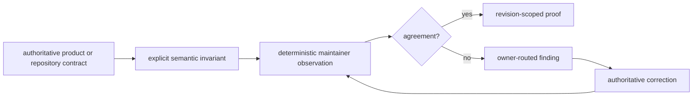

# Repository Governance

Repository governance makes ownership, generated-state relationships, public
claims, and release prerequisites executable. `bijux-pollenomics-dev` observes
those contracts and reports disagreement. It is not a second runtime, a source
collector, a scientific curator, or an atlas publisher.

## Package Boundary

`bijux-pollenomics-dev` owns repository observation, deterministic findings,
documentation support, and release guards. The canonical runtime package owns
public scientific and publication behavior; the compatibility distribution
delegates to that runtime; data and report producers own their governed output
trees. Moving domain logic into the maintainer package would make a check an
unreviewed second implementation.

## Module Map

| Module family | Responsibility | Authority consumed |
| --- | --- | --- |
| `api` | frozen-schema rendering and drift observation | canonical API intent and checked-in schema |
| `docs` | badge and documentation integrity support | package metadata, site configuration, and reader contracts |
| `quality` | dependency and repository-policy checks | package architecture and repository configuration |
| `release` | licence, version, and publication eligibility checks | legal assets, package metadata, tags, and built artifacts |
| `trusted_process` | bounded subprocess execution and diagnostics | caller-declared command, roots, and expected result |

The modules report agreement or disagreement. They do not create a competing
scientific fact, product member, version, or release identity.

## Governance Domains

| Domain | Maintainer implementation | Authoritative owner remains |
| --- | --- | --- |
| API freeze | `api.freeze_contracts` and `api.openapi_drift` | canonical API schema and runtime compatibility decision |
| documentation presentation | `docs.badge_sync` plus repository documentation tests | package metadata, navigation, public evidence, and documentation owners |
| dependency policy | `quality.deptry_scan` | package architecture and dependency metadata |
| legal assets | `release.license_assets` | root `LICENSE` and `NOTICE` authorities |
| version and artifact eligibility | `release.version_resolver` and `release.publication_guard` | Git tag, package metadata, build, and release workflow |
| process execution | `trusted_process` | the caller's command, scope, working directory, and output contract |

The maintainer package owns the observation and diagnostic behavior in the
middle column. It does not acquire the authority named in the final column.

## Rule Lifecycle

An invariant should be encoded where its meaning is owned. The check consumes
that invariant, compares observed state, and reports enough identity to make
the correction unambiguous.

## Schema And Scope Governance

Schema governance binds canonical intent, normalized representation, digest,
and compatibility review. Scope governance binds a check to the exact paths,
packages, members, or publication surfaces it claims to inspect. A green
result outside that declared scope cannot be promoted into repository-wide
proof.

When a schema or scope changes, update the owner first, regenerate managed
derivatives through their producer, inspect removed and reinterpreted fields,
and retain a focused regression. Never hand-edit a pin or widen a glob merely
to make current state agree with an old expectation.

## Add Or Change A Governance Rule

Before adding a rule, answer:

1. Which durable contract is at risk?
2. Which authority decides the expected state?
3. Can the check observe the relation without recreating domain logic?
4. Which paths, members, or external identities are in scope?
5. Is the check read-only, or does a separate mode own a bounded generated
   surface?
6. Which result distinguishes disagreement, invalid invocation, and unavailable
   environment?
7. What focused proof demonstrates the rule itself?

Prefer semantic relationships over incidental text. For example, compare a
schema with its pinned representation and digest; compare a manifest with its
members; compare badge rendering with package metadata. Use language checks
when wording strength or prohibited terminology is the governed contract.

## Generated Governance State

Badge blocks and package legal copies have explicit synchronizers. Check mode
observes drift; synchronization materializes declared targets from their
authorities. Review the authoritative input and all written targets, then rerun
check mode to prove convergence.

Other findings do not grant a generic write capability. API intent, scientific
posture, report membership, package metadata, and workflow behavior must be
corrected by their own owners and regenerated through their own producers.

| Finding | Unsafe response | Durable response |
| --- | --- | --- |
| frozen API drift | hand-edit the digest to silence the comparison | decide canonical schema intent, regenerate the pin, and verify compatibility |
| generated claim overstates evidence | weaken or delete the checker | correct evidence or producer wording and retain the bounded posture |
| badge drift | edit one badge URL outside the managed block | correct metadata or catalog and run the owned synchronizer |
| missing governed artifact | create an empty placeholder | recover through the declared producer with lineage and semantic validation |
| external service unavailable | treat the repository state as failed evidence | record the environmental block and unchanged governed state |

## Security And Release Pressure

Governance must fail closed when a required contract cannot be evaluated or
when public state exceeds its authority. Release urgency does not justify:

- bypassing exit status or publication guards;
- accepting development, local, or mismatched artifact versions;
- weakening evidence-language or traceability assertions;
- hand-editing managed standards, generated reports, or frozen derivatives;
- deleting exclusions or recovery records to create a cleaner result; or
- treating a local build as proof of external publication.

Failing closed preserves the last coherent governed state and names the
condition required to proceed. It does not mean every environmental failure is
a product defect.

## Governance Evidence

A reviewable governance change retains the changed rule and owner, the before
and after observation, deterministic diagnostics, focused tests, generated
targets if any, warnings, and broader proof intentionally not run. Commit the
rule and its contract coverage together so the repository never contains an
unenforced promise or a check without an authoritative meaning.
