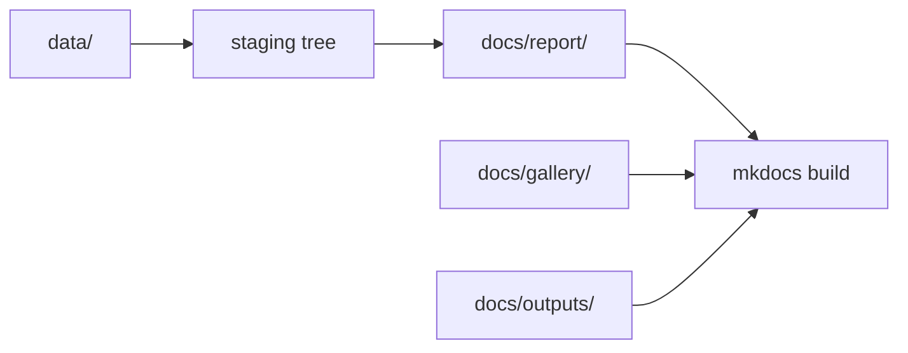

# Artifact Lifecycle

The repository publishes both narrative documentation and generated output artifacts. They should not be edited or reviewed as if they were the same thing.

## Output Classes

- `docs/outputs/`: hand-maintained narrative pages that explain product behavior and output contracts
- `docs/report/`: generated publication artifacts such as the shared atlas, country bundles, JSON summaries, CSV inventories, and copied GeoJSON layers
- `docs/gallery/`: checked-in static media assets that are referenced by narrative pages or by generated outputs

## Generation Order

## Lifecycle Rule

The lifecycle is intentionally asymmetric:

- `docs/outputs/` pages are hand-maintained explanations
- `docs/report/` is regenerated from code and tracked source files
- `docs/gallery/` holds checked-in media evidence that can be referenced by either side

That asymmetry is a feature. It keeps generated outputs reviewable without pretending every visible page came from the same process.

## Review Expectations

When generated artifacts change:

1. confirm which source data or reporting code caused the change
2. review the generated files under `docs/report/`
3. update the narrative pages under `docs/outputs/` if the output contract changed
4. rebuild the docs site so the published shell still matches the generated artifacts

Report publication now stages generated bundles first and swaps them into `docs/report/` only after the build succeeds. That means reviewers should not expect half-written output trees from a failed regeneration.

## Editing Rule

- edit `docs/outputs/` by hand when explaining behavior, limits, or review expectations
- do not hand-edit `docs/report/` outputs unless the change is an intentional artifact regeneration in the same repository state
- treat `docs/gallery/` as checked-in evidence assets with stable names and explicit references

## Purpose

This page explains how generated publication artifacts, narrative output pages, and checked-in media are expected to evolve together without being mistaken for one another.
