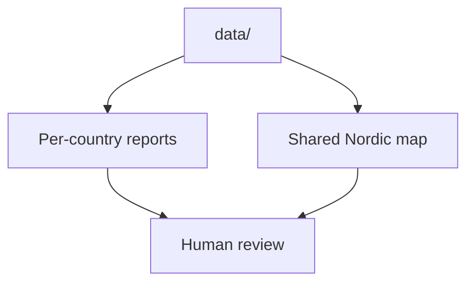

# Outputs

This section explains the browser-facing and file-facing outputs generated from the tracked `data/` tree.

It focuses on three things:

- what a published artifact contains
- what a published artifact is allowed to imply
- how generated bundles differ from the hand-maintained documentation around them

## Pages in This Section

- [Country reports](country-reports.md)
- [Nordic Evidence Atlas](nordic-evidence-atlas.md)
- [Lyngsjön Lake fieldwork](lyngsjon-lake-fieldwork.md)
- [Artifact lifecycle](artifact-lifecycle.md)
- [Published artifacts](published-artifacts.md)

## Use This Section When You Need To

- understand the difference between the shared atlas and the country bundles
- review a `docs/report/` change as a generated artifact rather than as hand-maintained prose
- check which output limits are product boundaries rather than scientific conclusions

## Canonical Status

This section is the canonical source for report and map documentation inside the docs site. It replaces the older narrative content that previously lived in separate `docs/report/...` guide pages.

## Reading Rule

Read this section when you need to know what a published artifact contains, what it intentionally omits, and which output behaviors are implementation limits rather than scientific conclusions.

## Purpose

This page organizes the output-side documentation around generated artifact families and the interpretation boundary they need to keep.
