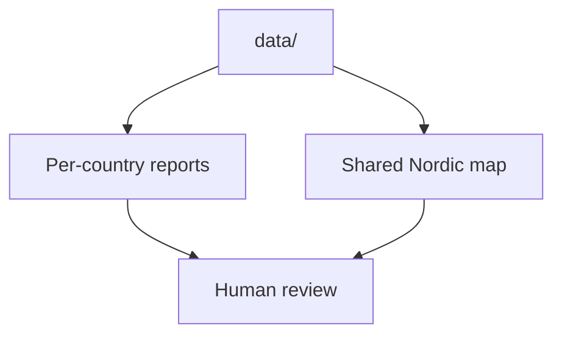

# Reports

This section explains the browser-facing and file-facing outputs generated from the tracked `data/` tree.

It also documents the boundary between generated publication artifacts and interactive interpretation. The shared map is the main visible output, but it is still a checked-in HTML artifact built from local commands rather than a live analysis service.

## Pages in This Section

- [Country reports](country-reports.md)
- [Nordic Evidence Atlas](nordic-evidence-atlas.md)
- [Lyngsjön Lake fieldwork](lyngsjon-lake-fieldwork.md)
- [Published artifacts](published-artifacts.md)

## Canonical Status

This section is the canonical source for report and map documentation inside the docs site. It replaces the older narrative content that previously lived in separate `docs/report/...` guide pages.

## Reading Rule

Read this section when you need to know what a published artifact contains, what it intentionally omits, and which current report behaviors are implementation limits rather than scientific conclusions.

## Purpose

This page organizes the output-side documentation for `bijux-pollenomics`.
