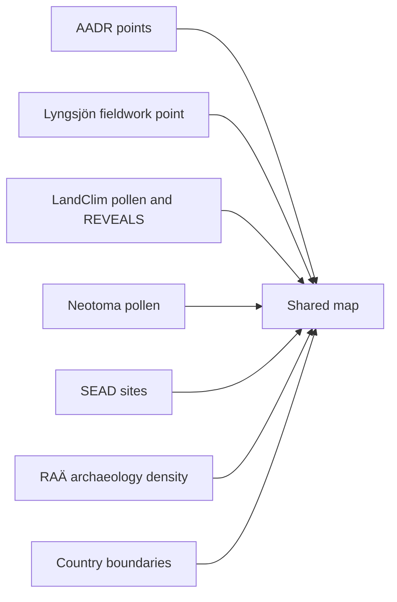

# Nordic Evidence Atlas

The Nordic Evidence Atlas is the main interactive product surface in this repository.

## Delivered Behavior

- one map for Sweden, Norway, Finland, and Denmark
- include and exclude by country
- include and exclude by data layer
- grouped layer controls for primary evidence, environmental context, archaeology context, and orientation
- distance circles around point layers
- clustering, search, zoom, empty-state handling, and live layer summaries
- a help dialog, focus inspector, floating legend, and status dock for continuous review while navigating
- time-window presets plus a dated-record distribution chart
- shareable URL state for country, layer, basemap, and distance selections
- a fieldwork documentation point for the Lyngsjön Lake sampling visit, with direct links to checked-in photo and video evidence

## Interaction Model

The atlas is designed around one workflow:

1. understand the active evidence stack and scope
2. narrow the view by country, layer, time window, and distance settings
3. inspect one focused record or overlay while the rest of the map remains interactive

That is why the interface carries grouped layer controls, live state summaries, a help dialog, a status dock, and a focused-record panel at the same time. They are part of the inspection workflow, not decorative UI.

## Scope Limits

- the AADR layer is tied to release `v62.0` in the checked-in artifact
- the RAÄ archaeology layer is Sweden-only in the present implementation
- the map is a static HTML artifact, not a backed web application
- the map bundle now carries its own Leaflet and marker-cluster assets locally, but basemap tiles still come from external services, so a fully offline browser session will not render the full map experience
- the map compares evidence layers visually, but it does not rank candidate sampling locations or compute archaeological suitability scores
- the evidence stack is Nordic-focused and source-limited; absence from the map is not evidence of scientific absence

## Layer Model

## Why One Shared Map

One shared atlas is better than multiple country-specific maps because readers can:

- compare countries quickly
- keep one mental model for controls and layers
- inspect borderland or regional patterns without changing pages
- apply the same distance logic across all countries

## Information Model

The map now treats AADR as one source inside a broader multi-evidence view.

- AADR release labels are shown as provenance, not as the map title
- every layer carries its own source and coverage description
- RAÄ archaeology is explicitly described as Sweden-only density coverage
- the live summary separates map build date from source release labels

## Interpretation Boundary

Use the map to inspect collected evidence and compare where sources overlap or diverge. Do not use it as proof that proximity alone establishes sampling value. The map helps organize evidence; it does not replace domain judgment.

## Published Files

- `docs/report/nordic-atlas/nordic-atlas_map.html`
- `docs/report/nordic-atlas/nordic-atlas_summary.json`

## Purpose

This page explains the product logic behind the map-first documentation experience and the shared-atlas design.
