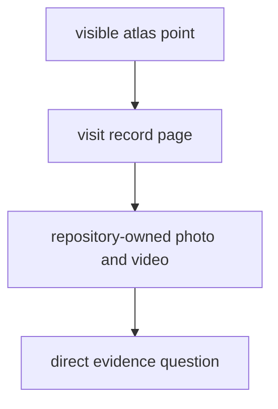

# Fieldwork

Fieldwork is the repository's direct visit surface. It shows, in the most
concrete possible way, that at least some mapped interpretation in the public
atlas is anchored to a real place, on a real day, with repository-owned media
that can be inspected directly.

In `bijux-pollenomics`, fieldwork is not the whole scientific argument. Pollen
context, environmental archaeology, boundaries, and ancient DNA still do most
of the analytical work. Fieldwork plays a different role. It shows where the
project has physically gone into the landscape, what was documented there, and
how one on-the-ground visit connects back to the wider evidence picture.

## Fieldwork Model

This section should work as a narrow but trustworthy bridge. You should be able
to move from a visible atlas point to a documented visit record, and from that
visit record to the photo and video captured on the day. If that route is
vague, fieldwork stops being evidence and becomes decoration.

## Start Here

- start with [Lyngsjön Lake Fieldwork](./lyngsjon-lake-fieldwork/index.md)
  if you want the current direct visit record
- open the [Nordic Evidence Atlas](../../report/regions/nordic/nordic_map.html)
  if your question begins with a mapped point and you want to understand why
  that area was worth documenting
- open the [data handbook](../pollenomics-data/index.md)
  if your real question is about provenance, normalization, or source-family
  coverage across the wider repository

## Section Pages

- [Lyngsjön Lake Fieldwork](./lyngsjon-lake-fieldwork/index.md)

## Why This Surface Matters

The fieldwork surface matters because a map point should not be trusted
blindly. In some cases, the repository can show not only the processed
evidence layers around a place, but also the fact that the team stood there,
documented the visit, and treated that location as a serious candidate for
cross-evidence work.

The Lyngsjön area is a good example of why this matters. It sits in a part of
the Nordic evidence space where pollen context, archaeology, and ancient DNA
are all unusually relevant together. That does not mean the area proves
everything by itself. It means it is a rational place to begin: rich enough to
connect multiple evidence families, focused enough to document carefully, and
concrete enough to inspect as an actual landscape rather than an
abstract atlas label.

## What You Can Learn Here

- whether a published fieldwork point refers to a real documented visit
- which date, location, and media support that visit record
- why this location was treated as a strong candidate for pollenomics work
- where fieldwork evidence stops and broader source-derived evidence begins

## First Inspection Path

- inspect `docs/gallery/2026-02-26-data-collection.JPG`
- inspect `docs/gallery/2026-02-26-data-collection.mp4`
- compare the visit record with the corresponding atlas point in the Nordic
  evidence surface
- then step outward into the data handbook if you want to understand the wider
  pollen, archaeology, and ancient-DNA context around the same area

## Scope And Restraint

The repository must resist an easy mistake here: one documented visit can make
an area feel more certain or more complete than it really is. This section only
works when it stays modest. It should deepen trust in one visit record, not
inflate the scientific completeness of the whole atlas.

## Media Boundary

This public surface intentionally shows only one photo and one video from the
day. They are enough to make the visit inspectable without turning the website
into a media dump.

If you are a curious reader and want more field material from the same visit,
send an email to `bijan@bijux.io`.

## Boundary Test

This section does not imply that every atlas point has matching field media. It
does not replace the data handbook, and it does not turn field documentation
into a substitute for pollen records, archaeological context, or sample-backed
ancient DNA. Its job is narrower and clearer: make one real visit legible.
